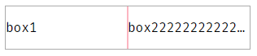

## 问题描述

HTML：

```html
<div id="container">
  <span class="box">
    <p>box1</p>
  </span>
  <span class="box">
    <p>box222222222222222222</p>
  </span>
</div>
```

CSS：

```css
#container {
  display: flex;
  width: 300px;
  outline: 1px solid #aaa;
}
.box {
  flex: 0 0 150px;
  outline: 1px solid lightpink;
}
.box p {
  white-space: nowrap;
  overflow: hidden;
  text-overflow: ellipsis;
}
```

结果：box2 中的内容超过容器宽度，没有显示省略号


## 解决方法

先说解决方法：给 .box 添加 `min-width:0;`

效果：


## 分析

### flex item 的原始尺寸

原始尺寸：flex item 被放进 flex 容器时的初始尺寸，即未 grow 或 shrink 时的尺寸。

原始尺寸优先级：`flex-basis` > `width` > 内容宽度。

`min-width` 和 `max-width` 会限制住原始尺寸，flex item 元素的 `min-width` 默认是 `auto`。

```css
/* 原始尺寸是 100px */
flex-basis: 200px;
max-width: 100px;
```

参考：

- [flex-basis 文本溢出问题](https://juejin.im/post/5de6379f6fb9a015fd699b41#heading-3)
- [Flex Basis 与 Width 的区别](https://www.jianshu.com/p/17b1b445ecd4)

### 为什么溢出隐藏会失效

box2 的 `flex-basis` 是 150px。`min-width`未设置，默认是 `auto`，那么 auto 代表什么呢？

flex 布局且不允许换行，这里 min-width 的`auto` 就是文字不换行时的长度（没有查到资料，是根据页面效果反推出来的）。所以 box2 的宽度被撑开了。

### 设置不同 `min-width` 的效果

`min-width` 的值在 `0-150px` 之间时，box 的最终宽度都是 150px。

`min-width` 大于 `150px` 时，box 的最终宽度是 min-width 的值。
