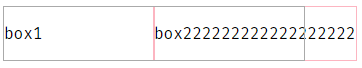
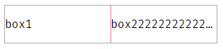
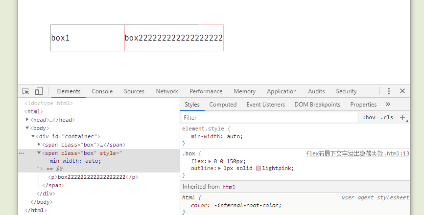

## 1 问题描述

HTML：

```html
<div id="container">
  <span class="box">
    <p>box1</p>
  </span>
  <span class="box">
    <p>box222222222222222222</p>
  </span>
</div>
```

CSS：

```css
#container {
  display: flex;
  width: 300px;
  outline: 1px solid #aaa;
}
.box {
  flex: 0 0 150px;
  outline: 1px solid lightpink;
}
/* 单行显示，溢出显示。。。 */
.box p {
  white-space: nowrap;
  overflow: hidden;
  text-overflow: ellipsis;
}
```

结果：box2 中的内容溢出了，没有显示省略号


---

## 2 解决方法

先说解决方法： **给 .box 添加 `min-width:0;`**

效果：


---

## 3 分析

### 3.1 概念+原理

为了方便描述，先定义一个概念 —— **原始大小** ：flex item 被放进一个 flex 容器之前的大小。

一个 flex item 元素的 **原始大小** 是怎么确定的？
优先级：`flex-basis` > `width` > 内容宽度。
`min-width` 和 `max-width`会限制住 **原始大小** 。

> "Basically: flex items will refuse to shrink below their minimum intrinsic width, unless you explicitly specify "min-width" or "width" or "max-width" on them."

举个例子，元素的 `max-width` 设置为 `100px` ， `flex-basis` 设置为 `200px` ，那么 **原始大小** 是 `100px`

flex item 元素的 `min-width` 默认是 `auto`

参考：

- stackoverflow：[ellipsis-in-flexbox-container](https://stackoverflow.com/questions/26465745/ellipsis-in-flexbox-container)
- 掘金：[【CSS】flex-basis 文本溢出问题](https://juejin.im/post/5de6379f6fb9a015fd699b41#heading-3)
- 简书：[[翻译]Flex Basis 与 Width 的区别](https://www.jianshu.com/p/17b1b445ecd4)

### 3.2 回头看我们的问题


给 box2 设置的 flex-basis 是 150px，所以原始大小的值是 150px ，但是受 min-width 限制。

min-width 默认是 `auto` ，那么这个 `auto` 是多少呢？

flex 布局，而且内部不允许换行，这里 min-width 的`auto` 就是文字不换行长度（没有查到资料，是根据页面效果反推出来的）

`min-width` => 默认值 `auto` => 文字不换行时的长度 => 长，大于`150px` 。所以， box2 的宽度被撑开了。

### 3.3 设置不同 `min-width`的效果：


box2 的 flex-basis 是 150px

min-width 在 0~150px 之间时，box 的最终宽度都是 150px
min-width 大于 150ox 时，box 的最终宽度是 min-width 的值。
