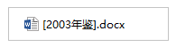

## 1 问题描述

在正式环境中，上传文件 **[2003 年鉴].docx** 时，报错 400。

但是，只有此文件上传时会报错，其他文件是正常的。

（后文为了方便描述，将问题文件称为 a）

## 2 分析

### 2.1 找到出错原因

400 报错，一般是请求参数和服务器接收参数的格式不同导致的。

但只有文件 a 出错，其他文件都正常。可能是文件 a 有什么特殊之处，触发了隐蔽的 bug。

最先猜测，可能是 a 的内容有问题，但是用 office 打开后看内容，很正常。

那么，可能是标题有问题。我把 a 改名为 **1.docx** ，然后重新上传。这样就不会报错了！

进一步排查发现：是标题中的特殊符号`[` 和 `]` 导致报错 400。

### 2.2 在开发环境，无法复现 bug

问题找到了，就要解决它了。但是，又遇到了麻烦：在开发环境中无法复现 bug。

用相同的代码、使用同一个电脑的同一个浏览器进行访问，同样去上传文件 a（不改名），不会出错。

因为代码是相同的。并且是用同一个电脑的同一个浏览器进行访问，说明不是客户端环境或者浏览器的问题。那么，只可能是服务器环境的的差异了。

### 2.3 找到服务器环境的差异

逐个对比开发和正式的服务器环境（jdk 版本、nginx 配置、防火墙设置等等），最终发现，是 tomcat 版本不同。

部署环境的 tomcat 版本比较高，有新特性：

> 严格按照 RFC 3986 规范进行访问解析，而 RFC 3986 规范定义了 Url 中只允许包含英文字母（a-zA-Z）、数字（0-9）、-\_.~4 个特殊字符以及所有保留字符

因为 get 请求的参数是拼接在 url 后面的，所以参数中只要包含 `[` 或 `]` 都会报错 400。

参考：

- [tomcat 请求出现 RFC 7230 and RFC3986 的错误，解决办法](https://blog.csdn.net/weixin_41986096/article/details/82785118)

## 3 总结一下

tomcat 高版本中，不允许 url 中有特殊字符。
上传 **[2003 年鉴].docx** 时，会触发一个 get 请求，请求参数中包含文件名称。所以这个请求的 url 地址中会包括特殊字符`[` 和 `]` ，被 tomcat 直接拦下，报错 400。

解决方法：

- 仍继续用高版本的 tomcat，但是修改它的配置，让它不再去拦截有特殊符号的 url
- 用低版本的 tomcat
- 拼在 url 后面的参数，先用`encodeURI()`转义
