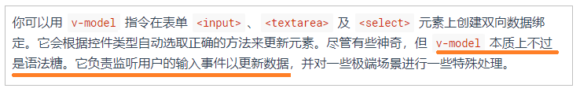
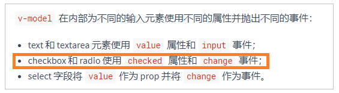

## 问题描述

vue 中，我用 `v-model` 将 checkbox 绑定到变量 `flag` 上。
但是当我用 js 去修改 flag 的值时，却没有触发 checkbox 的 `change` 事件。

```html
<section id="app">
  <button @click="flag=!flag">切换！</button>
  <input type="checkbox" v-model="flag" @change="handleChange" />
</section>
<script>
  var app = new Vue({
    el: "#app",
    watch: {
      flag(val) {
        console.log("监听到flag变化：", val);
      },
    },
    data: {
      flag: true,
    },
    methods: {
      handleChange() {
        console.log("触发change事件");
      },
    },
  });
</script>
```

flag 的值发生变化，有两种可能：

1. 用户通过鼠标点击 checkbox：checkbox 的勾选状态变了，flag 的值变了，触发 change 事件
2. 点击按钮，用 js 直接修改 flag 的值：checkbox 的勾选状态变了，flag 的值变了，但是**没有触发 change 事件**

## 是 v-model 的 bug 吗？

在网上没有搜索到相关的内容。最后在[vue 官方教程](https://cn.vuejs.org/v2/guide/forms.html)中看到了：


简单来说， `v-model` 的原理是：

- 监听 checkbox 的 `change` 事件，用 checkbox 的 `checked` 属性的值去更新 flag。这样一来，用户通过鼠标点击等操作修改了 checkbox 的值后，数据也会自动更新了！这就是常说的 **vue 双向绑定** 中的 **视图更新 => 数据更新**
- 监听 flag 值的变化，用 flag 去更新 checkbox 的 `checked` 属性。这是 **vue 双向绑定** 中的 **数据更新 => 视图更新**

现在回头去看我遇到的问题：点击按钮，用 js 直接修改 flag 的值后，checkbox 的勾选状态变了，但是 **没有触发 change 事件**

checkbox 的勾选状态改变了，说明 **数据更新 => 视图更新** 这条链没有问题，`v-model` 已经完成了它的使命。

我推测，可能问题不在 vue ，而在原生的 js 和 html 上！

## 大胆假设

我的猜想：用 js 去修改 checkbox 的 `checked` 属性，不会触发 `change` 事件。

不使用 vue，测试原生 js 的效果：

```html
<body>
  <section id="app">
    <button onclick="alterCheckboxValue()">切换！</button>
    <input type="checkbox" id="checkbox1" onchange="handleChange()" />
  </section>
  <script>
    function alterCheckboxValue() {
      const el = document.querySelector("#checkbox1");
      el.checked = !el.checked;
    }
    function handleChange(e) {
      console.log("触发change事件");
    }
  </script>
</body>
```

测试结果和使用 vue 的效果一致，猜想是正确的。

## 结论

**用 js 去修改 checkbox 的 checked 属性，不会触发 change 事件</span>**

所以，想要全方位监听 checkbox 的变化，只能：

1. 用户的操作用 change 事件监听
2. 自己用 js 修改的时候，自己在后面写处理函数

## 补充

我测试了其他函数，总结如下：
用户操作和 js 修改都会触发的事件：

- `onscroll`
- `onclick`

用户操作会触发，用 js 修改不会触发的事件

- `select`的`onchange`：
- `input[type="checkbox"]`的`onchange`
- `input[type="text"]`的`onchange`

我猜测可能是因为表单元素是**和用户交互的元素** ，所以被区别对待了
