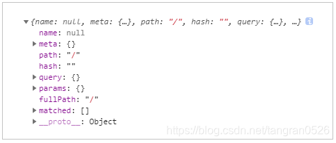
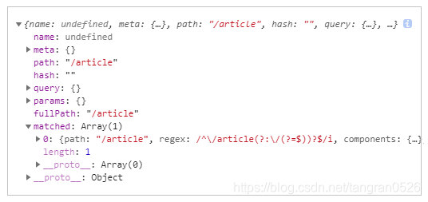
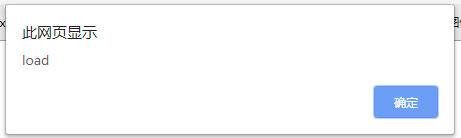
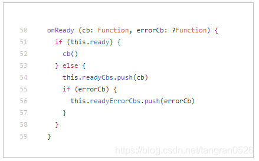
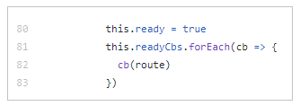

## 1 问题描述

页面加载时，需要判断：地址能否匹配上路由。如果匹配不上，就跳转到首页。

代码：

```js
mounted(){
	if (this.$route.matched.length === 0) {
		this.$router.push("/index");
	}
}
```

问题出现了：当访问的地址可以匹配上路由时，也会跳到首页。

---

## 2 找到问题

在 mounted 中打印 `$route`：

可以看到，所有的值都不对。最明显的是`path` 和 `fullPath` ，明明应该有值，但现在只是一个 `"/"` 。

我猜测：在 mounted 中，router 的初始化还没有完成，所以取到的是一个初始默认值。

加一个延时，试一下：

```js
mounted(){
	setTimeout(() => {
		if (this.$route.matched.length === 0) {
			this.$router.push("/index");
		}
	},1000);
}
```

延时 1000ms ，此时 router 的值是对的了：

问题确定了：

- **vue-router 初始化是需要一段时间的，在完成之前，取值只能拿到初始的默认值。**
- **在 mounted 中 router 初始化可能还没有完成。**

---

## 3 不能用定时器，用 onReady

上面用定时器延迟了 1000ms，取到了 router。但是，真正要解决这个问题，肯定不能用定时器，因为延迟的时间无法确定：

- 长了，影响体验
- 短了，可能 router 初始化还没完成呢

我去翻了官网 API，希望官方提供了**初始化完成时的回调方法**，果然找到了：[onReady](https://router.vuejs.org/zh/api/#router-onready)

代码改成：

```js
mounted(){
	this.$router.onReady(() => {
		if (this.$route.matched.length === 0) {
			this.$router.push("/index");
		}
	});
}
```

完美通过！

---

## 4 有的同学可能会担心：onReady 会不会错过啊？

（可能只有我担心这个问题）

### 4.1 “错过”是什么意思

先解释一下 “错过”。举个例子：

给 window 绑定 load 事件：

```html
<!DOCTYPE html>
<html>
  <head>
    <script>
      window.onload = function () {
        alert("load");
      };
    </script>
  </head>
  <body></body>
</html>
```

会弹出：


如果延迟一会儿，再绑定事件呢：

```html
<!DOCTYPE html>
<html>
  <head>
    <script>
      setTimeout(() => {
        window.onload = function () {
          alert("load");
        };
      }, 2000);
    </script>
  </head>
  <body></body>
</html>
```

这样就不会弹出了。因为延迟了 2000ms 后才绑定事件。这个时候 window 已经 load 完了。错过了。

### 4.2 onReady 会不会"错过"呢？

先说结论：**不会！**

因为 window.onload 和 vue-router 的 onReady 是完全不同的两种机制：

```js
// 机制一：绑定处理函数。绑定好之后，window触发load事件时，才会调用。所以存在错过的现象
window.onload = cb;

// 机制二：调用 onReady 函数！
router.onReady(cb);
```

去看看 [源码](https://github.com/vuejs/vue-router/blob/dev/src/history/base.js) ，onReady 到底是做了什么：

onReady：

- 如果路由已经 ready 了，就立即执行 `cb`。
- 如果路由还没有 ready，就把 `cb` 放到 readyCbs 中。

接着看源码，发现：

上面这段代码是在初始化完成后立即调用的：修改 ready 为 true ，并执行 readyCbs 中的 cb 。

所以，onReady 不会错过，放心的用！

---

参考：

- [vue-router 的 github ](https://github.com/vuejs/vue-router)
- [vue-router 的 API](https://router.vuejs.org/zh/api/#router-link)
