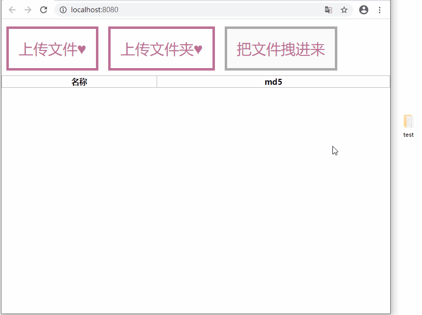

## 1 效果展示



本篇文章的重点：**拿到 File 对象之后，如何计算文件的 md5 值？几千个文件同时计算，页面卡顿崩溃怎么解决？**

不知道如何获取 File 对象可以看这篇文章：[上传三合一：拖拽上传、上传文件、上传文件夹，一次搞定！](https://blog.csdn.net/tangran0526/article/details/104156857)，这里不再复述了。

## 2 分析

懒了，不一步步说明了，直接放结论。

### 2.1 计算 MD5

直接用轮子 [js-spark-md5](https://github.com/satazor/js-spark-md5)。

### 2.2 解决页面卡顿问题

同时计算很多文件，页面卡顿崩溃，怎么办？

主要有两方面的压力：计算压力和渲染压力。

#### 2.2.1 计算压力：

缓解计算压力，有下面三种策略：
| 策略 | |
|:--|:--|
| 分块 | <span style="color:darkorange">缓解大文件造成的计算压力</span><br>文件很大时，一次性读取整个文件非常非常耗时，而且读取时页面会卡死。<br>所以必须要分块读取文件，并计算 md5。（ [js-spark-md5](https://github.com/satazor/js-spark-md5) 支持分块）|
| 排队 | <span style="color:darkorange">缓解文件多造成的计算压力</span> <br>同一时刻，只允许运行最多 n 个计算任务，后来的在等待队列中排队。|
|多线程| 使用 [Web Worker](https://developer.mozilla.org/zh-CN/docs/Web/API/Web_Workers_API) 多线程计算 md5。（安装 [worker-loader](https://github.com/webpack-contrib/worker-loader) 包以在 webpack 中使用 Web Worker）<br> **注意 worker 用完必须杀掉。不然数量多了之后，即使没在执行计算任务，浏览器也会崩**|

分块和排队都必须用。多线程可用可不用。

#### 2.2.2 渲染压力：

如果像开头的效果图一样，把所有文件都展示在页面上。那么文件一多，渲染压力就会很大。

在真实的业务中，渲染压力会更大。举例说一个场景：

- 选择要上传的文件后，先计算 MD5，之后分块上传文件。
- 上传列表中要展示所有文件的状态，是正在校验可用空间，还是正在排队算 MD5 等等。（这会导致，每个文件的每次状态改变，浏览器都要重新渲染）
- 因为是分块上传，所以有上传进度，进度百分比也要在上传列表中展示。（这会导致，每个任务的上传进度每次改变，浏览器都要重新渲染）

这个场景下，浏览器在上传过程中每时每刻都在不停地重新渲染，卡卡卡。

计算压力可以通过分块、排队、多线程来缓解，但渲染压力就没办法了。无论如何，几百几千个 div 一下子添加进来，并且一直在变化，浏览器肯定会卡的。

解决方法只有一个，就是不要显示太多文件。可以限制单次上传数量，或者上传列表添加分页功能，等等。

## 3 代码

ComputingMd5Factory.js：负责排队，给每个任务安排一个 Web Worker

```js
import ComputingMd5Worker from "worker-loader!./ComputingMd5Worker.js";

class ComputingMd5Factory {
  constructor() {
    // 等待队列
    this.waitingList = [];
    // 正在工作的数量
    this.workingCount = 0;
    // 最大同时工作的数量
    this.maxWorkingCount = 1;
  }
  addTask(file) {
    if (this.workingCount < this.maxWorkingCount) {
      this.workingCount++;
      this.computeMd5(file);
    } else {
      this.waitingList.push(file);
    }
  }
  // 用 worker 计算 md5
  computeMd5(file) {
    const worker = new ComputingMd5Worker();
    worker.postMessage({ file });
    worker.addEventListener("message", (e) => {
      if (e.data.isSuccessful) {
        file.md5 = e.data.md5;
        if (this.waitingList.length > 0) {
          // 不释放 workingCount ,直接把等待队列第一个拿进来.
          // 这样做是为了防止：释放 workingCount 后的瞬间有新任务 addTask ,插队了
          let newTask = this.waitingList.shift();
          this.computeMd5(newTask);
        } else {
          this.workingCount--;
        }
        // 立刻终止worker
        worker.terminate();
      } else if (e.data.isFailed) {
        // 立刻终止worker
        worker.terminate();
      }
    });
  }
}
export default ComputingMd5Factory;
```

ComputingMd5Worker.js：worker 文件，分块读取文件计算 md5。

```js
import SparkMD5 from "spark-md5";

const blobSlice = File.prototype.slice || File.prototype.mozSlice || File.prototype.webkitSlice;

// Read in chunks of 2MB
const chunkSize = 1024 * 1024 * 1024;

self.addEventListener("message", (e) => {
  computeMd5(e.data.file)
    .then((md5) => {
      self.postMessage({
        isSuccessful: true,
        md5: md5,
      });
    })
    .catch((message) => {
      self.postMessage({
        isFailed: true,
        message,
      });
    });
});

function computeMd5(file) {
  return new Promise((resolve, reject) => {
    var chunksCount = Math.ceil(file.size / chunkSize);
    var currentChunk = 0;
    var spark = new SparkMD5.ArrayBuffer();
    var fileReader = new FileReader();
    fileReader.onload = (e) => {
      spark.append(e.target.result);
      currentChunk++;
      if (currentChunk < chunksCount) {
        loadNext();
      } else {
        const md5 = spark.end();
        // 成功了
        resolve(md5);
      }
    };
    fileReader.onerror = (e) => {
      // 出错了
      reject("Something went wrong when reading the file");
    };
    function loadNext() {
      var start = currentChunk * chunkSize;
      var end = Math.min(start + chunkSize, file.size);

      fileReader.readAsArrayBuffer(blobSlice.call(file, start, end));
    }
    loadNext();
  });
}
```
