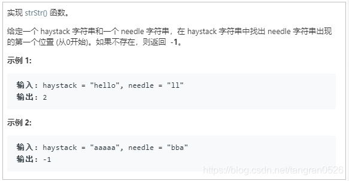
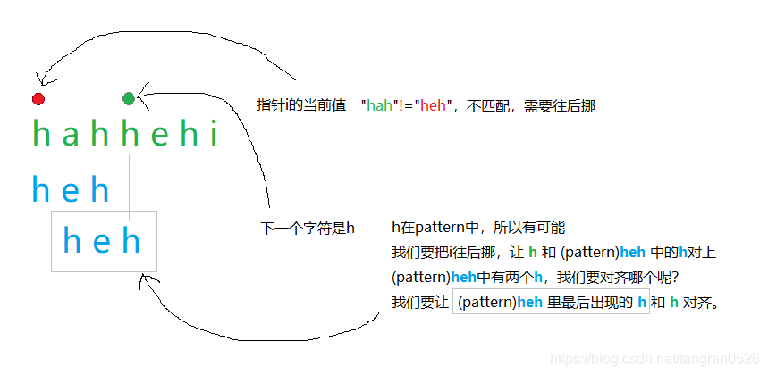

来源于力扣的题目：[28. 实现 strStr()](https://leetcode-cn.com/problems/implement-strstr/)


## 思路

循环目标串，看看是否匹配 pattern。每一轮中，匹配不成功的时候，需要把`i`向后挪。

暴力方法是每次把`i`往后挪一格，Sunday 方法每次挪`i`是有策略的。

先看图（目标串是绿色的，pattern 是蓝色的）：


具体来说：

1. 找到下一位字符，记为 ⭐，判断 ⭐ 是不是在 pattern 中【这里说的下一位字符，是上图的绿点对应的 h】
2. 如果 ⭐ 不在 pattern 里，`i`直接跳到 ⭐ 的后面一位（中间跳过的那些 i，它们对应的子串都包含 ⭐，所以不可能和 pattern 匹配上）
3. 如果 ⭐ 在 pattern 里，那么把`i`向后挪，让 pattern 中最后出现的 ⭐ 和目标串的 ⭐ 对齐

为了知道怎么挪`i`，需要先得到一个偏移表

## 代码

```js
var strStr = function (haystack, needle) {
  // 拼偏移表
  let driftAwayMap = {};
  for (let i = 0; i <= needle.length - 1; i++) {
    driftAwayMap[needle[i]] = needle.length - i;
  }
  let i = 0;
  while (i <= haystack.length - needle.length) {
    if (haystack.substr(i, needle.length) === needle) {
      // 找到了！
      return i;
    } else {
      // 向后推，看看下一个字符在needle中吗
      let nextChar = haystack[i + needle.length];
      if (driftAwayMap[nextChar]) {
        // 在，所以有可能匹配上
        i += driftAwayMap[nextChar];
      } else {
        // 不在。没可能了，跳过跳过
        i += needle.length + 1;
      }
    }
  }
  return -1;
};
```
