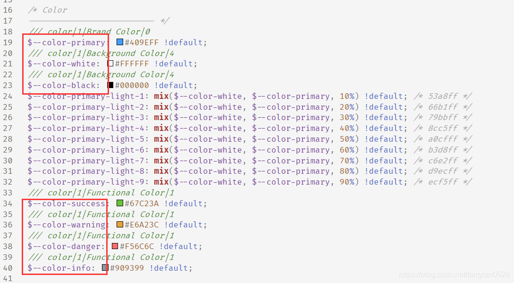

## 改变主题

具体参考官方说明：[在项目中改变 SCSS 变量](https://element.eleme.cn/#/zh-CN/component/custom-theme#zai-xiang-mu-zhong-gai-bian-scss-bian-liang)

```css
/* 改变主题色变量 */
$--color-primary: purple;

/* 改变 icon 字体路径变量，必需 */
$--font-path: '~element-ui/lib/theme-chalk/fonts';

@import "~element-ui/packages/theme-chalk/src/index
```

把主题色改成紫色后，按钮、文字、loading 等全都会变成紫色。而且相关颜色（比如按钮 hover 时的颜色）也会自动计算出来，不需要自己设置。

除了主题色，还有其他变量可以改。看源文件可以发现，所以变量的定义都统一放在 `~element-ui\packages\theme-chalk\src\common\var.scss` 中，想知道哪些可以改自己看就行：（下面红圈的都是可以改的）


## el-form

###### 1 rules

```javascript
rules: {
  name: [
    // 是按数组顺序校验的，所以走到 nameValidation 时肯定已经通过了前面两项校验。
    // 为什么不把前面两项校验都放在 nameValidation 中？因为设置 required:true 可以出现红色*
    { required: true, message: "不能为空", trigger: "blur" },
    { min: 2, max: 20, message: "长度在 2 到 20 个字符", trigger: "blur" },
    { validator: this.nameValidation, trigger: "blur" },
  ];
}
```

后续补充：红色`*` 可以通过添加 `class="is-required"` 来实现

###### 2 clearValidate

如果弹窗中有表单，表单有验证。那么每次打开弹窗后，都需要清除验证。清除的验证包括：

1. 之前打开弹窗留下的（之前的数据格式不对，但是点了取消弹窗，那么错误提示都还在）
2. 这次打开弹窗时，赋值触发的 change 验证

```js
 openDial() {
	// 显示弹窗
	this.dialogVisible = true;
	// 赋值（会触发 change 的验证）
	// ....
	// 等待form加载出来后，清除验证
	this.$nextTick(() => {
	    this.$refs.form.clearValidate();
	});
```

###### 3 禁用

需求：新增、编辑、查看共用一个页面，需要在查看时禁用所有输入框。

实现：在外层套一个 el-form，在 el-form 上使用属性 `disabled`来控制

> disabled：是否禁用该表单内的所有组件。若设置为 true，则表单内组件上的 disabled 属性不再生效

总结：

- 如果只需要 el-form 的 disabled 功能，那么不需要按格式嵌套 `el-form-item`，也不需要给 el-form 绑定 model
- 如果 el-form 里有表格，表格里有 el-input ，那么也会被控制
- el-form 里，只有 element 的元素会受控制，原生的不会被控制。（el-input 受控，input 不受控）
- 因为 el-button 也会被控制。所以**如果有按钮是在查看页面中也可以点击的，那么就不能用 el-button，要用 button**

###### 4 使用 button 时，一定要加上 `type="button"`

如果非要在 el-form 中使用 `<button>` ，那么一定要加上 `type="button"`。因为在非 IE 浏览器中，type 的默认值都是 **submit** 。 el-form 的底层是用 form 实现的。当 form 中包含了输入框和 `type="submit"` 的按钮时，focus 到输入框，按回车，会触发 button 的点击事件并刷新页面。

```html
<form>
  <div>姓名：<input type="text" /></div>
  <div>年龄：<input type="text" /></div>
  <div>
    <button onclick="alert(1)">点我</button>
  </div>
</form>
```

## el-table

###### 1 后端排序时，不能用 `default-sort` 来控制默认排序

假设页面中有表格 table1，表格上添加了 `sort-change` 来实现后端排序，并且添加了 `default-sort` 来实现初始的默认排序。

- 在 mounted 中手动刷新表格，会发送 ajax 请求（记为请求 M）
- default-sort 会自动触发绑定的 sortChange 方法，在 sortChange 内部也会发送一个 ajax 请求（记为请求 D）

我们希望看到有默认排序的表格（也就是请求 D 的结果）。但是，不能保证这两个异步请求谁先完成。

###### 2 el-pagination

分页组件 el-pagination 在初始化完成后，再通过 js 修改 `current-page` ，组件是不会响应它的变化的。
所以为了实现 “一上来就显示第 3 页” 这种需求，必须 **先把 current-page 改成 3，然后再初始化分页组件**。

（我自己封装的表格组件中，引入了 `startRenderingPaging` 参数，初始化为 false，控制分页组件的初始化时机。在组件内部的 ` refreshTable` 方法中，才把 `startRenderingPaging` 的值改为 true。所以使用的时候，只要在调用组件的 `refreshTable` 方法之前设置好 `current-page` 就可以了。）

## 监听 `el-input` 组件的事件

需求：点击搜索按钮、敲回车、输入框 blur 时进行搜索。

```html
<el-input v-model.trim="search" @blur="doSearch" @keyup.enter.native="doSearch">
  <el-button slot="append" icon="el-icon-search" @click="doSearch"></el-button>
</el-input>
```

说明：_el-input 组件_ 提供了`blur` `focus` `change` `clear` 四个自定义事件。因为 _el-input 组件_ 没有提供对 keyup 事件的监听，所以需要加上 `.native` 来监听原生事件。

## 用 v-for 渲染多个 el-switch ，需要知道是谁 change 了

开关的 change 事件的回调，只会返回新值：

用 v-for 渲染多个 el-switch，需要知道是谁 change 了：

```html
<div v-for="item in list" :key="item.id">
  <!-- <el-switch v-model="isOn" @change="handleChange" /> -->
  <el-switch v-model="isOn" @change="((value)=>{handleChange(value,item)})" />
</div>
```
