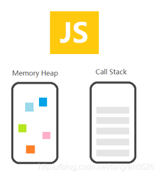

参考文章：

- [详解 JavaScript 中的 Event Loop（事件循环）机制 - 暮雨清秋](https://zhuanlan.zhihu.com/p/33058983)
- [JS 事件循环机制 - bwhite_bb](https://blog.csdn.net/qq_33120763/article/details/82317036)
- [JS：事件循环机制、调用栈以及任务队列 - Front_end_lh](https://blog.csdn.net/qq_31628337/article/details/71056294)
- [深入浅出 Javascript 事件循环机制(上)](https://zhuanlan.zhihu.com/p/26229293)
- [深入浅出 JavaScript 事件循环机制(下)](https://zhuanlan.zhihu.com/p/26238030)
- [tasks-microtasks-queues-and-schedules](https://jakearchibald.com/2015/tasks-microtasks-queues-and-schedules/)

###### 总结

- JS 是单线程的，有一个主进程和一个调用栈，主进程也就是 JS 的运行时进程

- 浏览器内核是多线程的，有很多个模块，其中有一个很重要的 webcore 模块，对 JS 中的大多异步操作进行处理。

- 当 JS 的调用栈中遇到异步操作时，会将任务交给浏览器的其他模块。如 DOM 操作会交给 webcore 中的 DOM Binding 模块处理，ajax 请求会交给 webcore 中 network 模块处理，setTimeout 会交给 webcore 中的 timer 模块处理，这些模块都是一个个独立的线程

- 事件队列并不是 JS 的，而是浏览器的一个事件处理模块

- Tasks execute in order, and the browser may render between them
- Microtasks execute in order, and are executed:
  - after every callback, as long as no other JavaScript is mid-execution
  - at the end of each task

###### 执行栈

当我们调用一个方法的时候，js 会生成一个与这个方法对应的执行环境（context），又叫执行上下文。这个执行环境中存在着这个方法的私有作用域，上层作用域的指向，方法的参数，这个作用域中定义的变量以及这个作用域的 this 对象。
（所以递归次数过多时，不断压栈，放不下了就会栈溢出）


###### 异步操作

js 引擎遇到异步事件后，不会等待它返回结果，而是会将这个事件挂起，继续执行**执行栈**中的任务。
当一个异步事件返回结果后，js 引擎会把这个事件放入**事件队列**中。放入之后不会立即执行其回调，而是等待当前执行栈中的所有任务都执行完毕。
当主线程处于闲置状态时，主线程会去查找**事件队列**是否有任务。如果有，那么主线程会取出排在第一位的事件，并把这个事件对应的回调放入执行栈中，然后执行其中的同步代码...，如此反复，这样就形成了一个无限的循环—— **事件循环（Event Loop**

###### macro task 与 micro task

具体的说，异步任务分为两类：

- 微任务（micro task）：`new Promise()` `new MutaionObserver()`
- 宏任务（macro task）：`setInterval()` `setTimeout()`

异步事件返回结果后，会被对应的放到**宏任务队列**或者**微任务队列**中去。主线程闲下来后，会先查看微任务队列，依次执行微任务队列中事件对应的回调，直到微任务队列为空。然后再去宏任务队列中取出一个事件并执行。

```js
console.log(1);
new Promise(function (resolve, reject) {
  console.log(2);
  resolve();
  console.log(3);
}).then(function () {
  console.log(4);
});
setTimeout(function () {
  console.log(5);
}, 0);
console.log(6);
setTimeout(function () {
  console.log(7);
}, 0);
new Promise(function (resolve, reject) {
  console.log(8);
  resolve();
  console.log(9);
}).then(function () {
  console.log(10);
});
```

[详解 JavaScript 中的 Event Loop（事件循环）机制 - 暮雨清秋](https://zhuanlan.zhihu.com/p/33058983)

###### web worker

后续的 web worker 技术，号称是多线程。然而，使用 web worker 技术开的多线程有着诸多限制，例如：

- 所有新线程都受主线程的完全控制，不能独立执行。这意味着这些“线程” 实际上应属于主线程的子线程。
- 另外，这些子线程并没有执行 I/O 操作的权限，只能为主线程分担一些诸如计算等任务。

所以严格来讲这些线程并没有完整的功能，也因此这项技术并非改变了 javascript 语言的单线程本质。下面，不讨论 web worker 的问题。
