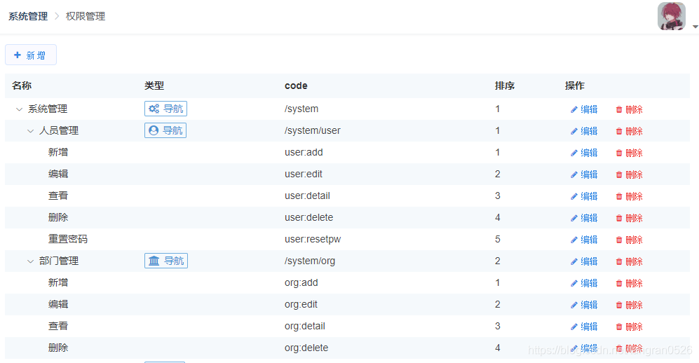

这是我 2020 年写的文章，一直是设置的“仅自己可见”。
现在再看这篇文章，感觉内容比较简单，也不完善。
不过还是发布出来吧，“仅我可见”分类下就这一篇文章，每次看到都很难受。。。

---

路由可以分为两类：

1. 不需要权限控制的：路由数据直接存在 route 中
2. 需要权限控制的：路由数据（名称、图标、是否有权限等）从服务器返回

###### 不需要权限控制的路由

不需要权限控制的页面（比如登录页、404 页面），信息没有必要存在数据库中，直接存在 route.meta 中就好了：

```js
{
	path: '2/frost',
	component: () => import('views/permission-test/1/1-2/modules/frost'),
	meta: {
	  noIntercept: true,	// 设置了 noIntercept，访问这个页面时不进行权限验证
	  breadcrumb: { 		// 面包屑的信息必须存在这里
	  	name: "面包屑中显示的名字",
	  	parentPath: '/permission-test/1/2'
	  },
	}
},
```

###### 需要权限控制的路由

路由数据（名称、图标、是否有权限等）从服务器返回

1. 在前端代码中，配置好路由规则
   ```js
   {
     path: "/system",
     component: Layout,
     children: [
       { path: 'user', component: () => import('views/system/user/index') },
     ]
   }
   ```
2. 将路由信息存在数据库中（系统中最好要包含权限管理页面，方便开发时录入、修改路由信息）
   项目中最好要包含**权限管理**页面，方便在开发阶段录入、修改路由信息。
   但要注意，在项目上线前要隐藏权限管理页面。因为这里配置的权限，和前端路由是必须要对应上的，不能随便改。如果用户一定要看权限管理页面，那么也不能提供新增、删除功能，只能编辑，编辑时也只允许改名称、图标、排序。
   
3. 给用户赋予权限：（用户 -> 角色 -> 权限）

## 获取权限信息


1. 获取面包屑中的内容文字：用 $route.matched 获取所有匹配上的路由。然后从 route.meta.title 中读名字
2. 系统管理是个过渡页面，没有真正的页面，那么就取它的 redirect 值

结合具体项目，有两个不同点：

- 项目中的菜单是从后台获取的，虽然路由规则是提前约定好的，但是菜单的显示名称可能会变化
- 项目中的菜单根据权限控制。所以不能在 route 中配置 redirect

针对两个不同点，解决方法分别是：

- 菜单的名称不从 route.meta 中读取，从后台返回的数据中读取
- 菜单的 redirect 值，也从后台返回的数据中计算
