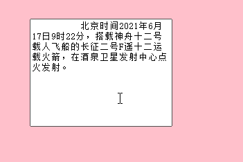
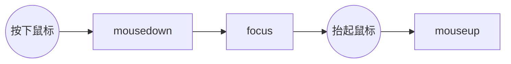
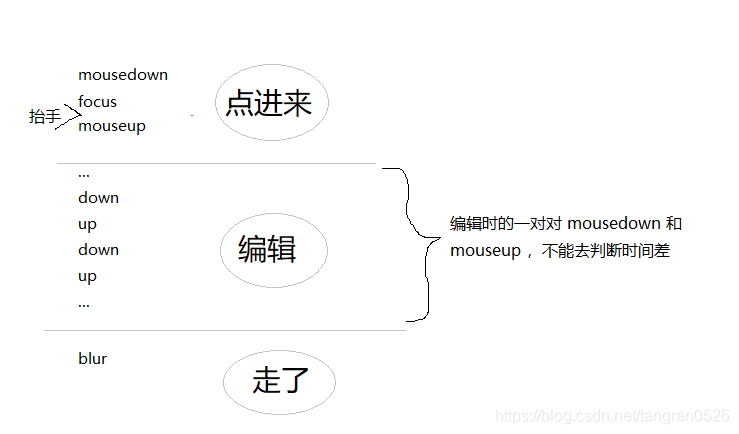

## 问题描述

正常情况下，对于文本框中的文字，可以通过鼠标拖拽选中


但是，当外层是可拖拽移动时，就会无法选中文字了：

（项目中拖拽组件用的是 vue-grid-layout，富文本用的是 tinymce）

## 思路

点击富文本后就进入了编辑文字的模式，此时要禁用外层的拖拽事件

#### 方案一：用 focus 和 blur （不可行）

- 在富文本的 focus 事件回调中，禁用外层拖拽；
- 在 blur 的事件回调中，启用外层拖拽

但实测发现，这种方案不可行。因为无论是点击 editor，还是拖拽 editor，都会触发 focus 事件。

#### 方案二：用 mousedown 和 mouseup 计算鼠标按下的时长

鼠标点击编辑器时，依次触发事件：



可以通过“鼠标按下的时间 `mouseup - mousedown` ”来区分：

- 这段时间 < 500ms，认为用户想点击进入编辑器。为了让用户可以在编辑器内部拖文字选中，要禁用外层的拖拽事件
- 这段时间 > 500ms，认为用户想拖拽。需要手动把编辑器 blur 掉

上面是基本思路，还有一些需要处理的逻辑，如下图

通过 focus 事件辅助判断，思路如下

- mousedown：记录按下鼠标的时间 time1
- focus：将 flag 置为 true
- mouseup：如果 flag 为 true，说明是“点进来”这个阶段，才需要去判断，然后立刻把 flag 改为 false

## 代码

```js
	data() {
	    return {
	      needCheckMouseUpTime: false, // 也就是上面说的flag
	      mouseDownTime: undefined,
	    }
	  },
	// 绑定事件
	editor.on('mousedown', e => {
       this.mouseDownTime = +new Date()
     })
     editor.on('focus', e => {
       this.needCheckMouseUpTime = true
     })
     editor.on('mouseup', e => {
       if (this.needCheckMouseUpTime) {
         const now = +new Date()
         const time = now - this.mouseDownTime
         if (time > 500) {
           // 鼠标按下的时间长于500ms，认为用户是想拖拽
           this.option.isDraggable = true
           this.$nextTick(() => {
             this.$refs.editor.element.blur()
           })
         } else {
           this.option.isDraggable = false
         }
         this.needCheckMouseUpTime = false
       }
     })
     editor.on('blur', e => {
       this.option.isDraggable = true
     })
```
