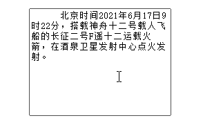
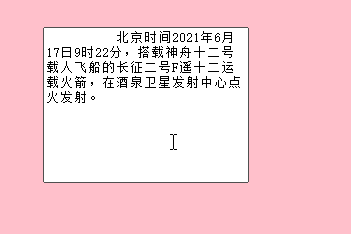
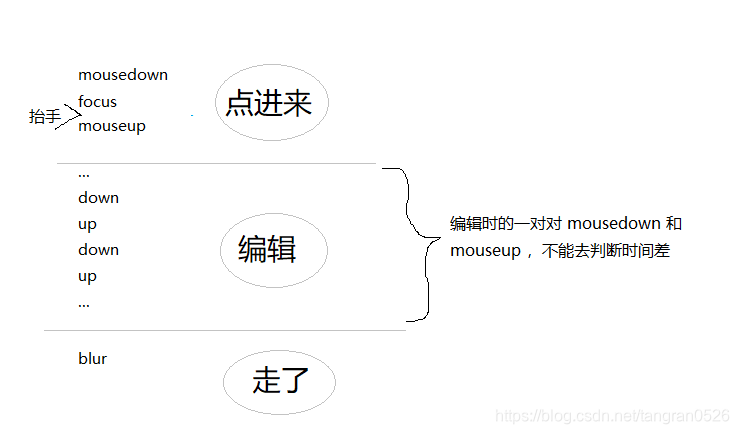

## 问题描述

正常情况下，对于文本框中的文字，可以通过鼠标拖拽选中



但是，当外层是可拖拽移动时，就会无法选中文字了：



（项目中拖拽组件用的是 vue-grid-layout，富文本用的是 tinymce）

## 思路

点击富文本后就进入了编辑文字的模式，此时要禁用外层的拖拽事件

###### 方案一：用 focus 和 blur （不可行）

- 在富文本的 focus 事件回调中，禁用外层拖拽；
- 在 blur 的事件回调中，启用外层拖拽

但实测发现，这种方案不可行。因为无论是点击 editor，还是拖拽 editor，都会触发 focus 事件。

###### 方案二：用 mousedown 和 mouseup 计算鼠标按下的时长

鼠标点击编辑器时事件顺序：按下 -> `mousedown` -> `focus` -> 抬起 -> `mouseup`

可以通过鼠标按下的持续时间来区分，即 `mouseup - mousedown`：

- 持续时间 < 500ms，认为用户想点击进入编辑器。为了让用户可以在编辑器内部拖文字选中，要禁用外层的拖拽事件
- 持续时间 > 500ms，认为用户想拖拽。需要手动把编辑器 blur 掉

上面是基本思路，还有一些需要处理的逻辑，如下图



通过 focus 事件辅助判断，思路如下

- mousedown：记录按下鼠标的时间 time1
- focus：将 flag 置为 true
- mouseup：如果 flag 为 true，说明是“点进来”这个阶段，才需要去判断，然后立刻把 flag 改为 false

## 代码

```js
let needCheckMouseUpTime = false; // 也就是上面说的flag
let mouseDownTime = undefined;

// 绑定事件
editor.on("mousedown", (e) => {
  mouseDownTime = +new Date();
});
editor.on("focus", (e) => {
  needCheckMouseUpTime = true;
});
editor.on("mouseup", (e) => {
  if (needCheckMouseUpTime) {
    const now = +new Date();
    const time = now - mouseDownTime;
    if (time > 500) {
      // 鼠标按下的时间长于500ms，认为用户是想拖拽
      setIsDraggable(true);
      this.$nextTick(() => {
        this.$refs.editor.element.blur();
      });
    } else {
      setIsDraggable(false);
    }
    needCheckMouseUpTime = false;
  }
});
editor.on("blur", (e) => {
  setIsDraggable(true);
});
```
