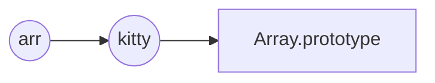

###### 1 判断调用构造函数时，有没有用 `new`

```js
function Person() {
  console.log(this, this instanceof Person);
}
Person(); // Window{},false
new Person(); // Person{},true
```

###### 2 给对象添加一个只读的属性

[API](https://developer.mozilla.org/zh-CN/docs/Web/JavaScript/Reference/Global_Objects/Object/defineProperty)

```js
let data = {};
Object.defineProperty(data, "name", {
  get: function () {
    return "emily";
  },
  set: function () {
    alert("不能改！");
  },
});

console.log(data.name); // "emily"
data.name = "john"; // 弹出："不能改"
console.log(data.name); // "emily"
```

###### 3 浏览器性能

[API](https://developer.mozilla.org/zh-CN/docs/Web/API/Window/performance)

获取：`getEntries({筛选条件})`，返回一个数组，按照`startTime`升序

```js
console.log(performance.getEntries({entryType: "mark"))
```

打点：`mark()` `measure()` 。打点后不手动清除的话会一直存在，用`getEntries()`可以获取。

```js
performance.mark("mark1-start");
// ...操作
performance.mark("mark1-end");
performance.measure("mark1", "mark1-start", "mark1-end");
```

移除打的点：`clearMarks()` `clearMeasures()`

```js
performance.clearMarks("mark1-start"); // 只清除"mark1-start"
performance.clearMarks(); // 清除全部mark
performance.clearMeasures("mark1");
performance.clearMeasures();
```

返回渲染开始时间（the performance measurement 开始的时间）：

```js
console.log(performance.timeOrigin);
```

上面都是关于时间的，空间的也有：查看内存使用率（非标准，仅 chrome 有）：

```js
console.log(performance.memory);
```

###### 4 Proxy

[API](https://developer.mozilla.org/zh-CN/docs/Web/JavaScript/Reference/Global_Objects/Proxy)

```js
var obj = {
  age: 19,
  jobList: [],
  latestJob: "",
};
let proxy = new Proxy(obj, {
  get(obj, prop) {
    if (!obj.hasOwnProperty(prop)) {
      throw new Error(`不存在${prop}属性！`);
    }
    return obj[prop];
  },
  set(obj, prop, value) {
    if (!obj.hasOwnProperty(prop)) {
      throw new Error(`不允许设置新属性${prop}！`);
    }
    switch (prop) {
      case "age":
        if (typeof value === "number") {
          obj.age = value;
        } else {
          throw new Error(`属性age必须为数字！`);
        }
        break;
      case "jobList":
        if (Array.isArray(value)) {
          obj.jobList = [...value];
          obj.latestJob = obj.jobList[obj.jobList.length - 1] || "";
        } else if (typeof value === "string") {
          obj.jobList = [value];
          obj.latestJob = value;
        } else {
          throw new Error(`属性jobList必须为数组或者字符串！`);
        }
        break;
      case "latestJob":
        if (typeof value === "string") {
          obj.latestJob = value;
          obj.jobList.push(obj.latestJob);
        } else {
          throw new Error(`属性latestJob必须为字符串！`);
        }
        break;
    }
  },
});
```

###### 5 判断两个值是否相等，要小心 NaN

出处：src/core/observer/index.js 的 `defineReactive()`：

```js
// 判断 newVal 和 value 是否相等的
if (newVal === value || (newVal !== newVal && value !== value)) {
  return;
}
```

`newVal !== newVal && value !== value` 这一句是用来处理 NaN 的。

在 js 中只有 NaN 是和自身不等的。如果 newVal 和 value 都是 NaN，那么 `newVal === value` 的结果是 false ，会进 `(newVal !== newVal && value !== value)`，结果是 true。

###### 6 Object.create()

`Object.create()` 方法创建一个新对象，使用现有的对象来提供新创建的对象的**proto**
[API](https://developer.mozilla.org/zh-CN/docs/Web/JavaScript/Reference/Global_Objects/Object/create)

```js
function Person(num) {
  this.num = num;
}
Person.prototype.MAX = 99;

const p1 = new Person(5);
const p2 = Object.create(Person.prototype);

console.log(p1.__proto__ === Person.prototype); // true
console.log(p2.__proto__ === Person.prototype); // true

console.log(p1.num, p1.MAX, p2.num, p2.MAX); // 5 99 undefined 99
```

用 Object.create() 实现对 push 的拦截：（Vue 中就是用这个思路实现对数组方法的拦截，拦截是为了触发依赖）

```js
let kitty = Object.create(Array.prototype);
kitty.push = function (...args) {
  console.log("push了！");
  Array.prototype.push.apply(this, args);
};
const arr = [];
arr.__proto__ = kitty;
```

原型链：（通过 `__proto__` 属性连接）


