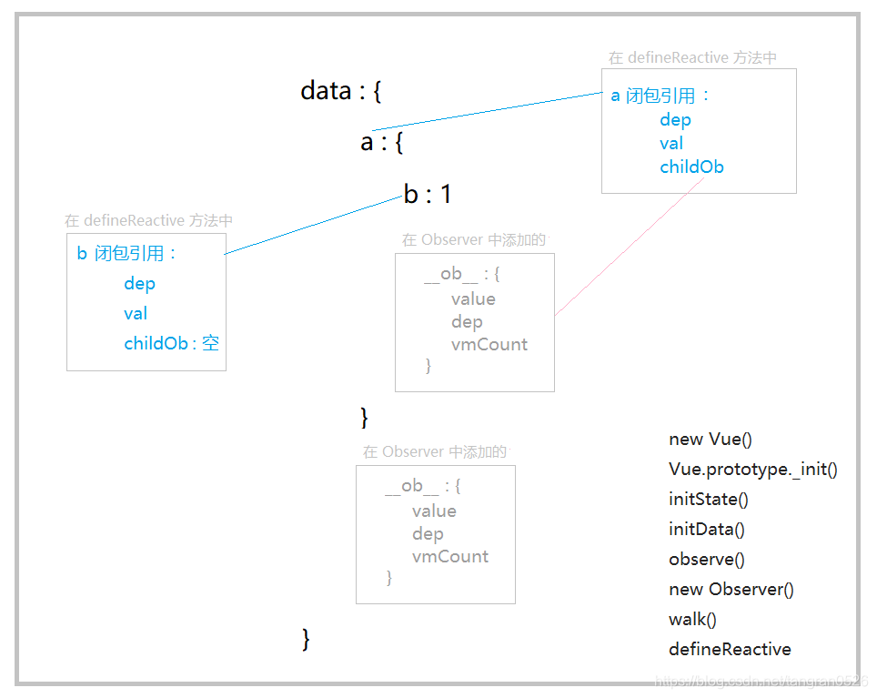
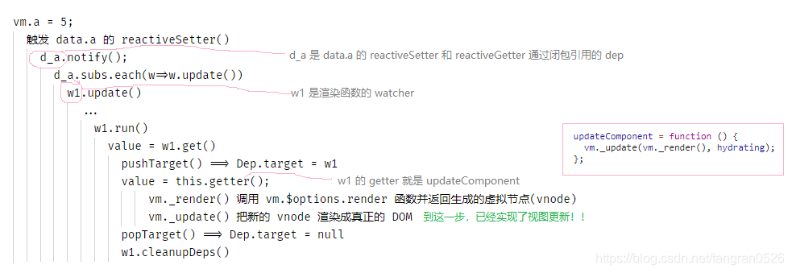
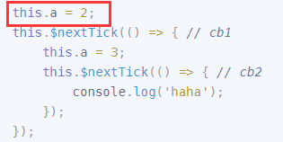
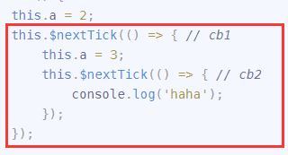
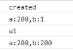
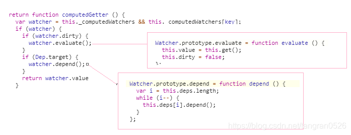
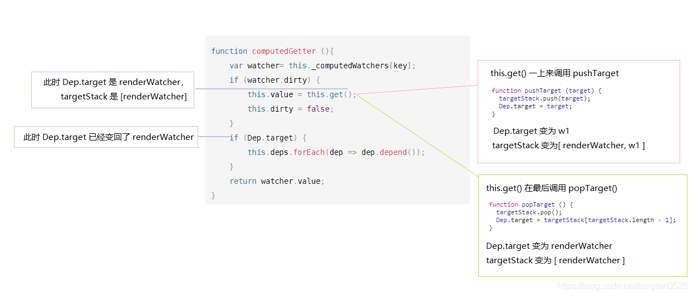
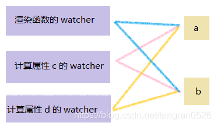

（给自己学源码的过程做个记录）

# Vue 的初始化

```js
Vue.prototype._init = function (options?: Object) {
  const vm: Component = this;

  vm._uid = uid++;

  vm._isVue = true;
  if (options && options._isComponent) {
    initInternalComponent(vm, options);
  } else {
    vm.$options = mergeOptions(resolveConstructorOptions(vm.constructor), options || {}, vm);
  }

  if (process.env.NODE_ENV !== "production") {
    // 设置渲染函数的作用域代理，其目的是为我们提供更好的提示信息
    initProxy(vm);
  } else {
    vm._renderProxy = vm;
  }

  vm._self = vm;
  initLifecycle(vm);
  initEvents(vm);
  initRender(vm);

  callHook(vm, "beforeCreate");
  initInjections(vm);
  initState(vm); // 包括 initProps、initMethods、initData、initComputed 以及 initWatch
  initProvide(vm);
  callHook(vm, "created");

  if (vm.$options.el) {
    vm.$mount(vm.$options.el);
  }
};
```

## Vue 选项的合并

```js
// 在 Vue.prototype._init_() 中：
vm.$options = mergeOptions(resolveConstructorOptions(vm.constructor), options || {}, vm);
```

```js
function mergeOptions() {
  // ...对选项进行规范化处理
  var options = {};
  var key;
  for (key in parent) {
    mergeField(key);
  }
  for (key in child) {
    if (!hasOwn(parent, key)) {
      mergeField(key);
    }
  }
  function mergeField(key) {
    var strat = strats[key] || defaultStrat;
    options[key] = strat(parent[key], child[key], vm, key);
  }
  return options;
}
```

### 在策略函数中通过判断 vm 是否存在，可以知道是创建实例，还是创建子类

使用 new 操作符创建实例：（可能是 `new Vue()`，也可能是 `new Sub()`）

```js
// _init 方法中调用 mergeOptions 函数，传递了 vm
vm.$options = mergeOptions(resolveConstructorOptions(vm.constructor), options || {}, vm);
```

使用 Vue.extend() 来创建子类：

```js
// Vue.extend 方法中调用 mergeOptions 函数，不传 vm
Sub.options = mergeOptions(Super.options, extendOptions);
```

### 选项 data 的合并策略

在合并阶段 strats.data 将被处理成一个函数。

这个函数并没有立即执行，而是到了后面初始化的阶段才执行的。这样做的原因是：在后面的初始化阶段中，是先初始化 inject 和 props ，再初始化 data 的，这就保证了我们能够使用 props 初始化 data 中的数据。

### 合并策略总结

- 对于 `el`、`propsData` 选项使用默认的合并策略 defaultStrat。
- 对于 `data` 选项，使用 mergeDataOrFn 函数进行处理，最终结果是 data 选项将变成一个函数，且该函数的执行结果为真正的数据对象。
- 对于 `生命周期钩子` 选项，将合并成数组，使得父子选项中的钩子函数都能够被执行
- 对于 `directives`、`filters` 以及 `components` 等资源选项，父子选项将以原型链的形式被处理，正是因为这样我们才能够在任何地方都使用内置组件、指令等。
- 对于 `watch` 选项的合并处理，类似于生命周期钩子，如果父子选项都有相同的观测字段，将被合并为数组，这样观察者都将被执行。
- 对于 `props`、`methods`、`inject`、`computed` 选项，父选项始终可用，但是子选项会覆盖同名的父选项字段。
- 对于 `provide` 选项，其合并策略使用与 data 选项相同的 mergeDataOrFn 函数。
- 最后，以上没有提及到的选项都将使默认选项 defaultStrat ：只要子选项不是 undefined 就使用子选项，否则使用父选项。

## 设置渲染函数的作用域代理

目的是为我们提供更好的提示信息

```js
// 在 Vue.prototype._init_() 中：
if (process.env.NODE_ENV !== "production") {
  initProxy(vm);
} else {
  vm._renderProxy = vm;
}
```

```js
// 在 在 /core/instance/proxy.js 中：
initProxy = function initProxy(vm) {
  if (hasProxy) {
    const options = vm.$options;
    // options.render._withStripped 这个属性只在测试代码中出现过，所以一般情况下这个条件都会为假，也就是使用 hasHandler 作为代理配置。
    const handlers = options.render && options.render._withStripped ? getHandler : hasHandler;
    vm._renderProxy = new Proxy(vm, handlers);
  } else {
    vm._renderProxy = vm;
  }
};
```

has 可以拦截以下操作：

- 属性查询: foo in proxy
- 继承属性查询: foo in Object.create(proxy)
- with 检查: with(proxy) { (foo); }
- Reflect.has()

**关键点就在 has 可以拦截 with 语句块里对变量的访问。渲染函数中用到了 with。**

```js
const hasHandler = {
  has(target, key) {
    const has = key in target;
    const isAllowed =
      allowedGlobals(key) ||
      (typeof key === "string" && key.charAt(0) === "_" && !(key in target.$data));
    if (!has && !isAllowed) {
      if (key in target.$data) warnReservedPrefix(target, key);
      else warnNonPresent(target, key);
    }
    return has || !isAllowed;
  },
};
```

- 在模版中可以用 parseInt，因为在 allowedGlobals 中
- 假如在 data 中定义了属性 *test，那么在模版中不能通过 \_test 访问（因为是以*开头的），只能通过 $data.\_test 访问

## initLifecycle

```js
export function initLifecycle(vm: Component) {
  const options = vm.$options;

  // locate first non-abstract parent
  let parent = options.parent; // 这里的 options.parent 是哪里来的呢？
  if (parent && !options.abstract) {
    while (parent.$options.abstract && parent.$parent) {
      parent = parent.$parent;
    }
    parent.$children.push(vm);
  }

  vm.$parent = parent;
  vm.$root = parent ? parent.$root : vm;

  vm.$children = [];
  vm.$refs = {};

  vm._watcher = null;
  vm._inactive = null;
  vm._directInactive = false;
  vm._isMounted = false;
  vm._isDestroyed = false;
  vm._isBeingDestroyed = false;
}
```

### vm.$options.parent 是哪里来的呢？

```js
// 子组件本身并没有指定 parent 选项
var ChildComponent = {
  created() {
    // 但是在子组件中访问父实例，能够找到正确的父实例引用
    console.log(this.$options.parent);
  },
};

var vm = new Vue({
  el: "#app",
  components: {
    // 注册组件
    ChildComponent,
  },
  data: {
    test: 1,
  },
});
```

Vue 在寻找父实例的时候是自动检测的。

上面的代码中，我们的子组件 ChildComponent 说白了就是一个 json 对象，或者叫做组件选项对象，在父组件的 components 选项中把这个子组件选项对象注册了进去，实际上在 Vue 内部，会首先以子组件选项对象作为参数通过 Vue.extend 函数创建一个子类出来，然后再通过实例化子类来创建子组件，而 createComponentInstanceForVnode 函数的作用，在这里大家就可以简单理解为实例化子组件，只不过这个过程是在虚拟 DOM 的 patch 算法中进行的

```js
// createComponentInstanceForVnode 的第二个参数就是 parent
const child = (vnode.componentInstance = createComponentInstanceForVnode(
  vnode,
  activeInstance,
  parentElm,
  refElm
));
```

activeInstance 这个变量将总是保存着当前正在渲染的实例的引用

### 抽象组件

特点：

1. 一般不渲染真实 DOM
2. 不出现在父子关系的路径上

Vue 内置的 keep-alive 和 transition 就是抽象组件。

## initState

在 Vue.prototype._init_() 中：

```js
callHook(vm, "beforeCreate");
initInjections(vm); // resolve injections before data/props
initState(vm);
initProvide(vm); // resolve provide after data/props
callHook(vm, "created");
```

```js
export function initState(vm: Component) {
  vm._watchers = [];
  const opts = vm.$options;
  if (opts.props) initProps(vm, opts.props);
  if (opts.methods) initMethods(vm, opts.methods);
  if (opts.data) {
    initData(vm);
  } else {
    observe((vm._data = {}), true /* asRootData */);
  }
  if (opts.computed) initComputed(vm, opts.computed);
  if (opts.watch && opts.watch !== nativeWatch) {
    initWatch(vm, opts.watch);
  }
}
```

---

# 数据响应系统

## 数据响应系统的基本思路

```js
const data = {
  name: "emily",
  age: 13,
  info: {
    message: "你好",
  },
};
let Target = null;
walk(data);
function walk(obj) {
  for (let key in obj) {
    const deps = [];
    let val = obj[key];
    if (Object.prototype.toString.call(val) === "[object Object]") {
      walk(val);
    }
    Object.defineProperty(obj, key, {
      get() {
        deps.push(Target);
        return val;
      },
      set(newValue) {
        if (val === newValue) {
          return;
        }
        let oldVal = val;
        val = newValue;
        deps.forEach((dep) => dep(val, oldVal));
      },
    });
  }
}

function $watch(expOrFn, cb) {
  if (typeof expOrFn === "function") {
    Target = cb;
    expOrFn();
  } else if (typeof expOrFn === "string") {
    Target = cb;
    let arr = expOrFn.split(".");
    let obj = data;
    for (let i = 0; i <= arr.length - 1; i++) {
      obj = obj[arr[i]];
    }
  }
}

$watch("name", (val, oldVal) => {
  alert(`name 由 ${oldVal} 变化为 ${val}`);
});

$watch("info.message", (val, oldVal) => {
  alert(`info.message 由 ${oldVal} 变化为 ${val}`);
});

function render() {
  document.body.innerHTML = `${data.name}今年${data.age}岁，${data.info.message}`;
}

$watch(render, render);
```

## Observer


```js
// 在 Vue.prototype._init() 中：
initLifecycle(vm);
initEvents(vm);
initRender(vm);
callHook(vm, "beforeCreate");
initInjections(vm); // resolve injections before data/props
initState(vm);
initProvide(vm); // resolve provide after data/props
callHook(vm, "created");
```


```js
export function initState(vm: Component) {
  vm._watchers = [];
  const opts = vm.$options;
  if (opts.props) initProps(vm, opts.props);
  if (opts.methods) initMethods(vm, opts.methods);
  if (opts.data) {
    initData(vm);
  } else {
    observe((vm._data = {}), true /* asRootData */);
  }
  if (opts.computed) initComputed(vm, opts.computed);
  if (opts.watch && opts.watch !== nativeWatch) {
    initWatch(vm, opts.watch);
  }
}
```


```js
/* initData 的作用：
 根据 vm.$options.data() 获取数据 vm._data
 校验 vm._data 是否是一个纯对象
 检查 vm._data 上的键是否与 props 、methods 对象上的键冲突
 在 Vue 实例对象上添加代理访问数据对象的同名属性
 最后调用 observe 函数开启响应式之路
*/

function initData(vm: Component) {
  let data = vm.$options.data;

  // 经过 mergeOptions 函数处理后 data 选项必然是一个函数，为什么这里还要判断？
  // 是为了防止开发者在 beforeCreate 中修改了 vm.$options.data 的值
  data = vm._data = typeof data === "function" ? getData(data, vm) : data || {};

  if (!isPlainObject(data)) {
    data = {};
    process.env.NODE_ENV !== "production" &&
      warn(
        "data functions should return an object:\n" +
          "https://vuejs.org/v2/guide/components.html#data-Must-Be-a-Function",
        vm
      );
  }
  // proxy data on instance
  const keys = Object.keys(data);
  const props = vm.$options.props;
  const methods = vm.$options.methods;
  let i = keys.length;
  while (i--) {
    const key = keys[i];
    if (process.env.NODE_ENV !== "production") {
      // data 和 methods 中不能有重名的 key
      if (methods && hasOwn(methods, key)) {
        warn(`Method "${key}" has already been defined as a data property.`, vm);
      }
    }
    // data 和 props 中不能有重名的 key
    if (props && hasOwn(props, key)) {
      process.env.NODE_ENV !== "production" &&
        warn(
          `The data property "${key}" is already declared as a prop. ` +
            `Use prop default value instead.`,
          vm
        );
    } else if (!isReserved(key)) {
      // isReserved 判断是否以 $ 或 _ 开头。Vue 是不会代理那些键名以 $ 或 _ 开头的字段的，因为 Vue 自身的属性和方法都是以 $ 或 _ 开头的，所以这么做是为了避免与 Vue 自身的属性和方法相冲突。
      // 没有和 props 重名，并且不以$和_开头的key，进行代理。
      // proxy 函数的原理是通过 Object.defineProperty 函数在实例对象 vm 上定义与 data 数据字段同名的访问器属性，并且这些属性代理的值是 vm._data 上对应属性的值。
      /* 举例：当我们访问 ins.a 时实际访问的是 ins._data.a。而 ins._data 才是真正的数据对象。
			const ins = new Vue ({ data: { a: 1 } }) */
      proxy(vm, `_data`, key);
    }
  }
  // observe data
  // 将数据转换成响应式的
  observe(data, true /* asRootData */);
}
```


```js
function observe(value, asRootData) {
  if (!isObject(value) || value instanceof VNode) {
    return;
  }
  var ob;
  // 当一个数据对象被观测之后将会在该对象上定义 __ob__ 属性，所以 if 分支是用来避免重复观测
  if (hasOwn(value, "__ob__") && value.__ob__ instanceof Observer) {
    ob = value.__ob__;
  } else if (
    shouldObserve &&
    !isServerRendering() &&
    (Array.isArray(value) || isPlainObject(value)) &&
    Object.isExtensible(value) &&
    !value._isVue
  ) {
    ob = new Observer(value);
  }
  if (asRootData && ob) {
    ob.vmCount++;
  }
  return ob;
}
```


```js
export class Observer {
  value: any;
  dep: Dep;
  vmCount: number; // number of vms that has this object as root $data

  constructor(value: any) {
    this.value = value;
    this.dep = new Dep();
    this.vmCount = 0;
    def(value, "__ob__", this);
    if (Array.isArray(value)) {
      protoAugment(value, arrayMethods, arrayKeys);
      this.observeArray(value);
    } else {
      this.walk(value);
    }
  }

  walk(obj: Object) {
    const keys = Object.keys(obj);
    for (let i = 0; i < keys.length; i++) {
      defineReactive(obj, keys[i]);
    }
  }

  observeArray(items: Array<any>) {
    for (var i = 0, l = items.length; i < l; i++) {
      observe(items[i]);
    }
  }
}
```

Vue 对于对象和数组的监测方式是不同的

- 对象：为每个属性调用 `defineReactive` 方法（ 用 Object.defineProperty 来给每一个属性值设置 getter setter）

- 数组：通过拦截数组变异方法来实现监测。（变异方法：会改变数组的值的方法，包括 push、pop、shift、unshift、splice、sort 以及 reverse 等）

### 观测对象 - defineReactive

defineReactive 的核心：将对象的属性转换为访问器属性，即为对象的属性设置一对 getter/setter。（每对 getter 和 setter 都通过闭包引用着属于这个字段的 dep、val 和 childOb）

- getter 中要返回值+收集依赖
- setter 中要设置值+触发依赖

```js
export function defineReactive (obj,key) {
  const dep = new Dep()
  var val = obj[key];
  var childOb = observe(val);
  Object.defineProperty(obj, key, {
	get: function reactiveGetter () {
		var value = val;
		if (Dep.target) {
		  dep.depend();
		  if (childOb) {
		    childOb.dep.depend();
		  }
		}
		return value
	}
	set: function reactiveSetter (newVal) {
	   val = newVal;
	   childOb = observe(newVal);
	   dep.notify();
	 }
	});
  })
}
```

#### 被观测后的数据对象的样子

```js
const data = {
  a: {
    b: 1,
  },
};
```



#### getter ： 返回值 + 收集依赖

```js
	get: function reactiveGetter () {
	   var value = getter ? getter.call(obj) : val;
	     if (Dep.target) {
	       dep.depend();
	       if (childOb) {
	         childOb.dep.depend();
	         if (Array.isArray(value)) {
	           dependArray(value);
	         }
	       }
	     }
	     return value
	   },
```

##### `childOb.dep.depend()` 的作用是什么

要结合上面的例子和图去理解：

```js
data: {
  a: {
    b: 1;
  }
}
```

如果读取了 data.a 的值，那么依赖会被收集到两个 dep 中：

1. `data.a` 的 getter/setter 通过闭包引用的 `dep`
   触发时机：修改 data.a 时会进入 setter ，从而触发
2. `data.a.childOb.dep` 即 `data.a.__ob__.dep`
   触发时机：使用 Vue.set() 和 Vue.delete() 添加、删除属性时，触发依赖

   ```js
   Vue.set = function (obj, key, val) {
     defineReactive(obj, key, val);
     obj.__ob__.dep.notify();
   };
   ```

   所以当我们给 data.a 添加属性时

   ```js
   Vue.set(data.a, "c", 1);
   ```

   之所以能够触发依赖，就是因为 Vue.set 函数中触发了收集在 `data.a.__ob__.dep` 这个”筐“中的依赖：

   ```js
   Vue.set = function (obj, key, val) {
     defineReactive(obj, key, val);
     obj.__ob__.dep.notify(); // 相当于 data.a.__ob__.dep.notify()
   };

   Vue.set(data.a, "c", 1);
   ```

   所以 `__ob__` 属性以及` __ob__.dep` 的主要作用是为了添加、删除属性时有能力触发依赖，而这就是 Vue.set 或 Vue.delete 的原理。

##### `dependArray()` 的作用是什么

如果读取的属性值是数组，那么需要调用 dependArray 函数逐个触发数组每个元素的依赖收集

#### setter ： 设置值 + 触发依赖更新

```js
set: function reactiveSetter(newVal) {
  var value = getter ? getter.call(obj) : val;
  if (newVal === value || (newVal !== newVal && value !== value)) {
    // NaN 和自身不等
    return;
  }
  if (setter) {
    setter.call(obj, newVal);
  } else {
    val = newVal;
  }
  childOb = !shallow && observe(newVal);
  dep.notify();
}
```

### 观测数组 - 拦截数组变异方法

对于数组，是通过拦截数组变异方法来实现监测

变异方法：会改变数组的值的方法，包括 push、pop、shift、unshift、splice、sort 以及 reverse 等

比如，有一个数组 `arr:[{a:1},"emily"}` 。拦截 arr 的变异方法，手动触发依赖。并 observe 数组中的每一项。
所以，修改数组时，必须使用 Vue 指定的变异方法，或者 Vue.set() Vue.delete。通过索引修改数组项，或者通过 length 属性修改数组长度，都不会触发依赖更新。

```html
<div id="app">{{arr}}</div>
<script>
  const vm = new Vue({
    el: "#app",
    data: {
      arr: [{ a: 1 }, "emily"],
    },
  });
</script>
```

```js
vm.arr[0].a = 2; // ok 因为是修改{a:1}这个对象中属性a的值，属于对象监测，会触发 a 的 setter，从而触发依赖

vm.arr[0] = 3; // 不ok 通过索引改数组中的项，不会触发 arr 的 setter，不会触发依赖更新
Vue.set(vm.arr, 0, 5); // ok Vue.set()内部会触发依赖更新
```

## Vue.set 和 Vue.delete

### Vue.set

```js
function set(target, key, val) {
  if (isUndef(target) || isPrimitive(target)) {
    warn("Cannot set reactive property on undefined, null, or primitive value: " + target);
  }
  if (Array.isArray(target) && isValidArrayIndex(key)) {
    target.length = Math.max(target.length, key);
    target.splice(key, 1, val); // splice 这个变异方法已经被 Vue 拦截了，可以触发依赖更新
    return val;
  }
  if (key in target && !(key in Object.prototype)) {
    target[key] = val;
    return val;
  }
  var ob = target.__ob__;
  // target._isVue 说明是 Vue 实例
  // ob.vmCount>0 说明是根数据对象
  if (target._isVue || (ob && ob.vmCount)) {
    warn(
      "Avoid adding reactive properties to a Vue instance or its root $data " +
        "at runtime - declare it upfront in the data option."
    );
    return val;
  }
  if (!ob) {
    target[key] = val;
    return val;
  }
  defineReactive(ob.value, key, val);
  ob.dep.notify();
  return val;
}
```

### Vue.delete

```js
function del(target, key) {
  if (isUndef(target) || isPrimitive(target)) {
    warn("Cannot delete reactive property on undefined, null, or primitive value: " + target);
  }
  if (Array.isArray(target) && isValidArrayIndex(key)) {
    target.splice(key, 1); // 还是利用 splice
    return;
  }
  var ob = target.__ob__;
  if (target._isVue || (ob && ob.vmCount)) {
    warn(
      "Avoid deleting properties on a Vue instance or its root $data " + "- just set it to null."
    );
    return;
  }
  if (!hasOwn(target, key)) {
    return;
  }
  delete target[key];
  if (!ob) {
    return;
  }
  ob.dep.notify();
}
```

---

# 渲染函数的观察者

## $mount 挂载函数

- runtime 版本中的 $mount ：（出处：src/platforms/web/runtime/index.js）
  ```js
  Vue.prototype.$mount = function (el?: string | Element, hydrating?: boolean): Component {
    el = el && inBrowser ? query(el) : undefined; // el 被处理成 DOM 元素了
    return mountComponent(this, el, hydrating);
  };
  ```
- runtime-with-compiler 版本中的 $mount ：（出处：src/platforms/web/entry-runtime-with-compiler.js）

  ```js
  const mount = Vue.prototype.$mount
  Vue.prototype.$mount = function (
    el?: string | Element,
    hydrating?: boolean
  ): Component {
    el = el && query(el)

    const options = this.$options
    // resolve template/el and convert to render function
    if (!options.render) {
      let template = options.template
      if (template) {
        // template 可以是字符串。
        // 如果是以`#`开头，那么就当作 id 去拿到对应的 DOM 元素，然后取 innerHTML
        if (typeof template === 'string') {
          if (template.charAt(0) === '#') {
            template = idToTemplate(template)
          }
        } else if (template.nodeType) {
        	// template 也可以就是一个 DOM 元素，取 innerHTML
          template = template.innerHTML
        }
      } else if (el) {
        // vm.$options.template 不存在的话，才从 el 中取值。
        // el 在方法的第一行已经处理为 DOM 元素了，取 outerHTML
        template = getOuterHTML(el)
      }
      // 经过上面的代码，template 被处理成 HTML 内容字符串，但是可能为空。
      if (template) {
        const { render, staticRenderFns } = compileToFunctions(template,......)
        options.render = render
        options.staticRenderFns = staticRenderFns
      }
    }
    return mount.call(this, el, hydrating)
  }
  ```

  带 compiler 的版本，在 mount 前多了一步获取 render 。获取 render 的优先级是： render > template > el

  vm.$options.render 不存在时，根据 template 或 el 设置 template 的值，然后使用`compileToFunctions(template,...)` 获取 render 。

  例：可以在 template 中传 `#id`，要注意这时候取的是 innerHTML

  ```html
  <div id="app"></div>
  <div id="pencil" style="display: none;">
    <section>铅笔<span>{{test}}</span></section>
  </div>
  <script>
    const vm = new Vue({
      el: "#app",
      data: {
        test: 1,
      },
      template: "#pencil",
    });
  </script>
  ```

  渲染结果是：
  

无论是 runtime 版本，还是 runtime-with-compiler 版本， $mount 函数最终都将通过 mountComponent 函数去真正的挂载组件

## 渲染函数的观察者

```js
export function mountComponent(vm: Component, el: ?Element, hydrating?: boolean): Component {
  // 这里仅仅是暂时赋值而已，这是为了给虚拟DOM的 patch 算法使用的，实际上 vm.$el 会在后面的 _update() 中被 patch 算法的返回值重写。
  vm.$el = el;

  callHook(vm, "beforeMount");

  // 定义并初始化 updateComponent 方法，但不执行
  let updateComponent = () => {
    // vm._render() : 调用 vm.$options.render 函数并返回生成的虚拟节点(vnode)
    // vm._update() : 把 vm._render 函数生成的虚拟节点渲染成真正的 DOM
    vm._update(vm._render(), hydrating);
  };

  new Watcher(
    vm,
    updateComponent,
    noop,
    {
      before() {
        if (vm._isMounted && !vm._isDestroyed) {
          callHook(vm, "beforeUpdate");
        }
      },
    },
    true
  );
  hydrating = false;

  if (vm.$vnode == null) {
    vm._isMounted = true;
    callHook(vm, "mounted");
  }
  return vm;
}
```

注意这一段，实例化了一个 Watcher，称为 **渲染函数的观察者**：

```js
new Watcher(
  vm,
  updateComponent,
  noop,
  {
    before() {
      if (vm._isMounted && !vm._isDestroyed) {
        callHook(vm, "beforeUpdate");
      }
    },
  },
  true
);
```

Watcher 的构造方法接收 5 个参数

```js
class Watcher {
  constructor(
    vm: Component,
    expOrFn: string | Function,
    cb: Function,
    options?: ?Object,
    isRenderWatcher?: boolean /* 是否为渲染函数的观察者。只有 mountComponent 才传 true */
  ) {}
}
```

- Watcher 实例初始化的时候，会将执行 updateComponent 方法。
  updateComponent() => vm.\_render() => vm.$options.render() => 触发数据属性的 getter , getter 中收集到依赖(观察者)。

- 当数据变化时，触发 setter , setter 中将重新执行所有依赖。这会触发重新求值，也就是说会调用 updateComponent 函数，这就完成了重新渲染。（所以 Watcher 的第三个参数 cb 传的是 noop ）

## Watcher

- lazy：是不是 lazy 求值？计算属性的 watcher 是 lazy 的，即在创建 watcher 的时候不计算 value，只有在使用到计算属性的值的时候，才进行计算。

- dirty：watcher 当前是不是没计算？lazy 的 watcher，创建时是 dirty 的。第一次使用到值时，计算值并将 dirty 改为 false

```js
class Watcher {
  constructor(
    vm: Component,
    expOrFn: string | Function,
    cb: Function,
    options?: ?Object,
    isRenderWatcher?: boolean
  ) {
    this.vm = vm;
    // isRenderWatcher 是否为渲染函数的观察者。只有在 mountComponent 中这个值才是 true。
    // 所以 vm._watcher 是当前实例对象的渲染函数的观察者
    if (isRenderWatcher) {
      vm._watcher = this;
    }
    // vm._watchers 属性是在 initState 函数中初始化的，其初始值是一个空数组。
    // vm._watchers 中包括当前实例对象 vm 的所有观察者，包括一个渲染函数的观察者，和非渲染函数的观察者。
    vm._watchers.push(this);

    if (options) {
      this.deep = !!options.deep; // 是深度观测吗
      // options.user 这个 Watcher 是开发者定义的吗
      // 开发者定义的 Watcher，options.user 会自动被设置为 true，如：Vue 的 watch 选项，Vue.$watch 等。
      // 内部定义的观察者：渲染函数的观察者、计算属性的观察者等。
      this.user = !!options.user;
      this.lazy = !!options.lazy; // 是惰性求值吗 （Vue 内部在实现计算属性这个功能时，创建的观察者是惰性的）
      this.sync = !!options.sync; // 当数据变化时是否同步求值并执行回调 默认情况下当数据变化时不会同步求值并执行回调，而是将需要重新求值并执行回调的观察者放到一个异步队列中，当所有数据的变化结束之后统一求值并执行回调。
      this.before = options.before; // 钩子。当数据变化之后，触发更新之前，调用 before 选项
    } else {
      this.deep = this.user = this.lazy = this.sync = false;
    }
    this.cb = cb;
    this.id = ++uid; // uid for batching
    this.active = true;
    this.dirty = this.lazy; // for lazy watchers

    // deps 和 depIds 是一组，存储上一次求值过程中，收集到的依赖。【用来避免重复求值时，重复收集依赖】
    // newDeps 和 newDepIds 是一组，存储当前求值过程中，收集到的依赖。【用来避免在一次求值中，重复收集依赖】
    // 每次求值结束之后，会 cleanupDeps()：①对比 deps 和 newDeps，移除无用依赖。②把 newDeps 的值赋给 deps③清空 newDeps。
    this.deps = [];
    this.newDeps = [];
    this.depIds = new Set();
    this.newDepIds = new Set();

    // parse expression for getter
    if (typeof expOrFn === "function") {
      this.getter = expOrFn;
    } else {
      this.getter = parsePath(expOrFn);
    }

    this.value = this.lazy ? undefined : this.get();
  }

  /**
   * Evaluate the getter, and re-collect dependencies.
   */
  get() {
    pushTarget(this);
    let value;
    const vm = this.vm;
    value = this.getter.call(vm, vm);
    // "touch" every property so they are all tracked as
    // dependencies for deep watching
    if (this.deep) {
      traverse(value);
    }
    popTarget();
    this.cleanupDeps();
    return value;
  }

  /**
   * Add a dependency to this directive.
   */
  addDep(dep: Dep) {
    const id = dep.id;
    if (!this.newDepIds.has(id)) {
      this.newDepIds.add(id);
      this.newDeps.push(dep);
      if (!this.depIds.has(id)) {
        dep.addSub(this);
      }
    }
  }

  /**
   * Clean up for dependency collection.
   */
  cleanupDeps() {
    // 对比 deps 和 newDeps，移除无用依赖。
    let i = this.deps.length;
    while (i--) {
      const dep = this.deps[i];
      if (!this.newDepIds.has(dep.id)) {
        dep.removeSub(this);
      }
    }
    // 把 newDeps 的值赋给deps
    let tmp = this.depIds;
    this.depIds = this.newDepIds;
    this.newDepIds = tmp;
    this.newDepIds.clear();
    tmp = this.deps;
    this.deps = this.newDeps;
    // 清空 newDeps。
    this.newDeps = tmp;
    this.newDeps.length = 0;
  }

  /**
   * Subscriber interface.
   * Will be called when a dependency changes.
   */
  update() {
    if (this.lazy) {
      this.dirty = true;
    } else if (this.sync) {
      this.run();
    } else {
      queueWatcher(this);
    }
  }

  /**
   * Scheduler job interface.
   * Will be called by the scheduler.
   */
  run() {
    if (this.active) {
      const value = this.get();
      if (
        value !== this.value ||
        // Deep watchers and watchers on Object/Arrays should fire even
        // when the value is the same, because the value may
        // have mutated.
        isObject(value) ||
        this.deep
      ) {
        // set new value
        const oldValue = this.value;
        this.value = value;

        this.cb.call(this.vm, value, oldValue);
      }
    }
  }

  /**
   * Evaluate the value of the watcher.
   * This only gets called for lazy watchers.
   */
  evaluate() {
    this.value = this.get();
    this.dirty = false;
  }

  /**
   * Depend on all deps collected by this watcher.
   */
  depend() {
    let i = this.deps.length;
    while (i--) {
      this.deps[i].depend();
    }
  }

  /**
   * Remove self from all dependencies' subscriber list.
   */
  teardown() {
    if (this.active) {
      // remove self from vm's watcher list
      // this is a somewhat expensive operation so we skip it
      // if the vm is being destroyed.
      if (!this.vm._isBeingDestroyed) {
        remove(this.vm._watchers, this);
      }
      let i = this.deps.length;
      while (i--) {
        this.deps[i].removeSub(this);
      }
      this.active = false;
    }
  }
}
```

### 例：$watch() 时，发生了什么

```html
<div id="app"></div>
<script>
  var vm = new Vue({
    el: "#app",
    data: {
      a: 1,
      b: 100,
    },
  });
  vm.$watch(
    function () {
      return this.a + this.b + this.a;
    },
    function () {
      console.log("happy");
    }
  );
  vm.a = 5;
</script>
```

`$watch()` 时，发生了什么：

`vm.a = 5` 时，发生了什么


### 例：template 中用到了 a。修改 a 的值时，发生了什么

```html
<div id="app">{{a}}</div>
<script>
  var vm = new Vue({
    el: "#app",
    data: {
      a: 1,
      b: 100,
    },
  });
  vm.a = 5;
</script>
```



### watcher.run()

```js
Watcher.prototype.run = function run() {
  if (this.active) {
    var value = this.get();
    // 对于渲染函数的观察者，this.get() 的返回值等价于 updateComponent() 的返回值是，这个值永远是 undefined。所以，渲染函数的观察者永远进不了下面的 if 语句。
    // 实际上 if 中的代码是为非渲染函数类型的观察者准备的，它用来对比新旧两次求值的结果，当值不相等的时候会调用通过参数传递进来的回调。
    if (
      value !== this.value ||
      // Deep watchers and watchers on Object/Arrays should fire even
      // when the value is the same, because the value may
      // have mutated.
      isObject(value) ||
      this.deep
    ) {
      // set new value
      var oldValue = this.value;
      this.value = value;
      this.cb.call(this.vm, value, oldValue);
    }
  }
};
```

## 异步更新队列

### 概述

属性值 a 发生变化时，触发 a 的 reactiveSetter，a 的所有依赖（也就是观察者 watcher）都触发更新。

默认，watcher 是异步更新的。真正的更新操作是 run 方法。同步更新时直接调用 run()；异步更新调用 queueWatcher，但最终还是调用 run()

```js
Watcher.prototype.update = function ()
  if (this.sync) {
    this.run()
  } else {
    queueWatcher(this)
  }
}
```

调用 queueWatcher 把 watcher 放到 queue 中排队，等待执行。
在第一个 watcher 入队时，调用 `nextTick()` 把 flushSchedulerQueue 放到任务队列中。（nextTick 的作用可以简单理解为 setTimeout。在所有同步代码执行完毕之后，才会执行 flushSchedulerQueue ）

```js
function queueWatcher(watcher) {
	queue.push(watcher)
	if ( 是第一个进入 queue 的 watcher ) {
		nextTick(flushSchedulerQueue)
	}
}
```

所有同步代码都执行完毕，执行任务队列中的 flushSchedulerQueue：一次性执行队列中所有 watcher 的 run 方法，然后清空队列

```js
function flushSchedulerQueue() {
  queue.forEach((watcher) => {
    watcher.run();
  });
  queue.length = 0;
}
```

### 为什么要异步更新？

- 同步更新：属性值变化后，立刻重新求值完成更新操作。如果同时修改很多属性的值，那么每个属性值的变化都会导致重新渲染，很慢，而且很多是无用功。

- 异步更新：属性值变化后，不立即重新求值，而是将需要执行更新操作的观察者 watcher 放入一个队列中。当所有的修改操作完成之后，再一次性的执行队列中所有 watcher 的更新方法，同时清空队列。

上面说的重新求值，指的是 `watcher.run()`：

```js
Watcher.prototype.update = function ()
  if (this.computed) {
    // 省略...
  } else if (this.sync) {
    this.run()
  } else {
    queueWatcher(this)
  }
}
```

### queueWatcher

异步更新是通过调用 queueWatcher 来实现的：

- 把观察者放到 queue 中。
- 在第一个观察者入队时，调用 `nextTick(flushSchedulerQueue)`。这样在所有同步代码执行完成后，就会执行 flushSchedulerQueue

```js
function queueWatcher(watcher: Watcher) {
  const id = watcher.id;
  if (has[id] == null) {
    // 避免同一个观察者 watcher 重复入队
    has[id] = true;
    if (!flushing) {
      queue.push(watcher);
    } else {
      // flushing 为 true ，说明正在执行更新操作。
      // “难道在队列执行更新的过程中还会有观察者入队的操作吗？”，实际上是会的，典型的例子就是计算属性，比如队列执行更新时经常会执行渲染函数观察者的更新，渲染函数中很可能有计算属性的存在，由于计算属性在实现方式上与普通响应式属性有所不同，所以当触发计算属性的 get 拦截器函数时会有观察者入队的行为，这个时候我们需要特殊处理，也就是 else 分支的代码，
      // if already flushing, splice the watcher based on its id
      // if already past its id, it will be run next immediately.
      // 这段代码的作用是为了保证观察者的执行顺序
      let i = queue.length - 1;
      while (i > index && queue[i].id > watcher.id) {
        i--;
      }
      queue.splice(i + 1, 0, watcher);
    }
    // queue the flush
    if (!waiting) {
      // 一进来就把 waiting 设置为 true , 保证了即使同时调用 queueWatcher ，if 中的内容只会执行一次。
      // 在 flushSchedulerQueue() => resetSchedulerState() 中，把 flushing 和 waiting 都设为 false
      waiting = true;

      if (process.env.NODE_ENV !== "production" && !config.async) {
        flushSchedulerQueue();
        return;
      }
      nextTick(flushSchedulerQueue);
    }
  }
}
```

### flushSchedulerQueue

flushSchedulerQueue 中会对 queue 中的每一个 watcher 执行 `watcher.run()`，然后清空 queue

```js
function flushSchedulerQueue() {
  currentFlushTimestamp = getNow();
  flushing = true;
  var watcher, id;

  queue.sort(function (a, b) {
    return a.id - b.id;
  });

  // do not cache length because more watchers might be pushed
  // as we run existing watchers
  for (index = 0; index < queue.length; index++) {
    watcher = queue[index];
    if (watcher.before) {
      watcher.before();
    }
    id = watcher.id;
    has[id] = null;
    watcher.run();
  }

  // keep copies of post queues before resetting state
  var activatedQueue = activatedChildren.slice();
  var updatedQueue = queue.slice();

  resetSchedulerState();

  // call component updated and activated hooks
  callActivatedHooks(activatedQueue);
  callUpdatedHooks(updatedQueue);
}
```

### nextTick

watcher 异步更新，内部是通过调用 nextTick 实现的。

当调用栈空闲后，在同一次事件循环内会将 microtask 队列中所有的任务全部执行完毕，然后从 (macro)task 中只读取一个任务并执行。

所以，在 microtask 中把所有在 UI 重渲染之前需要更新的数据全部更新，这样只需要一次重渲染就能得到最新的 DOM 了。恰好 Vue 是一个数据驱动的框架，如果能在 UI 重渲染之前更新所有数据状态，这对性能的提升是一个很大的帮助，所有要优先选用 microtask 去更新数据状态而不是 (macro)task。所以理论上最优的选择是使用 Promise，当浏览器不支持 Promise 时再降级为 setTimeout。

```js
// src/core/util/next-tick.js
const callbacks = [];
let pending = false;

function flushCallbacks() {
  pending = false;
  const copies = callbacks.slice(0);
  callbacks.length = 0;
  for (let i = 0; i < copies.length; i++) {
    copies[i]();
  }
}
let timerFunc;

if (typeof Promise !== "undefined" && isNative(Promise)) {
  const p = Promise.resolve();
  timerFunc = () => {
    p.then(flushCallbacks);
  };
} else {
  // Fallback to setTimeout.
  timerFunc = () => {
    setTimeout(flushCallbacks, 0);
  };
}

export function nextTick(cb?: Function, ctx?: Object) {
  callbacks.push(() => {
    cb.call(ctx);
  });
  if (!pending) {
    pending = true;
    timerFunc();
  }
}
```

==注意区分，有两个队列：queue 和 callbacks==

- queue 是用来放 watcher 的。每次 queue 由空变为有内容时，会调用 `nextTick(flushSchedulerQueue)` 来把 flushSchedulerQueue 放到 callbacks 中
- 每次调用 nextTick，都会把 cb 放到 callbacks 中。
- callbacks 是用来放回调函数的。每次 callbacks 由空变为有内容时，promise 或者 setTimeout 将 `flushCallbacks` 放到事件队列中。

### 具体分析

```js
var vm = new Vue({
  el: "#app",
  watch: {
    a() {
      // w1
      console.log("w1");
    },
  },
  data: {
    a: 1,
  },
  mounted() {
    this.a = 2;
    this.$nextTick(() => {
      // cb1
      this.a = 3;
      this.$nextTick(() => {
        // cb2
        console.log("haha");
      });
    });
  },
});
```

执行完这一行后：

a 的值变化，触发 `w1.update()` => `queueWatcher (w1)`：

- queue 由 `[]` 变为 `[w1]`
- nextTick(flushSchedulerQueue);
  - callbacks 中由 `[]` 变为 `[flushSchedulerQueue]`
  - pending 是 false。所以将 pending 改为 true，并 timerFunc() 中利用 promise 或者 setTimeout 将 `flushCallbacks` 放到事件队列中，事件队列由 `[]` 变为 `[flushCallbacks]`

（flushSchedulerQueue 执行 queue 中的所有 watcher.run()，flushCallbacks 执行 callbacks 中的所有方法）

```js
queue = [w1];
callbacks = [flushSchedulerQueue];
pending = true;
事件队列 = [flushCallbacks];
```

然后执行：

nextTick(cb1);

- callbacks 中由 `[flushSchedulerQueue]` 变为 `[flushSchedulerQueue,cb1]`
- pending 是 true，所以不需要用 timerFunc() 将 `flushCallbacks` 放到事件队列中，事件队列仍是 `[flushCallbacks]`

```js
queue = [w1];
callbacks = [flushSchedulerQueue, cb1];
pending = true;
事件队列 = [flushCallbacks];
```

同步代码执行完成，开始执行事件队列中的任务了：即执行 flushCallbacks

- pending 改为 true
- 把 callbacks 复制出来一份，然后清空 callbaks
- 执行复制出的 copies 的所有内容（copies = [ flushSchedulerQueue, cb1 ] ）

执行 flushSchedulerQueue:

- 执行 queue 中的所有 watcher.run() (queue = [ w1 ] ） ==执行 w1==
-     清空 queue

执行 cb1

- `this.a=3;` a 的值变化，触发 `w1.update()` => `queueWatcher (w1)` 。。。。和之前完全一样

### 其他小例子

```html
<div id="app"></div>
<script>
  var vm = new Vue({
    el: "#app",
    watch: {
      a() {
        console.log("w1");
        this.b = this.a;
        console.log(`a:${this.a},b:${this.b}`);
      },
    },
    data: {
      a: 1,
      b: 1,
    },
    created() {
      console.log("created");
      this.a = 200;
      console.log(`a:${this.a},b:${this.b}`);
    },
  });
</script>
```

输出结果：


```html
<div id="app">{{a}}</div>
<script>
  var vm = new Vue({
    el: "#app",
    watch: {
      a() {
        console.log("w1");
      },
    },
    data: {
      a: 1,
    },
    mounted() {
      console.log("mounted");
      this.a = 200;
      console.log(document.getElementById("app").innerHTML);
      setTimeout(() => {
        console.log("setTimeout", document.getElementById("app").innerHTML);
      }, 0);
      Promise.resolve().then(() => {
        console.log("Promise", document.getElementById("app").innerHTML);
      });
      console.log("mounted end");
    },
  });
</script>
```

输出结果：


```html
<div id="app"></div>
<script>
  var vm = new Vue({
    el: "#app",
    watch: {
      a() {
        console.log("w1");
      },
    },
    data: {
      a: 1,
    },
    mounted() {
      console.log("mounted");
      this.a = 2;
      this.$nextTick(() => {
        // cb1
        console.log("cb1");
        this.a = 3;
        this.$nextTick(() => {
          //cb2
          console.log("cb2");
          this.a = 4;
          console.log("cb2 end");
        });
        console.log("cb1 end");
      });
      console.log("mounted end");
    },
  });
</script>
```

输出结果：


## 深度观测

```js
get() {
	pushTarget(this)
	let value
	const vm = this.vm
	value = this.getter.call(vm, vm)
	if (this.deep) {
		traverse(value)
	}
	popTarget()
	this.cleanupDeps()
	return value
}
```

**traverse 函数** 的作用就是递归地读取被观察属性的所有子属性的值，这样所有子属性都会收集到 watcher ，从而达到深度观测的目的

```js
// src/core/observer/traverse.js：
const seenObjects = new Set();

export function traverse(val: any) {
  _traverse(val, seenObjects);
  seenObjects.clear();
}

function _traverse(val: any, seen: SimpleSet) {
  let i, keys;
  const isA = Array.isArray(val);
  if ((!isA && !isObject(val)) || Object.isFrozen(val) || val instanceof VNode) {
    return;
  }
  if (val.__ob__) {
    const depId = val.__ob__.dep.id;
    if (seen.has(depId)) {
      return;
    }
    seen.add(depId);
  }
  if (isA) {
    i = val.length;
    while (i--) _traverse(val[i], seen); // 触发 val[i] 的 reactiveGetter
  } else {
    keys = Object.keys(val);
    i = keys.length;
    while (i--) _traverse(val[keys[i]], seen); // 触发 val[keys[i]] 的 reactiveGetter
  }
}
```

这段代码是用来避免死循环的：

```js
if (val.__ob__) {
  const depId = val.__ob__.dep.id;
  if (seen.has(depId)) {
    return;
  }
  seen.add(depId);
}
```

如果没有上面这一段，那么下面的情况会导致死循环：

```js
const obj1 = {};
const obj2 = {};

obj1.data = obj2;
obj2.data = obj1;
```

## 计算属性的实现


```js
function initComputed(vm, computed) {
  var watchers = (vm._computedWatchers = Object.create(null));
  for (var key in computed) {
    var getter = computed[key];
    // 建立 watcher
    watchers[key] = new Watcher(vm, getter, noop, { lazy: true });
    // 设置 computedGetter
    defineComputed(vm, key, userDef);
  }
}
```

初始化计算属性的时候，对每一个计算属性：

- 建立 watcher，设为 lazy
- 设置 computedGetter（每次读取值的时候，调用 wathcer.evaluate() ，如果是 dirty 的就现算）

lazy 的 watcher 特点是：

- 创建 watcher 的时候不计算，设置 dirty 为 true，之后用到时才算
- 依赖变化的时候，不重新计算，设置 dirty 为 true，之后用到时才算

watcher.dirty = true 说明值没算过或者已经是过时的了，取值的时候需要重新计算。


```js
class Watcher {
  constructor() {
    // ...
    this.dirty = this.lazy;
    // ...
    this.value = this.lazy ? undefined : this.get();
  }
  evaluate() {
    this.value = this.get();
    this.dirty = false;
  }
  depend() {
    var i = this.deps.length;
    while (i--) {
      this.deps[i].depend();
    }
  }
}
```


```js
function defineComputed(target, key, userDef) {
  sharedPropertyDefinition = {
    enumerable: true,
    configurable: true,
    get: function computedGetter() {
      if (watcher.dirty) {
        watcher.evaluate();
      }
      if (Dep.target) {
        watcher.depend();
      }
      return watcher.value;
    },
    set: userDef.set || noop,
  };
  Object.defineProperty(target, key, sharedPropertyDefinition);
}
```

计算属性是一个桥梁

### 举例说明

#### 情况一：定义了计算属性，但是根本没用到

```js
	<div id="app"></div>
	<script>
		var vm = new Vue({
			el: "#app",
			computed: {
				b: function w_b() {
					console.log('执行w_b');
					return this.a;
				},
				c: function w_c() {
					console.log('执行w_c');
					return this.a;
				}
			},
			data: {
				a: 1,
			},
		});
	</script>
```

这种情况下，vm.\_watchers 中有三个 watcher：

- 计算属性 b 对应的 w_b（ w_b.deps = [] ）
- 计算属性 c 对应的 w_c（ w_c.deps = [] ）
- 渲染函数 renderFunction 对应的 w0（w0.deps = [] ）

vm 中创建了 4 个 Dep 对象，只关注最后一个 d_a：

- defineReactive('$attrs') 中建的
- defineReactive('$listeners') 中建的
- observe(data) 给根元素建的
- vm.\_data.a 的 getter/setter 通过闭包引用的 dep，记为 d_a（d_a.subs = [] ）

分析：计算属性是 lazy 求值的。因为没有用到 b 和 c，所以不会去计算 b 和 c 的值（w_b 和 w_c 根本没有执行过），也就不会收集 b 、c 对 a 的依赖关系了。

#### 情况二：定义了计算属性，而且用到了

```js
	<div id="app">{{b}}</div>
	<script>
		var vm = new Vue({
			el: "#app",
			computed: {
				b: function w_b() {
					console.log('执行w_b');
					return this.a;
				},
				c: function w_c() {
					console.log('执行w_c');
					return this.a;
				}
			},
			data: {
				a: 1,
			},
		});
	</script>
```

渲染模版中多出了 b。这种情况下，watcher 和 dep 的数量不变，但是之间的依赖关系变了：

vm.\_watchers 中有三个 watcher：

- 计算属性 b 对应的 w_b（ w_b.deps = ==[d_a]== ）
- 计算属性 c 对应的 w_c（ w_c.deps = [] ）
- 渲染函数 renderFunction 对应的 w0（w0.deps = ==[d_a]== ）

vm 中的 4 个 Dep 对象，仍然只关注 d_a：

- vm.\_data.a 的 getter/setter 通过闭包引用的 dep，记为 d_a（d_a.subs = ==[w1,renderWatcher]== ）

#### 情况二中多出来的依赖关系是怎么来的

渲染模版中有 b，所以渲染函数会触发 b 的 computedGetter

整理并简化一下，computedGetter 就变成：


所以，计算属性是一个 ==桥梁==。让渲染函数的 watcher 和 a 之间构建了直接的依赖关系。

##### 再啰嗦几句

计算属性 b 是个 watcher，和属性 a 完全不同

- a 变化时，会通知所有依赖更新，因为属性 a 有 dep。
- b 变化时，不会触发任何更新，因为 b 它自己就是个 watcher，根本没有 dep 这个属性

==依赖链并不是：**w0 => b => a**，而是 **w0 => a，w_b => a**==

直接让 w0 和 a 建立了联系，所以 a 变的时候，w0 也会变。w0 变的时候需要取 b 的值，b 才重新计算的。

##### 偏个题 Dep.target



#### 情况三：复杂一点

```js
	<div id="app">
		{{d}}
	</div>
	<script>
		var vm = new Vue({
			el: "#app",
			computed: {
				c: function w_c() {
					console.log('执行w_c');
					return this.a + this.b;
				},
				d: function w_d() {
					console.log('执行w_d');
					return this.c + 50;
				},
			},
			data: {
				a: 1,
				b: 100,
			},
		});
	</script>
```

（渲染函数的 watcher 记为 w0）


计算属性 c 是桥梁，让 d 和 a、b 搭上线
计算属性 d 是桥梁，让 渲染函数 和 a、b 搭上线

#### 在情况三中，a 变化时，发生了什么

`dep_a.subs = [w0, w_c, w_d]`

所以，a 的变化，会依次触发 w_c、 w_d、w0 的 update()

```js
Watcher.prototype.update = function () {
  if (this.lazy) {
    this.dirty = true;
  } else if (this.sync) {
    this.run();
  } else {
    queueWatcher(this);
  }
};
```

w_c 和 w_d 是 lazy 的，update() 时 只需要把 dirty 置为 true（dirty 说明值过期了，后面用到时需要重新计算）

w0 通过 queueWatcher() ：

```js
queue = [w0];
callbacks = [flushSchedulerQueue];
事件队列 = [flushCallbacks];
```

1. 同步代码执行完成，取出事件队列中的 flushCallbacks 执行
2. 执行 callbacks 中的函数 => 执行 flushSchedulerQueue()
3. 对 queue 中的 watcher 全部 run => 执行 w0.run() => 执行 w0.get()

执行 w0.get() 时，需要读取 d 的值，触发 d 的 computedGetter。因为 w_d 的 dirty 为 true，所以 w_d.get() 重新求值

执行 w_d.get() 时，需要读取 c 的值，触发 c 的 computedGetter。因为 w_c 的 dirty 为 true，所以 w_c.get() 重新求值

```js
function computedGetter() {
  var watcher = this._computedWatchers[key];
  if (watcher.dirty) {
    watcher.value = this.get();
    watcher.dirty = false;
  }
  if (Dep.target) {
    watcher.depend();
  }
  return watcher.value;
}
```

# 其他重要选项的初始化及实现

## props

```js
function initProps(vm, propsOptions) {
  var propsData = vm.$options.propsData || {};
  var props = (vm._props = {});

  var isRoot = !vm.$parent;
  // root instance props should be converted
  if (!isRoot) {
    toggleObserving(false);
  }
  var loop = function (key) {
    keys.push(key);
    var value = validateProp(key, propsOptions, propsData, vm);

    defineReactive(props, key, value);
    // static props are already proxied on the component's prototype
    // during Vue.extend(). We only need to proxy props defined at
    // instantiation here.
    if (!(key in vm)) {
      proxy(vm, "_props", key);
    }
  };

  for (var key in propsOptions) loop(key);
  toggleObserving(true);
}
```
