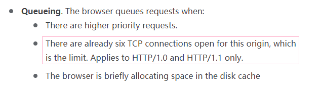

## 问题描述

多文件分块上传时可能同时触发非常多 ajax 请求。

打开 F12 发现，同一时刻只会有几个（目测不超过十个）请求在正常工作，其余的都处在 **pending** 状态

## 原因

根据 [chrome developers docs](https://developer.chrome.com/docs/devtools/network/reference/#timing-explanation)：

对于不同的浏览器或者同一浏览器的不同版本，这个数值是不同的。

其他参考：
[StackOverflow - How many concurrent AJAX (XmlHttpRequest) requests are allowed in popular browsers?](https://stackoverflow.com/questions/985431/max-parallel-http-connections-in-a-browser)
