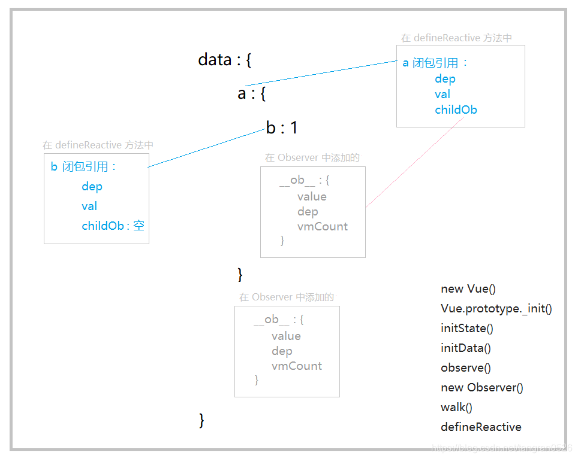

## 数据响应系统的基本思路

```js
const data = {
  name: "emily",
  age: 13,
  info: {
    message: "你好",
  },
};
let Target = null;
walk(data);
function walk(obj) {
  for (let key in obj) {
    const deps = [];
    let val = obj[key];
    if (Object.prototype.toString.call(val) === "[object Object]") {
      walk(val);
    }
    Object.defineProperty(obj, key, {
      get() {
        deps.push(Target);
        return val;
      },
      set(newValue) {
        if (val === newValue) {
          return;
        }
        let oldVal = val;
        val = newValue;
        deps.forEach((dep) => dep(val, oldVal));
      },
    });
  }
}

function $watch(expOrFn, cb) {
  if (typeof expOrFn === "function") {
    Target = cb;
    expOrFn();
  } else if (typeof expOrFn === "string") {
    Target = cb;
    let arr = expOrFn.split(".");
    let obj = data;
    for (let i = 0; i <= arr.length - 1; i++) {
      obj = obj[arr[i]];
    }
  }
}

$watch("name", (val, oldVal) => {
  alert(`name 由 ${oldVal} 变化为 ${val}`);
});

$watch("info.message", (val, oldVal) => {
  alert(`info.message 由 ${oldVal} 变化为 ${val}`);
});

function render() {
  document.body.innerHTML = `${data.name}今年${data.age}岁，${data.info.message}`;
}

$watch(render, render);
```

## Observer


```js
// 在 Vue.prototype._init() 中：
initLifecycle(vm);
initEvents(vm);
initRender(vm);
callHook(vm, "beforeCreate");
initInjections(vm); // resolve injections before data/props
initState(vm);
initProvide(vm); // resolve provide after data/props
callHook(vm, "created");
```


```js
export function initState(vm: Component) {
  vm._watchers = [];
  const opts = vm.$options;
  if (opts.props) initProps(vm, opts.props);
  if (opts.methods) initMethods(vm, opts.methods);
  if (opts.data) {
    initData(vm);
  } else {
    observe((vm._data = {}), true /* asRootData */);
  }
  if (opts.computed) initComputed(vm, opts.computed);
  if (opts.watch && opts.watch !== nativeWatch) {
    initWatch(vm, opts.watch);
  }
}
```


```js
/* initData 的作用：
 根据 vm.$options.data() 获取数据 vm._data
 校验 vm._data 是否是一个纯对象
 检查 vm._data 上的键是否与 props 、methods 对象上的键冲突
 在 Vue 实例对象上添加代理访问数据对象的同名属性
 最后调用 observe 函数开启响应式之路
*/

function initData(vm: Component) {
  let data = vm.$options.data;

  // 经过 mergeOptions 函数处理后 data 选项必然是一个函数，为什么这里还要判断？
  // 是为了防止开发者在 beforeCreate 中修改了 vm.$options.data 的值
  data = vm._data = typeof data === "function" ? getData(data, vm) : data || {};

  if (!isPlainObject(data)) {
    data = {};
    process.env.NODE_ENV !== "production" &&
      warn(
        "data functions should return an object:\n" +
          "https://vuejs.org/v2/guide/components.html#data-Must-Be-a-Function",
        vm
      );
  }
  // proxy data on instance
  const keys = Object.keys(data);
  const props = vm.$options.props;
  const methods = vm.$options.methods;
  let i = keys.length;
  while (i--) {
    const key = keys[i];
    if (process.env.NODE_ENV !== "production") {
      // data 和 methods 中不能有重名的 key
      if (methods && hasOwn(methods, key)) {
        warn(`Method "${key}" has already been defined as a data property.`, vm);
      }
    }
    // data 和 props 中不能有重名的 key
    if (props && hasOwn(props, key)) {
      process.env.NODE_ENV !== "production" &&
        warn(
          `The data property "${key}" is already declared as a prop. ` +
            `Use prop default value instead.`,
          vm
        );
    } else if (!isReserved(key)) {
      // isReserved 判断是否以 $ 或 _ 开头。Vue 是不会代理那些键名以 $ 或 _ 开头的字段的，因为 Vue 自身的属性和方法都是以 $ 或 _ 开头的，所以这么做是为了避免与 Vue 自身的属性和方法相冲突。
      // 没有和 props 重名，并且不以$和_开头的key，进行代理。
      // proxy 函数的原理是通过 Object.defineProperty 函数在实例对象 vm 上定义与 data 数据字段同名的访问器属性，并且这些属性代理的值是 vm._data 上对应属性的值。
      /* 举例：当我们访问 ins.a 时实际访问的是 ins._data.a。而 ins._data 才是真正的数据对象。
			const ins = new Vue ({ data: { a: 1 } }) */
      proxy(vm, `_data`, key);
    }
  }
  // observe data
  // 将数据转换成响应式的
  observe(data, true /* asRootData */);
}
```


```js
function observe(value, asRootData) {
  if (!isObject(value) || value instanceof VNode) {
    return;
  }
  var ob;
  // 当一个数据对象被观测之后将会在该对象上定义 __ob__ 属性，所以 if 分支是用来避免重复观测
  if (hasOwn(value, "__ob__") && value.__ob__ instanceof Observer) {
    ob = value.__ob__;
  } else if (
    shouldObserve &&
    !isServerRendering() &&
    (Array.isArray(value) || isPlainObject(value)) &&
    Object.isExtensible(value) &&
    !value._isVue
  ) {
    ob = new Observer(value);
  }
  if (asRootData && ob) {
    ob.vmCount++;
  }
  return ob;
}
```


```js
export class Observer {
  value: any;
  dep: Dep;
  vmCount: number; // number of vms that has this object as root $data

  constructor(value: any) {
    this.value = value;
    this.dep = new Dep();
    this.vmCount = 0;
    def(value, "__ob__", this);
    if (Array.isArray(value)) {
      protoAugment(value, arrayMethods, arrayKeys);
      this.observeArray(value);
    } else {
      this.walk(value);
    }
  }

  walk(obj: Object) {
    const keys = Object.keys(obj);
    for (let i = 0; i < keys.length; i++) {
      defineReactive(obj, keys[i]);
    }
  }

  observeArray(items: Array<any>) {
    for (var i = 0, l = items.length; i < l; i++) {
      observe(items[i]);
    }
  }
}
```

Vue 对于对象和数组的监测方式是不同的

- 对象：为每个属性调用 `defineReactive` 方法（ 用 Object.defineProperty 来给每一个属性值设置 getter setter）

- 数组：通过拦截数组变异方法来实现监测。（变异方法：会改变数组的值的方法，包括 push、pop、shift、unshift、splice、sort 以及 reverse 等）

### 观测对象 - defineReactive

defineReactive 的核心：将对象的属性转换为访问器属性，即为对象的属性设置一对 getter/setter。（每对 getter 和 setter 都通过闭包引用着属于这个字段的 dep、val 和 childOb）

- getter 中要返回值+收集依赖
- setter 中要设置值+触发依赖

```js
export function defineReactive (obj,key) {
  const dep = new Dep()
  var val = obj[key];
  var childOb = observe(val);
  Object.defineProperty(obj, key, {
	get: function reactiveGetter () {
		var value = val;
		if (Dep.target) {
		  dep.depend();
		  if (childOb) {
		    childOb.dep.depend();
		  }
		}
		return value
	}
	set: function reactiveSetter (newVal) {
	   val = newVal;
	   childOb = observe(newVal);
	   dep.notify();
	 }
	});
  })
}
```

#### 被观测后的数据对象的样子

```js
const data = {
  a: {
    b: 1,
  },
};
```



#### getter ： 返回值 + 收集依赖

```js
get: function reactiveGetter() {
  var value = getter ? getter.call(obj) : val;
  if (Dep.target) {
    dep.depend();
    if (childOb) {
      childOb.dep.depend();
      if (Array.isArray(value)) {
        dependArray(value);
      }
    }
  }
  return value;
}
```

###### `childOb.dep.depend()` 的作用是什么

要结合上面的例子和图去理解：

```js
data: {
  a: {
    b: 1;
  }
}
```

如果读取了 data.a 的值，那么依赖会被收集到两个 dep 中：

1. `data.a` 的 getter/setter 通过闭包引用的 `dep`

触发时机：修改 data.a 时会进入 setter ，从而触发

2. `data.a.childOb.dep` 即 `data.a.__ob__.dep`

触发时机：使用 Vue.set() 和 Vue.delete() 添加、删除属性时，触发依赖

```js
Vue.set = function (obj, key, val) {
  defineReactive(obj, key, val);
  obj.__ob__.dep.notify();
};
```

所以当我们给 data.a 添加属性时

```js
Vue.set(data.a, "c", 1);
```

之所以能够触发依赖，就是因为 Vue.set 函数中触发了收集在 `data.a.__ob__.dep` 这个”筐“中的依赖：

```js
Vue.set = function (obj, key, val) {
  defineReactive(obj, key, val);
  obj.__ob__.dep.notify(); // 相当于 data.a.__ob__.dep.notify()
};

Vue.set(data.a, "c", 1);
```

所以 `__ob__` 属性以及` __ob__.dep` 的主要作用是为了添加、删除属性时有能力触发依赖，而这就是 Vue.set 或 Vue.delete 的原理。

###### `dependArray()` 的作用是什么

如果读取的属性值是数组，那么需要调用 dependArray 函数逐个触发数组每个元素的依赖收集

#### setter ： 设置值 + 触发依赖更新

```js
set: function reactiveSetter(newVal) {
  var value = getter ? getter.call(obj) : val;
  if (newVal === value || (newVal !== newVal && value !== value)) {
    // NaN 和自身不等
    return;
  }
  if (setter) {
    setter.call(obj, newVal);
  } else {
    val = newVal;
  }
  childOb = !shallow && observe(newVal);
  dep.notify();
}
```

### 观测数组 - 拦截数组变异方法

对于数组，是通过拦截数组变异方法来实现监测

变异方法：会改变数组的值的方法，包括 push、pop、shift、unshift、splice、sort 以及 reverse 等

比如，有一个数组 `arr:[{a:1},"emily"}` 。拦截 arr 的变异方法，手动触发依赖。并 observe 数组中的每一项。
所以，修改数组时，必须使用 Vue 指定的变异方法，或者 Vue.set() Vue.delete。通过索引修改数组项，或者通过 length 属性修改数组长度，都不会触发依赖更新。

```html
<div id="app">{{arr}}</div>
<script>
  const vm = new Vue({
    el: "#app",
    data: {
      arr: [{ a: 1 }, "emily"],
    },
  });
</script>
```

```js
vm.arr[0].a = 2; // ok 因为是修改{a:1}这个对象中属性a的值，属于对象监测，会触发 a 的 setter，从而触发依赖

vm.arr[0] = 3; // 不ok 通过索引改数组中的项，不会触发 arr 的 setter，不会触发依赖更新
Vue.set(vm.arr, 0, 5); // ok Vue.set()内部会触发依赖更新
```

## Vue.set 和 Vue.delete

### Vue.set

```js
function set(target, key, val) {
  if (isUndef(target) || isPrimitive(target)) {
    warn("Cannot set reactive property on undefined, null, or primitive value: " + target);
  }
  if (Array.isArray(target) && isValidArrayIndex(key)) {
    target.length = Math.max(target.length, key);
    target.splice(key, 1, val); // splice 这个变异方法已经被 Vue 拦截了，可以触发依赖更新
    return val;
  }
  if (key in target && !(key in Object.prototype)) {
    target[key] = val;
    return val;
  }
  var ob = target.__ob__;
  // target._isVue 说明是 Vue 实例
  // ob.vmCount>0 说明是根数据对象
  if (target._isVue || (ob && ob.vmCount)) {
    warn(
      "Avoid adding reactive properties to a Vue instance or its root $data " +
        "at runtime - declare it upfront in the data option."
    );
    return val;
  }
  if (!ob) {
    target[key] = val;
    return val;
  }
  defineReactive(ob.value, key, val);
  ob.dep.notify();
  return val;
}
```

### Vue.delete

```js
function del(target, key) {
  if (isUndef(target) || isPrimitive(target)) {
    warn("Cannot delete reactive property on undefined, null, or primitive value: " + target);
  }
  if (Array.isArray(target) && isValidArrayIndex(key)) {
    target.splice(key, 1); // 还是利用 splice
    return;
  }
  var ob = target.__ob__;
  if (target._isVue || (ob && ob.vmCount)) {
    warn(
      "Avoid deleting properties on a Vue instance or its root $data " + "- just set it to null."
    );
    return;
  }
  if (!hasOwn(target, key)) {
    return;
  }
  delete target[key];
  if (!ob) {
    return;
  }
  ob.dep.notify();
}
```
