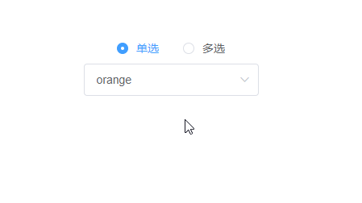
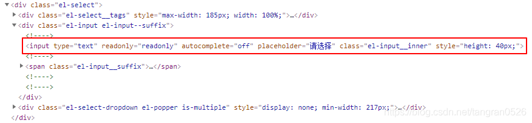
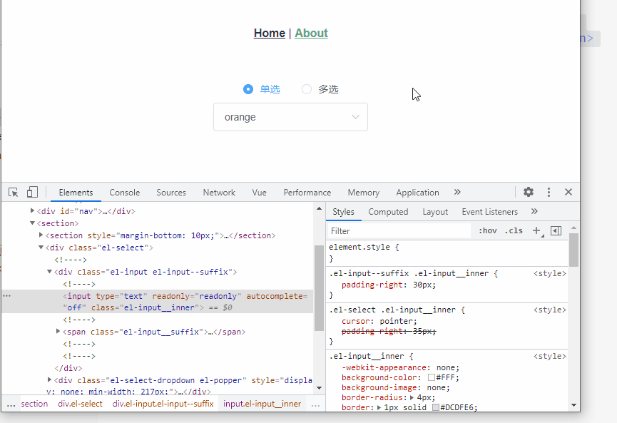
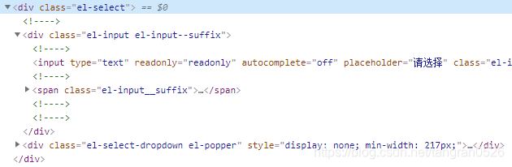
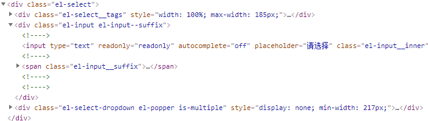
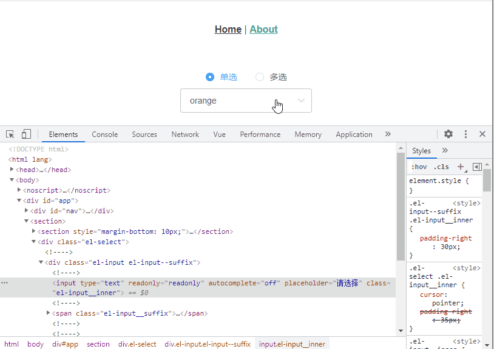
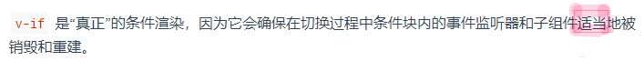
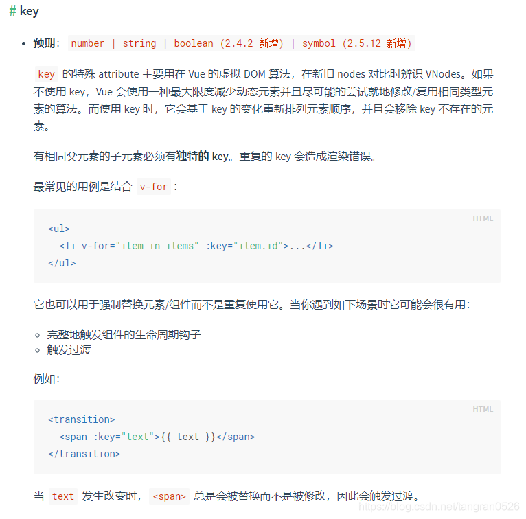
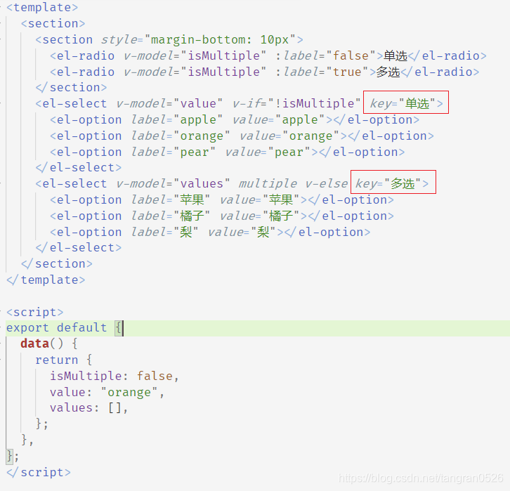

## 问题描述

使用 element-ui。页面中有一个 select，可切换单选和多选，使用 v-if 控制会出错（用 v-show 控制则不会出错）

如下图：单选选择 pear，切换到多选，pear 还在

代码：

```html
<template>
  <section>
    <section style="margin-bottom: 10px">
      <el-radio v-model="isMultiple" :label="false">单选</el-radio>
      <el-radio v-model="isMultiple" :label="true">多选</el-radio>
    </section>
    <el-select v-model="value" v-if="!isMultiple">
      <el-option label="apple" value="apple"></el-option>
      <el-option label="orange" value="orange"></el-option>
      <el-option label="pear" value="pear"></el-option>
    </el-select>
    <el-select v-model="values" multiple v-else>
      <el-option label="苹果" value="苹果"></el-option>
      <el-option label="橘子" value="橘子"></el-option>
      <el-option label="梨" value="梨"></el-option>
    </el-select>
  </section>
</template>

<script>
  export default {
    data() {
      return {
        isMultiple: false,
        value: "orange",
        values: [],
      };
    },
  };
</script>
```

---

## 分析

### 多选时，显示的 pear 是哪来的？

打开 F12，找到多选时出错的元素：

红圈中的 `<input type="text">` ，把他隐藏掉，多选时的 "pear" 就消失了。


### 为什么多选中的 input 会携带单选时的值 'pear'

这是`<el-select>`单选的结构：

这是 `<el-select>`多选的结构:


猜测：在 v-if 切换的时候，input 没有重新渲染。

实验一下：在单选时给内部的 input 添加一个属性。切换到多选，看看多选内部的 input 是否有这个属性

石锤了，这个出错的 input 是直接从单选组件复用过来的，所以会显示 pear

### 为什么会复用？ v-if 不是销毁重建吗？

[API v-if](https://cn.vuejs.org/v2/api/#v-if) 中写道：

但是在 [教程](https://cn.vuejs.org/v2/guide/conditional.html#v-if-vs-v-show) 中提到：


**适当**地被销毁重建，关键字在==适当==

也就是说，造成我们的问题的原因是： vue 在切换的过程中，认为`input`不需要销毁重建，所以直接复用了。

---

## 怎么解决

告诉 vue 这两个组件是不同的，我不想复用。

添加 [`key`](https://cn.vuejs.org/v2/api/#key)


下面是我的无责任猜测：
平时用 v-if 和 v-else 不会出现问题，是因为两个组件如果差别很大就不会复用。如果没差别，那么复用了也看不出来。
但是对于这次的问题，这两个 input 看上去没差别（自身和层级都一致），所以 vue 给复用了。忽略了它们两个内部的 value 值是不同的。

---

## 反思

之前以为只有在 v-for 中才需要添加 key；对于 v-if ，只知道是真正的条件渲染，会销毁重建，但并不清楚它在切换地过程中也会“适当”复用。
其实就是没有完全弄懂原理，只知道个大概。写一些普通的代码没问题，但是遇到一些极端情况，就会出现这种难以理解的 bug。
之后还是要继续看源码呀
