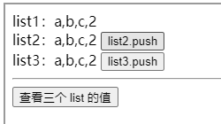
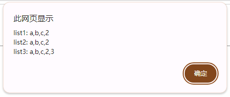
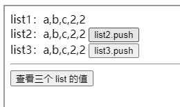

其实不是 computed 的坑，是我自己没弄清原理瞎用，导致出现各种问题。。

## 演示

```html
<div>list1：{{list1.join(",")}}</div>
<div>
  list2：{{list2.join(",")}}
  <input type="button" value="list2.push" @click="list2.push(2)" />
</div>
<div>
  list3：{{list3.join(",")}}
  <input type="button" value="list3.push" @click="list3.push(3)" />
</div>
<hr />
<input type="button" value="查看三个 list 的值" @click="lookOneLook" />
```

```js
const list1 = ref(["a", "b", "c"]);
const list2 = computed({
  get() {
    return list1.value;
  },
  set(val) {
    alert("触发list2的setter");
    list1.value = val;
  },
});
const list3 = computed({
  get() {
    return list1.value.map((o) => o);
  },
  set(val) {
    alert("触发list3的setter");
    list1.value = val;
  },
});
function lookOneLook() {
  alert(`list1: ${list1.value}\nlist2: ${list2.value}\nlist3: ${list3.value}`);
}
```

<iframe src="https://liuzx-emily.github.io/blog-demo/vue2-computed-tip/"></iframe>

点击按钮向 list2 中 push，数据变化，页面也变化（list1 2 3 都变）：



点击按钮向 list3 中 push，页面无变化。点击“查看三个 list 的值”按钮，在弹窗中可以发现 list3 的数据确实变化了（只有 list3 变化，list1 2 不变）：



此时再次向 list2 中 push，list3 之前的修改被覆盖掉了：



而且在这一过程中，无论是 list2.push 还是 list3.push 都没有触发 computed setter。

## 分析

- list2.push
  能成功修改三个 list 的值。因为 list2 和 list1 是相同的引用地址，list2.push 此时等价于 list1.push。list1 变化后触发 list3 变化
- list3.push
  能成功修改自己，但是数据变化没有触发视图更新。因为 computed 只是个 Watcher，自身没有绑定依赖，值变化不会触发视图的更新。所以在页面中看不到 list3 变化，只能在弹窗中看到 list3 的变化（因为弹窗是每次点击后当场取值的）
- 又 list2.push
  此时 list3 之前的修改被覆盖掉了

对于引用类型的计算属性，只有 `list2=...` 这样修改引用地址，才会触发 setter

## 总结

- <span style="color:darkorange">对于引用类型的计算属性，只有 list2=... 这样修改引用地址，才会触发 setter</span>
- 计算属性自己只是个 Watcher，不是像 props 和 data 那样的数据。所以<span style="color:darkorange">绝对不要在计算属性上加自定义的属性</span>，因为没有意义：
  - 1 它不是对象，没有依赖关系。数据变化，"依赖"不会更新
  - 2 computed 内部关联的变量一旦变化，computed 的值就会重新计算，你自己添加的属性的修改就都没了。
- 下面的写法一有效，是因为引用相同，相当于单纯起了个别名。这种起别名的操作以后少干，因为逻辑上不清晰，复杂项目中出了 bug 不好调试。

```js
const someData = reactive({ options: { name: "foo" } });
// 写法一 changeName 有效，是因为 options.value 和 someData.options 是相同引用
const options = computed(() => someData.options);
// 写法二 changeName 无效
const options = computed(() => {
  return { name: someData.options.name };
});

function changeName() {
  options.value.name = "bar";
}
```

- <span style="color:darkorange">computed 本质就是一个有 value 的 Watcher，不要把它当数据用！</span>
