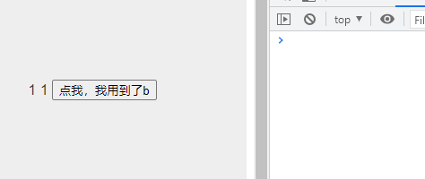
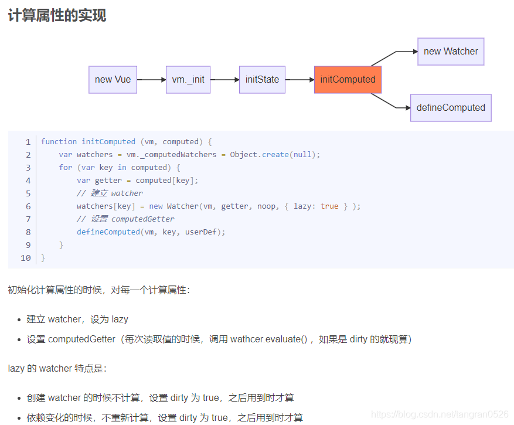
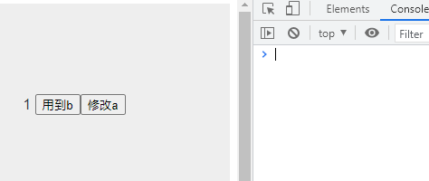

## 先看实例

```html
<template>
  <section>
    {{ c }} {{ c }}
    <input type="button" value="点我，我用到了b" @click="handleClick" />
  </section>
</template>

<script>
  export default {
    computed: {
      b() {
        console.log("computed b");
        return this.a;
      },
      c() {
        console.log("computed c");
        return this.a;
      },
    },
    data() {
      return {
        a: 1,
      };
    },
    created() {
      console.log("created");
    },
    mounted() {
      console.log("mounted");
    },
    methods: {
      handleClick() {
        console.log(this.b);
      },
    },
  };
</script>
```



- 页面加载时，触发的顺序是：`created` => `computed c` => `mounted`
- 点击按钮时：第一次点击触发 `computed b`，之后的点击不触发

## 原因



具体看 [vue 源码思路理解（持续更新）](https://blog.csdn.net/tangran0526/article/details/104772671) 中的 **计算属性的实现**

回过头分析上面的例子：

- 页面加载时：初始化数据 -> `created` -> 渲染模板期间，template 用到了 c，第一次用到 C 的时候会触发一次 `computed c` 来求值，第二次用到 c 时不会重复求值 -> 渲染完成 `mounted`

- 点击按钮时：用到了 b，第一次点击的时候，b 还没有值，触发一次 `computed b` 来求值；之后点击，此时 b 已经有值了，不会重复求值

## 练手

```html
<template>
  <section>
    {{ c }}
    <input type="button" value="用到b" @click="() => b" />
    <input type="button" value="修改a" @click="a += 1" />
  </section>
</template>

<script>
  export default {
    computed: {
      b() {
        console.log("computed b");
        return this.a;
      },
      c() {
        console.log("computed c");
        return this.a;
      },
    },
    data() {
      return {
        a: 1,
      };
    },
    created() {
      console.log("created");
    },
    mounted() {
      console.log("mounted");
    },
  };
</script>
```

初始化、点击两个按钮的时候，分别输出什么？

---

---

答案：

