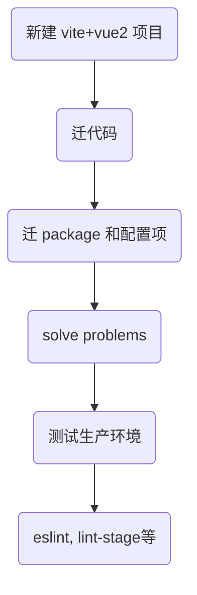

## 迁移过程



1. 新建 vite+vue2 空项目：使用 [ vite-plugin-vue2 插件 ](https://github.com/underfin/vite-plugin-vue2)，确保项目可以正常启动、运行
   [vite-vue2 项目模板](https://github.com/liuzx-emily/vite-vue2-template-project)
2. 迁代码： 将代码原封不动地拷到新建的 vite 项目中
3. 迁 package 和配置项

   这一步仅处理必需项（指不处理会导致项目启动、运行时报错的），eslint uglify 等就是非必需

   大部分 package 与底层框架无关，可以直接放到 vite 项目中，比如 `element-ui` `echarts` `axois`；与框架相关的包需要处理：

   - `script-loader`, `style-loader`, `css-loader` 是 webpack 用来加载 js 和 css 资源的；vite 不需要这些 loader，直接忽略
   - `@vue/cli-plugin-babel` 看名字就知道是 vue-cli 专用的。在 vite 项目中需要使用基础的 babel-plugin 包，或者找找有没有开箱即用的 vite-babel-plugin
   - `uglifyjs-webpack-plugin` webpack 压缩代码的插件；vite 打包使用 rollup，不需要这个包

   把 vue-cli 的配置翻译成 vite 的配置，**vue.config.js** -> **vite.config.js**

4. solve problems：启动、运行项目 -> 报错 -> 解决问题，不断重复
   要把所有页面点一遍，因为 vite 在开发模式下按需提供源码，当某个子页面出错时（比如 import 文件路径不对），可能项目启动、运行时都正常，只有点进这个子页面才会报错（在使用 vue-cli 时，这种错误在启动阶段就会报错）

5. 测试生产环境
   开发模式 ok 了，现在测试生产环境能否正常运行。
   这一步也要把所有页面点一遍。 vite 在开发环境中利用了浏览器对 ES Module 的原生支持，但是生产环境仍然使用 rollup 打包。这个区别会导致在开发环境正常，但是生产环境下出错，比如：dynamic import vars

6. 处理非必需项：配置 eslint prettier lint-stage 等

PS：有的问题一直解决不了的话，可以试试把 node_modules 和 package-lock.json 删掉，重新安一次依赖。也许就好了。。

## 踩坑记录

### require 改 import

vite 项目中使用 require 会报错

```js
const CodeMirror = require("codemirror/lib/codemirror");
require("codemirror/addon/hint/show-hint");
```


需要改为

```js
import * as CodeMirror from "codemirror/lib/codemirror";
import "codemirror/addon/hint/show-hint";
```

#### vite 兼容 commonjs

这句话**不是** 说： vite 项目中可以用 commonjs 的语法
而是：**vite 可以将 commonjs 的包转换为 es modules 格式，这样在 vite 项目中就可以用 import 去使用这个包了**

vite 使用 `@rollup/plugin-commonjs` 插件进行转换。vite 内置这个插件，开箱即用。

参考：

- [vite 依赖预构建 - CommonJS 和 UMD 兼容性](https://cn.vitejs.dev/guide/dep-pre-bundling.html#the-why)
- [A list of rollup plugins compatibility for Vite v2.4.0](https://vite-rollup-plugins.patak.dev/)
- [@rollup/plugin-commonjs](https://github.com/rollup/plugins/tree/master/packages/commonjs)

---

### dynamic import var

dynamic import 的路径中有变量时，打包会有些 tricky

```js
// static import
import "./dirA/dirB/test.js";

function load() {
  // dynamic import
  import("./dirA/dirB/test.js").then((module) => {});
}
function load2(name) {
  // dynamic import var
  import(`./dirA/dirB/${name}.js`).then((module) => {});
}
```

本次迁移中，vue-router 动态路由使用了 dynamic import vars 的写法，在开发环境正常，但是生产环境报错：

```js
/* path 可能的值为：
		  'test1'
		  'system/user/index'
		  'module1/list'
		  'module2/dir1/dir2/dir3/dir4/dir5/editor'
	*/
const path = route.path;
route.component = () => import(`./views/${path}.vue`);
```

开发环境下 vite 按需提供代码，执行到这里的时候，计算出 import 的路径，然后直接加载相应的源码。

生产环境下 vite 需要打包。打包的时候必须知道会用到哪些文件，只把会用到的文件打包起来。
上面这段代码 import 的路径里面有变量，`./views` 文件夹下有很多层很多文件，vite 打包时怎么知道你会用到哪些文件呢？
`@rollup/plugin-dynamic-import-vars` 插件就是处理这类问题的，它提供了一系列规则，让你可以告知 rollup 在打包时放入哪些文件

```js
route.component = () => import(`./views/${path}.vue`);

// 若 views 文件夹的直接子文件有 test1.vue, test2.vue, a.js，那么打包后代码为：
route.component = __variableDynamicImportRuntime0__("./views/" + n + ".vue");
function __variableDynamicImportRuntime0__(n) {
  switch (n) {
    case "./views/test1.vue":
      return __vitePreload(() => import("./test1.86034b1c.js"));
    case "./views/test2.vue": // test2.vue 我们用不到，但是还是被打包进来了
      return __vitePreload(() => import("./test2.45b86d5b.js"));
    default:
      return new Error("Unknown variable dynamic import: " + n);
  }
}
```

按照这个插件的规则，我们的代码只会把 views 文件夹下一级的 .vue 文件打包进来

路径的层级需要用 `"/"` 显式的写明，不能隐含在变量里

还有一点，即使你手动引用某个文件，希望打包时带上它，比如：

```js
import "./views/system/user/index.vue";
route.component = () => import(`./views/${path}.vue`);
//
```

打包后，user 文件也看不了：user 文件确实被打包进来了，但是没有在 **variableDynamicImportRuntime0** 方法中注册，即 switch 中没有这个 case。所以还是找不到

参考：

- [@rollup/plugin-dynamic-import-vars](https://github.com/rollup/plugins/tree/master/packages/dynamic-import-vars)
- [webpack 的处理机制 - Dynamic expressions in import()
  ](https://webpack.js.org/api/module-methods/#dynamic-expressions-in-import)

#### 解决方案

不用变量了，把所有要用的文件列出来：

```js
const componentsMap = {
  test1: () => import("./views/test1.vue"),
  "system/user/index": () => import("./views/system/user/index.vue"),
  "module1/list": () => import("./views/module1/list.vue"),
  "module2/dir1/dir2/dir3/dir4/dir5/editor": () => import("./views/test1.vue"),
};
//
route.component = componentsMap[path];
```

---

### 名称补全

在 vue-cli 项目中，路径可以简写：

```js
import "dirA/dirB/index.js";
// 可以简写为:
import "dirA/dirB";
```

这是因为[ webpack 提供了 resolve.mainFiles 配置项](https://webpack.js.org/configuration/resolve/#resolvemainfiles)
vite 没有提供这个配置项，根据简写的路径找不到文件，所以要把路径补全

#### vite 启动时可能不报错

vite 是用什么才加载什么。所以可能启动时一切正常，点进子页面才会报错。
在补全名称的时候，要把所有页面都点一遍，才能改全。

不想这样挨个页面点着找的话，也可以：
先不迁移代码。在 vue-cli 框架下，把配置改为 `resolve.mainFiles=[] ` 。这样启动的时候就会把所有没写全的路径都报错。（这会导致 node_modules 的一些包也报错，不管就行了）
全改完之后，再把代码复制到 vite 中。

---

### scss prependData

vite.config.js :

```js
  css: {
    preprocessorOptions: {
      scss: {
        additionalData: `@import "./src/assets/style/custom-class/index.scss";`,
      },
    },
  },
```

---

### alias 必须使用绝对路径

vite.config.js 中配置 alias

```js
resolve: {
    alias: {
      '@': './src',
    },
  },
```

在项目中使用：

`import '@/assets/style/commons.css' `

启动后报错：

查看 [官网文档](https://cn.vitejs.dev/config/#resolve-alias) ，发现 alias 必须用绝对路径。所以改成：

```js
const { resolve } = require('path')

resolve: {
    alias: {
      '@': resolve(__dirname, 'src'),
    },
  },
```

---

### svg 使用插件 vite-plugin-svg-icons

使用方式很简单，参考 [官方说明](https://github.com/anncwb/vite-plugin-svg-icons) 即可

在 vite.config.js 中配置：

```js
const { resolve } = require("path");
import viteSvgIcons from "vite-plugin-svg-icons";

export default {
  plugins: [
    viteSvgIcons({
      iconDirs: [resolve(__dirname, "src/icons/svg")],
      symbolId: "icon-[name]",
    }),
  ],
};
```

在 main.js 中添加：

```js
import "virtual:svg-icons-register";
```

---

### element 自定义主题

vue-cli 项目中按照 element 官方说明配置的，可以正常运行：

将这段代码迁移到 vite 项目中，启动后报错：

将 `'~element-ui/` 改为 `'element-ui/` 就可以了

---

### json 读取失败

项目中使用了一个 json 文件，在 vue-cli 中一切正常，但是在 vite 中会报错：

不是 json 内容格式的问题，也不是中文路径的问题（后来试过，中文路径也 ok）

最后发现是编码不对，现在是 `UTF-8 WITH BOM` 格式，改成 `UTF-8` 就可以了

---

### 样式错乱

代码迁移过来后，配置项改好了，问题也解决了，项目已经可以正常启动和运行了。
点了点，发现只有一个页面中的局部样式错乱了，其他页面都没问题。

出问题的这部分是 element 的组件，一开始怀疑是 element 版本不同导致的。但改成同版本后还是不对。

进一步排查后发现是 display:inline-block; 的空白符问题：之前使用 vue-cli 时，这段代码中两个 div 之间没有空格；改用 vite 之后，两个 div 之间有空格了。

因为是开发阶段，所以不是 uglify 之类导致的。

怀疑是 vue-template-compiler 的版本问题，在 vite.config.js 中配置

```js
    createVuePlugin({
      vueTemplateOptions: {
        compilerOptions: {
          whitespace: 'condense',
        },
      },
    }),
```

重新启动， ok 了

---

### eslint

先在 vscode 里面安了 eslint 的插件

把 vue-cli 项目中的 .eslintrc.js 文件也挪过来。

eslint 报错：Failed to load config "@vue/prettier" to extend from.

猜测应该是需要安装这个 config，去老项目的 package.json 中找到了：[@vue/eslint-config-prettier](https://www.npmjs.com/package/@vue/eslint-config-prettier)，这个包是专门给 vue-cli 用的 ( 名字开头是 @vue/ 的包好像都是 vue-cli 的）

> @vue/eslint-config-prettier：eslint-config-prettier for Vue CLI

所以去装 eslint-config-prettier `npm install --save-dev eslint-config-prettier`
然后改一下设置

```
extends: [
    'plugin:vue/essential',
    'eslint:recommended',
    'prettier', //'@vue/prettier'是专门给vue-cli用的
],
```

之后 eslint 报错：找不到 babel-eslint， 安装一下就好了

把规则改了测试了一下，eslint 已经生效

---

### lint-staged

npm install -D lint-staged prettier
package.json 中添加：

```
  "scripts": {
    "prepare": "husky install",
    "lint-staged": "lint-staged"
  },

  "lint-staged": {
    "src/**/*.{js,vue,css,scss}": [
      "prettier --write"
    ]
  }
```

执行 npm run prepare

.husky/pre-commit：

```
#!/bin/sh
. "$(dirname "$0")/_/husky.sh"

npm run lint-staged
```

---

### 打包失败，内存溢出

打包时报错，因为内存不够
package.json 中：

```
"build": "NODE_OPTIONS=--max-old-space-size=8192 vite build",
```

这个命令在 linux 服务器上 ok，但是 windows 下不行。

npm i cross-env --save-dev

改为：

```
"build": "cross-env NODE_OPTIONS=--max-old-space-size=8192 vite build",
```

---

### rollup treeshaking

代码：

```js
const data = getData();
const flag = eval(str); // str like 'data.length>0'
```

开发阶段 ok 的，打包后报错：`ReferenceError: dataRe is not defined`

原因是，打包后，treeshaking 了：认为 data 变量没有使用，所以代码变成了：

```js
getData();
const flag = eval(str);
```

解决方案：不用 eval 写法。

要是不想改代码，只能把 treeshaking 关闭了

vite.config.js:

```js
  build: {
    rollupOptions: {
      treeshake: false, //
    },
  },
```

参考
[rollup - treeshake](https://rollupjs.org/guide/en/#treeshake)
