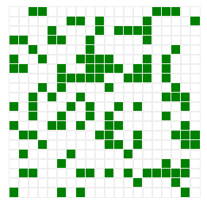

规则：[康威生命游戏](https://zh.wikipedia.org/wiki/%E5%BA%B7%E5%A8%81%E7%94%9F%E5%91%BD%E6%B8%B8%E6%88%8F)


用 **@vue/composition-api** 形式写的。
纯写着玩。没做优化，80\*80 的格子，演化间隔 1000/60 ms 时已经能感到明显的卡顿，应该是渲染问题。

总结：

- 在计算每个 cell 下一步状态之前，要先把 cells 深拷贝一份，用拷贝的这份算（不然就变成算着改着，后计算的 cell 取到的邻居值就不对了）
- world 要用 reactive 包一下
- 设置 cells 元素要用 Vue.set

## 代码

index.vue ：

```html
<template>
  <div>
    <input type="button" value="evolve" @click="handleClickEvolve" />
    <input type="button" value="stop" @click="handleClickStop" />

    <div v-for="i in world.row" class="row" :key="i">
      <div v-for="j in world.col" :key="j" class="cell" :class="getCellClass(i - 1, j - 1)"></div>
    </div>
  </div>
</template>

<script>
  import { useLifeGame } from "./useLifeGame";
  export default {
    setup() {
      const { world, evolve, stop, isCellAlive } = useLifeGame({
        row: 50,
        col: 70,
        initialAliveCells: true,
      });

      function getCellClass(i, j) {
        return isCellAlive(i, j) ? "alive" : "dead";
      }

      const handleClickEvolve = () => evolve(1000 / 60);
      const handleClickStop = stop;
      return {
        world,
        getCellClass,
        handleClickEvolve,
        handleClickStop,
      };
    },
  };
</script>
<style lang="scss" scoped>
  .row {
    font-size: 0;
    .cell {
      display: inline-block;
      width: 12px;
      height: 12px;
      outline: 1px solid #eee;
      &.alive {
        background: green;
      }
    }
  }
</style>
```

useLifeGame.js:

```js
import { reactive } from "@vue/composition-api";
import { cloneDeep } from "lodash";
import Vue from "vue";
/* 

*/
class World {
  constructor({
    row = 70,
    col = 70,
    initialAliveCells = [
      [0, 0],
      [1, 1],
      [2, 2],
      [3, 3],
    ],
  } = {}) {
    this.row = row;
    this.col = col;
    this.cells = [];
    for (let i = 0; i <= this.row - 1; i++) {
      const rows = Array(this.col);
      for (let j = 0; j <= this.col - 1; j++) {
        rows[j] = this._getInitialState(initialAliveCells, i, j);
      }
      this.cells[i] = rows;
    }
  }
  _getInitialState(initialAliveCells, i, j) {
    if (Array.isArray(initialAliveCells)) {
      return !!initialAliveCells.find(([x, y]) => x === i && y === j);
    } else if (typeof initialAliveCells === "boolean") {
      return Math.random() < 0.3;
    }
  }
  getCell(i, j) {
    return this.cells[i][j];
  }
  setCellState(i, j, state) {
    Vue.set(this.cells[i], j, state);
  }
  toNextDay() {
    const _cells = cloneDeep(this.cells);
    const cells = [];
    for (let i = 0; i <= this.row - 1; i++) {
      const rows = Array(this.col);
      for (let j = 0; j <= this.col - 1; j++) {
        rows[j] = this._cellToNextDay(i, j, _cells);
      }
      cells[i] = rows;
    }
    this.cells = cells;
  }
  _cellToNextDay(i, j, _cells) {
    let state = _cells[i][j];
    const count = this._getAliveNeighbourCount(i, j, _cells);
    if (state) {
      if (count < 2 || count > 3) {
        state = false;
      }
    } else {
      if (count === 3) {
        state = true;
      }
    }
    return state;
  }
  _getAliveNeighbourCount(i, j, _cells) {
    let count = 0;
    const x1 = Math.max(i - 1, 0);
    const x2 = Math.min(i + 1, this.row - 1);
    const y1 = Math.max(j - 1, 0);
    const y2 = Math.min(j + 1, this.col - 1);
    for (let y = y1; y <= y2; y++) {
      for (let x = x1; x <= x2; x++) {
        if (y === j && x === i) {
          continue;
        }
        const neighbourState = _cells[x][y];
        if (neighbourState) {
          count++;
        }
      }
    }
    return count;
  }
}
export function useLifeGame({ row, col, initialAliveCells } = {}) {
  const world = reactive(new World({ row, col, initialAliveCells }));

  function isCellAlive(i, j) {
    return world.getCell(i, j);
  }

  let timer;
  function evolve(ms = 1000) {
    stop();
    timer = setInterval(() => {
      world.toNextDay();
    }, ms);
    return timer;
  }
  function stop() {
    clearInterval(timer);
    timer = null;
  }

  return {
    world,
    evolve,
    stop,
    isCellAlive,
  };
}
```
