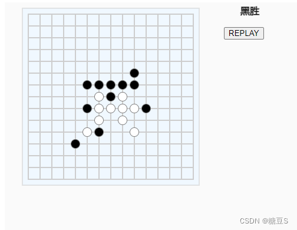

之前写 Life Game 时渲染用的是 div，这次换 canvas 试试。
找了个 canvas 库 [p5i](https://github.com/antfu/p5i)，用起来还可以
写着玩的，代码还有很多可优化的，懒得弄了。

## 代码

```html
<!DOCTYPE html>
<html>
  <head>
    <meta charset="UTF-8" />
    <script src="http://unpkg.com/p5i"></script>
    <title>五子棋demo</title>
  </head>
  <body>
    <div id="target"></div>
    <script>
      useWuziqi();
      function useWuziqi({ count = 15 } = {}) {
        const steps = []; // 落子记录 [{ player: Number, position: [x, y] }]
        let nextPlayer = 1; // 1黑棋 2白棋
        let winner; // undefined,1,2
        useUI();

        // handle落子
        function onPlayingStoneOnBoard(clickedStone) {
          steps.push({
            player: nextPlayer,
            position: clickedStone,
          });
          if (checkWinning()) {
            winner = nextPlayer;
          } else {
            nextPlayer = 3 - nextPlayer;
          }
        }

        function checkWinning() {
          const { player: lastPlayer, position: lastPosition } = steps[steps.length - 1];
          const lastPlayerStepsPositions = steps
            .filter((o) => o.player === lastPlayer)
            .map((o) => o.position);
          function checkCommon(xpianyiliang, ypianyiliang) {
            let count = 1;
            // 向负方向找
            let xSpan = 0;
            let ySpan = 0;
            let flag = true;
            while (flag) {
              xSpan -= xpianyiliang;
              ySpan -= ypianyiliang;
              flag = lastPlayerStepsPositions.find((o) =>
                isSamePosition(o, [lastPosition[0] + xSpan, lastPosition[1] + ySpan])
              );
              if (flag) {
                count++;
              }
            }
            // 向正方向找
            xSpan = 0;
            ySpan = 0;
            flag = true;
            while (flag) {
              xSpan += xpianyiliang;
              ySpan += ypianyiliang;
              flag = lastPlayerStepsPositions.find((o) =>
                isSamePosition(o, [lastPosition[0] + xSpan, lastPosition[1] + ySpan])
              );
              if (flag) {
                count++;
              }
            }
            return count === 5;
          }
          function checkHorizontal() {
            return checkCommon(0, 1);
          }
          function checkVertical() {
            return checkCommon(1, 0);
          }
          function check_leftTop_to_rightBottom() {
            return checkCommon(1, 1);
          }
          function check_rightTop_to_leftBottom() {
            return checkCommon(-1, 1);
          }
          return (
            checkHorizontal() ||
            checkVertical() ||
            check_leftTop_to_rightBottom() ||
            check_rightTop_to_leftBottom()
          );
        }

        function useUI() {
          const boardOffsetX = 40;
          const boardOffsetY = 20;
          const cellSize = 20;
          // get cells positions
          const cellsPositions = [];
          for (let i = 0; i < count; i++) {
            cellsPositions.push([]);
            for (let j = 0; j < count; j++) {
              cellsPositions[i].push([boardOffsetX + j * cellSize, boardOffsetY + i * cellSize]);
            }
          }
          function drawBoard({ line, rect, circle, fill, stroke }) {
            // 棋盘框和底色
            const boardPadding = 10;
            fill("aliceblue");
            stroke("#ccc");
            rect(
              boardOffsetX - boardPadding,
              boardOffsetY - boardPadding,
              (count - 1) * cellSize + 2 * boardPadding
            );

            // 棋盘格子
            for (let i = 0; i < count; i++) {
              for (let j = 0; j < count; j++) {
                let y = boardOffsetY + i * cellSize;
                line(boardOffsetX, y, (count - 1) * cellSize + boardOffsetX, y);
                let x = boardOffsetX + j * cellSize;
                line(x, boardOffsetY, x, (count - 1) * cellSize + boardOffsetY);
              }
            }

            // 天元
            fill("#333");
            circle(
              boardOffsetX + ((count - 1) / 2) * cellSize,
              boardOffsetY + ((count - 1) / 2) * cellSize,
              5
            );
          }
          let highlightCell;
          function drawHighlightCross({ fill, rect, noStroke }) {
            if (highlightCell) {
              const [cellX, cellY] = cellsPositions[highlightCell[0]][highlightCell[1]];
              noStroke();
              fill("#535bf2");
              rect(cellX - 5, cellY - 1, 10, 2);
              rect(cellX - 1, cellY - 5, 2, 10);
            }
          }
          function drawPlayedStones({ circle, fill, stroke }) {
            steps.forEach((step) => {
              const [cellX, cellY] = cellsPositions[step.position[0]][step.position[1]];
              stroke("gray");
              fill(step.player === 1 ? "black" : "white");
              circle(cellX, cellY, 15);
            });
          }
          function drawResults({ text, textSize }) {
            if (winner) {
              textSize(16);
              text(winner === 1 ? "黑胜" : "白胜", 400, 20);
            }
          }
          function replay() {
            steps.length = 0;
            winner = undefined;
          }
          let button;
          function setup({ createCanvas, createButton }) {
            createCanvas(500, 500);
            button = createButton("REPLAY");
            button.position(380, 50);
            button.mousePressed(replay);
          }
          function draw({
            background,
            rect,
            fill,
            noStroke,
            line,
            stroke,
            circle,
            text,
            textSize,
          }) {
            background("#fafafa");
            noStroke();
            drawBoard({ line, rect, circle, fill, stroke });
            drawHighlightCross({ rect, fill, noStroke });
            drawPlayedStones({ circle, fill, stroke });
            drawResults({ text, textSize });
          }
          function mouseClicked({ mouseX, mouseY }) {
            const clickedStone = findTargetStone({ mouseX, mouseY });
            if (clickedStone) {
              onPlayingStoneOnBoard(clickedStone);
            }
          }
          function mouseMoved({ mouseX, mouseY }) {
            highlightCell = findTargetStone({ mouseX, mouseY });
          }

          P5I.p5i({ setup, draw, mouseClicked, mouseMoved }, document.getElementById("target"));

          // 鼠标指向的落子位置
          function findTargetStone({ mouseX, mouseY }) {
            if (winner) return;
            for (let i = 0; i < count; i++) {
              for (let j = 0; j < count; j++) {
                const [cellX, cellY] = cellsPositions[i][j];
                if (Math.pow(cellX - mouseX, 2) + Math.pow(cellY - mouseY, 2) <= 40) {
                  const avaliable = !steps.find((step) => isSamePosition(step.position, [i, j]));
                  if (avaliable) {
                    return [i, j];
                  }
                }
              }
            }
            return;
          }
        }
      }
      function isSamePosition(pos1, pos2) {
        return pos1[0] === pos2[0] && pos1[1] === pos2[1];
      }
    </script>
  </body>
</html>
```
