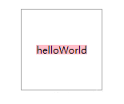
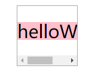
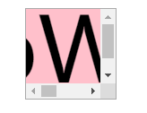

css 的 flex 布局虽然好用，但坑也不少。整理如下：

## 使用 flex 的 center 时，如果本身尺寸 > 父容器尺寸，则内容会显示不全

### bug 描述

想要的 center 效果是：

- 元素尺寸小时，在父元素里居中显示

- 元素尺寸超过父元素时，父元素出滚动条。





但 flex 的 center 是有 bug 的（`justify-content:center` 和 `align-items:center`）：

```html
<style>
  #container {
    display: flex;
    width: 100px;
    height: 100px;
    outline: 1px solid #aaa;
    justify-content: center;
    align-items: center;
    overflow: auto;
  }
  #content {
    background: pink;
    font-size: 100px;
  }
</style>
<div id="container">
  <div id="content">helloWorld</div>
</div>
```

效果：

当元素尺寸超过父容器时，无论是水平方向还是竖直方向，元素内容都无法显示全。

### 解决方案

能确保元素尺寸一定小于父容器时，可以用 `justify-content:center` 和 `align-items:center`；不然别用。

想要 center 的话，用 margin: auto 来替代：

- 水平方向，元素设置 `margin-left:auto; margin-right:auto;`，父元素设置 `display:flex` （如果不给父元素设置 display:flex，不会影响子元素的水平居中效果。但是子元素的背景会被切断）
  ```html
  <style>
    #container {
      display: flex;
      width: 100px;
      height: 100px;
      outline: 1px solid #aaa;
      overflow: auto;
    }
    #content {
      background: pink;
      font-size: 50px;
      margin-left: auto;
      margin-right: auto;
    }
  </style>
  <div id="container">
    <div id="content">helloWorld</div>
  </div>
  ```
- 竖直方向，元素设置 `margin-top :auto; margin-bottom:auto;`，父元素设置 `display:flex`
  ```html
  <style>
    #container {
      display: flex;
      width: 300px;
      height: 80px;
      outline: 1px solid #aaa;
      overflow: auto;
    }
    #content {
      background: pink;
      font-size: 100px;
      margin-top: auto;
      margin-bottom: auto;
    }
  </style>
  <div id="container">
    <div id="content">hey</div>
  </div>
  ```

参考：[Can't scroll to top of flex item that is overflowing container](https://stackoverflow.com/questions/33454533/cant-scroll-to-top-of-flex-item-that-is-overflowing-container)

## flex 布局中 overflow:hidden 失效

需要加 `min-width:0` ，具体见 [《flex 布局中 text-overflow:ellipsis 失效》](post:e7b45efa-c8bf-48b1-b9fc-325f160ef0ef)

所以，常见的**左定宽，右伸缩**布局应该这样写：

```css
.left {
  flex: 0 0 300px;
}
right {
  flex: 1 1 auto;
  min-width: 0; /* 必不可少！因为后代元素中难免有 overflow:hidden 的 */
}
```
