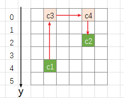
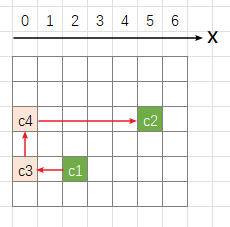
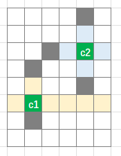
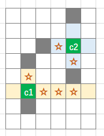
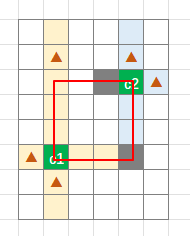
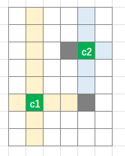
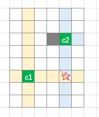
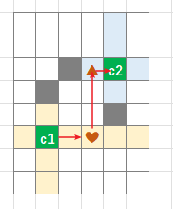
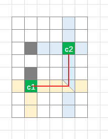
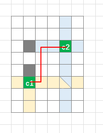

预览点[这里](https://liuzx-emily.github.io/liuzx-emily/) ，代码在相应的 github 仓库中

（首次加载比较慢，以后可以看看怎么优化一下打包）

## 准备工作

###### vue3 + vite + p5 + [eslint](https://eslint.vuejs.org/user-guide/)

```js
// .eslintrc.cjs
module.exports = {
  env: {
    browser: true,
    es2021: true,
  },
  extends: ["eslint:recommended", "plugin:vue/vue3-essential"],
  parserOptions: {
    ecmaVersion: "latest",
    sourceType: "module",
  },
  plugins: ["vue"],
  rules: {},
};
```

###### 数据结构

```js
cells = [
  {
    x,
    y,
    avaliable, // 格子是否可用：初始化游戏时，用来判断此格子能不能放图片
    imgId,
  },
];
```

###### 图片是在 [icones](https://icones.js.org/) 下载的 svg，方便且图片体积小

###### 使用 p5 的 library

click 时需要判断是否点到了某个格子。之前写五子棋时就有同样的需求，那时自己写了个方法实现的。这次想锻炼一下检索能力，就查了查有没有现成的包，果然找到了—— [p5.collide2D](https://github.com/bmoren/p5.collide2D)
但是说明里没讲怎样引用。在项目里直接 `import` 会报错：`Uncaught ReferenceError: p5 is not defined`
只能去看 p5.collide2d.js 的源码了：

```js
p5.prototype._collideDebug = false;
p5.prototype.collideRectRect = function (x, y, w, h, x2, y2, w2, h2) {...};
p5.prototype.collideRectRectVector = function (p1, sz, p2, sz2) {...};
```

这样的写法是不支持模块化引用的，只能自己改一改了。
把代码下载到本地，然后在文件开头加上 `import p5 from "p5";`

## 画图

- 预加载图片
  ```js
  new p5(function (p) {
    // 在 p5.preload 中加载图片
    p.preload = function () {
      imageNames.forEach((name) => {
        const url = new URL(`./assets/svg/${name}.svg`, import.meta.url).href; // vite 中使用 `new URL` 获取图片地址
        imageMaps[name] = p.loadImage(url); // p5.loadImage 可以直接加载 svg 格式
      });
    };
    p.setup = function () {};
    p.draw = function () {};
  }
  ```
- 初始化游戏

  ```js
  const cells = [];
  function newGame() {
    cells.length = 0;
    initCells();
    placeImges();
  }

  function initCells() {
    for (let i = 0; i < 8; i++) {
      for (let j = 0; j < 14; j++) {
        cells.push({ x: i, y: j, available: true, imgId: undefined });
      }
    }
  }

  function placeImges() {
    const cellsToPlace = cells.filter((cell) => cell.available); // avaliable 为 false 的格子，不放图片
    while (cellsToPlace.length > 0) {
      const [cell1] = cellsToPlace.splice(0, 1);
      const randomIndex = p5.prototype.random(0, cellsToPlace.length);
      const [cell2] = cellsToPlace.splice(randomIndex, 1);
      const image = p5.prototype.random(imageNames);
      cell1.imgId = image;
      cell2.imgId = image;
    }
  }
  ```

## 关键算法：判断相连

判断两个格子是否能相连。如果能相连，还要返回相连路径


### 傻瓜算法

先写了个傻瓜算法，粗暴的遍历查找

- y 从 min 到 max（ cell3 和 cell4 沿 y 轴向下移），判断 cell1 -> cell3 -> cell4 -> cell2 通不通
- x 从 min 到 max（ cell3 和 cell4 沿 x 轴向右移），判断 cell1 -> cell3 -> cell4 -> cell2 通不通
  

这样就简化为判断三条直线通不通

但有很多不必要的计算，找的也不是最短路径

### 优化算法

小伙伴提供了一个有趣的思路，步骤如下：

1. check if 不拐弯
2. check if 拐一个弯
3. check if 转两个弯，从**圈**上走
4. check if 转两个弯，从**圈**外走，找最短的

具体解释如下：

#### passableCells

passableCells：cell 沿着上下左右四个方向延伸，直到遇到障碍物为止

如下图：cell1 的 passableCells 是黄色格子，cell2 的 passableCells 是蓝色格子；



更近一步，passableCells 还可以分为**圈上的**和**圈外的**。
如下图：**圈** 指的是 cell1 和 cell2 围成的矩形，有三角标记的格子就是“圈上的”

对于**圈外的** passableCells，要知道它的 **方向** 和 **到圈的距离**：
如下图，三角标记的格子到 **圈** 的距离都是 1


##### step1： check if 不拐弯

```js
// check if 不拐弯
const isDirectConnecting = checkIsDirectConnectable(cell1, cell2);
if (isDirectConnecting) {
  return [cell1, cell2]; // 联通路径
}
```

##### step2：check if 拐一个弯

等价于判断 passableCells_cell1_innerRect（cell1 的延伸格子，内圈上的） 和 passableCells_cell2_innerRect 是否有交集

如下图：无交集，说明不可能只拐一个弯就连上

有交集（星星格子），说明能连上。联通路径是 celll1->交集点->cell2


```js
// check if 拐一个弯
const [intersectionCell] = getIntersection(
  passableCells_cell1_innerRect,
  passableCells_cell2_innerRect
);
if (intersectionCell) {
  return [cell1, intersectionCell, cell2]; // 联通路径
}
```

##### step3：check if 转两个弯 在圈上走

等价于判断：passableCells_cell1_innerRect 中的格子 和 passableCells_cell2_innerRect 的格子，是否有能直接连接的

如下图：找到能直接连接的了：

没有能直接连接的：


```js
// check if 转两个弯 从圈上走
for (let i = 0; i <= passableCells_cell1_innerRect.length - 1; i++) {
  const cell3 = passableCells_cell1_innerRect[i];
  for (let j = 0; j <= passableCells_cell2_innerRect.length - 1; j++) {
    const cell4 = passableCells_cell2_innerRect[j];
    if (checkIsDirectConnectable(cell3, cell4)) {
      return [cell1, cell3, cell4, cell2]; // 联通路径
    }
  }
}
```

##### step4：check if check if 转两个弯 从**圈** 外走，找最短路径

等价于判断：passableCells_cell1_outerRect 中的格子 和 passableCells_cell2_outerRect 的格子，是否有能直接连接的


```js
// check if check if 转两个弯 从圈外走，找最短路径
// 找最短路径
let distance = 1;
let leftCount = passableCells_cell1_outerRect.length;
while (leftCount > 0) {
  const cell5s = passableCells_cell1_outerRect.filter(
    (o) => o.toInnerRectDistance === distance
  );
  for (let i = 0; i <= cell5s.length - 1; i++) {
    const cell5 = cell5s[i];
    const cell6s = passableCells_cell2_outerRect.filter(
      (o) => o.dir === cell5.dir
    ); // 能连上的肯定是“方向”相同的
    for (let j = 0; j <= cell6s.length - 1; j++) {
      const cell6 = cell6s[j];
      if (checkIsDirectConnectable(cell5, cell6)) {
        return [cell1, cell5, cell6, cell2];
      }
    }
    leftCount--;
  }
  distance++;
}
```

#### 再看一遍路径长度

<span style="color:darkorange">step1 不拐弯</span> 肯定是最近的


<span style="color:darkorange">step2 拐一个弯</span> 和 <span style="color:darkorange">step3 转两个弯，在圈上走</span> ，路径长度是一样的，都是 `x坐标差 + y坐标差`




<span style="color:darkorange">step4 转两个弯 从圈外走</span>，路径长度是 `x坐标差 + y坐标差 + 2 * toInnerRectDistance`


## 完善功能

### 图片自动引入

```js
const imageNames = [];

const svgs = import.meta.glob("../assets/svg/*.svg");
for (const path in svgs) {
  const matchRes = path.match(/\/svg\/(\w+)\.svg/);
  const imageName = matchRes[1];
  imageNames.push(imageName);
}
```

### 提供多种初始牌型

```js
// 修改 initCells 方法
function initCells() {
   const strategy = randomPick([
      function(i,j){ ...},
      function(i,j){ ...},
    ]);
    for (let i = 0; i < 8; i++) {
      for (let j = 0; j < 14; j++) {
        cells.push({
          x: i,
          y: j,
          // avaliable: true,
          available: strategy(i, j),
          imgId: undefined,
        });
      }
    }
  }
```


### 消除时显示路径

点击 cell1 和 cell2 后，若能相连，则消除：


添加显示相连的路径：


上图中，路径出现时，两端的图片已经消失了，感觉怪怪的。

所以要让图片多显示一会儿：（要保证图片还显示，但不能“堵路”。不然会影响游玩手感）


```js
  p.touchEnded = function () {
    ...
    if (connectingLine) {
      // 消除的时候，添加 tempDisplayConnectingLines 和 tempDisplayEliminatedCells
      addTempDisplayItem({ type: "connectingLine", value: connectingLine, time: 800 });
      addTempDisplayItem({
        type: "eliminatedCells",
        value: [cloneDeep(activeCell), cloneDeep(targetCell)],
        time: 800,
      });
      activeCell.active = false;
      // imgId 必须立刻清空，不能“堵路”
      activeCell.imgId = undefined;
      targetCell.imgId = undefined;
    }
  };
```

```js
const tempDisplay = ref([]);
const tempDisplayConnectingLines = computed();
const tempDisplayEliminatedCells = computed();

function addTempDisplayItem(obj) {
  const id = uniqueId();
  tempDisplay.value.push({ id, type: obj.type, value: obj.value });
  // 添加进来的item，一段时间后会被清理掉
  setTimeout(() => {
    removeTempDisplayItem(id);
  }, obj.time);
}
function removeTempDisplayItem(id) {}
```

### 其他

新游戏、判断是否需要洗牌、洗牌、提示等，这些功能都没什么好说的

为了支持移动端，点击事件用 p5.touchEnded 替代 p5.click

## 部署

写完基本功能后截了个动图，爸妈看后说想玩一玩，所以我就发布在 github pages 上了。

（途中发现一个事情，vite build 后的页面不能直接打开。因为打包后的代码还是模块化的，不能在 `file://` 中打开）

github pages 可以设置 docs 为发布的目标文件夹


修改打包设置

```js
export default defineConfig({
  // ...
  build: {
      outDir: "docs",
});
```

每次修改完代码之后，重新打包，然后再 commit push（新的打包 docs 文件夹一定要 push 上去）
github 就会自动 build 和 deploy 了，需要一定时间，进度可以看 repo 的 actions 页签：

