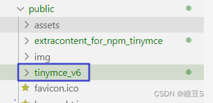
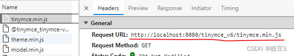
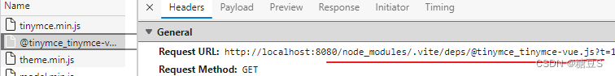
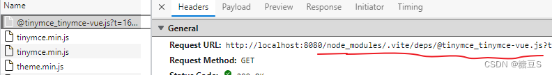
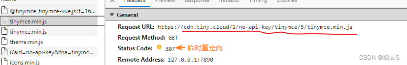
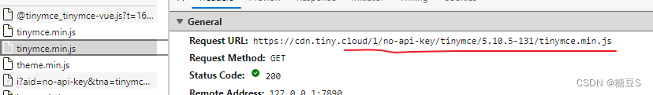
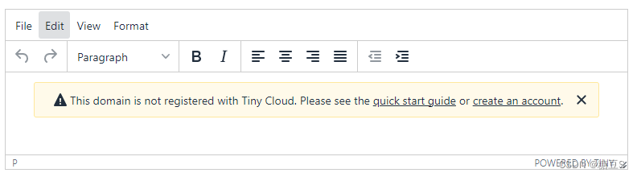
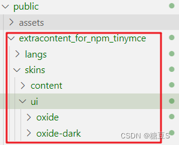
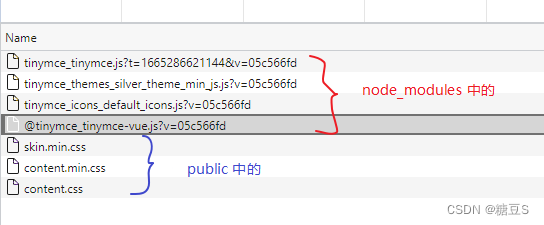

vite + vue 项目

使用 tinymce 官方提供的 [@tinymce/tinymce-vue](https://www.tiny.cloud/docs/integrations/vue/)，版本要根据 vue 的版本决定。我项目中 vue 是 2.7.7，对应的 @tinymce/tinymce-vue 是 `^3`。

这个组件只提供了 tinymce 对 vue 适配，tinymce 本身的所有功能都需要另行引用。结合官网的说明和自己的尝试，引用 tinymce 有三种方法

## 引用 tinymce 的三种方法

### 使用本地的 tinymce（推荐）

下载 tinymce ，放到 public 文件夹中



在 index.html 中引用：

```html
<head>
  <script src="/tinymce_v6/tinymce.min.js"></script>
</head>
```

在组件中使用：

```html
<template>
  <Editor />
</template>

<script setup>
  import Editor from "@tinymce/tinymce-vue";
</script>
```

相关的网络请求如下：

1. 先获取本地的 tinymce（因为在 index.html 中引用了）

   

2. 加载到 demo.vue 组件时，获取 `@tinymce/tinymce-vue`：

   

此时， `@tinymce/tinymce-vue` 中使用的是本地 public 文件夹中的 tinymce

### 不手动引用 tinymce

index.html 中不再引用 tinymce

demo.vue ：

```html
<template>
  <editor api-key="your-api-key" />
  <!-- **必须提供 api-key** -->
</template>

<script setup>
  import Editor from "@tinymce/tinymce-vue";
</script>
```

相关的网络请求如下：

1. 加载 demo.vue 时，获取 `@tinymce/tinymce-vue`：



2. 没有找到可用的 tinymce，去 cdn 请求 tinymce 5。触发 307（临时重定向）寻找具体的版本



3. 重定向到具体的版本



此时， `@tinymce/tinymce-vue` 中使用的 cdn 提供的 tinymce 资源（tinymce 暴露到全局作用域，即 window.tinymce）

这种用法必须提供 api-key。否则就会显示：



总结：必须连接外网，不能固定 tinymce 的具体版本（可以用 [cloudChannel](https://www.tiny.cloud/docs/tinymce/6/blazor-ref/#cloudchannel) 指定大版本）。必须提供有效的 api-key

### 使用 tinymce 的 npm 包

上面两种是官方推荐写法，这种是民间写法

demo.vue:

```html
<template>
  <editor :init="init" />
</template>

<script setup>
  import tinymce from "tinymce/tinymce";
  import "tinymce/themes/silver/theme.min.js"; //不写这行会报错
  import "tinymce/icons/default/icons"; //不写这行会报错
  import Editor from "@tinymce/tinymce-vue";
  const init = {
    // 不写这行会报错。这里是文件夹路径。public 下必须有相应的文件夹和文件
    skin_url: "/extracontent_for_npm_tinymce/skins/ui/oxide",
    // 不写这行会报错。public 下必须有相应的文件
    content_css:
      "/extracontent_for_npm_tinymce/skins/content/document/content.css",
  };
</script>
```

tinymce 本体在 node_modules 中，但样式和语言包都要放在 public 里（麻烦）：



相关网络请求：



要加插件的话， 不能放在 tinymce/plugins 里（因为在 node_modules 中）。

## 解释

`@tinymce/tinymce-vue` 中有这样一段代码（简化的）：

```js
   mounted: function () {
       if (window.tinymce !== null) {
          // 初始化
       } else {
       	  // 去 cdn 请求 tinymce 资源，然后再初始化
       }
   },
```

tinymce 的 npm 包（方法三）中也是把 tinymce 暴露到全局作用域了（目瞪口呆，闹半天这个 npm 包根本不是模块化）：

```js
const exportToWindowGlobal = function (tinymce2) {
  window.tinymce = tinymce2;
  window.tinyMCE = tinymce2;
};
```

## 总结

tinymce 的 npm 包太鸡肋了，直接往 window 上注册变量。

只推荐第一种写法。

或者干脆别用 `@tinymce/tinymce-vue` 了，没什么大用。还是在 index.html 中引用本地的 tinymce ， demo.vue 改为：

```js
<template>
  <section id="target"></section>
</template>

<script setup>
import { onMounted } from 'vue'

onMounted(() => {
  // eslint-disable-next-line no-undef
  tinymce.init({
    selector: '#target',
  })
})
</script>
```
