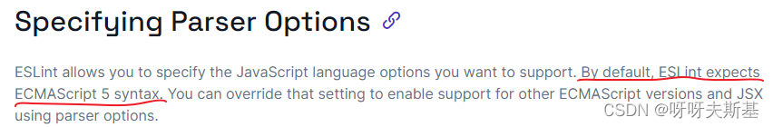
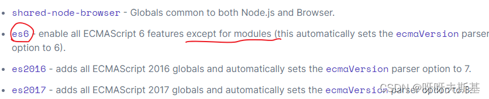
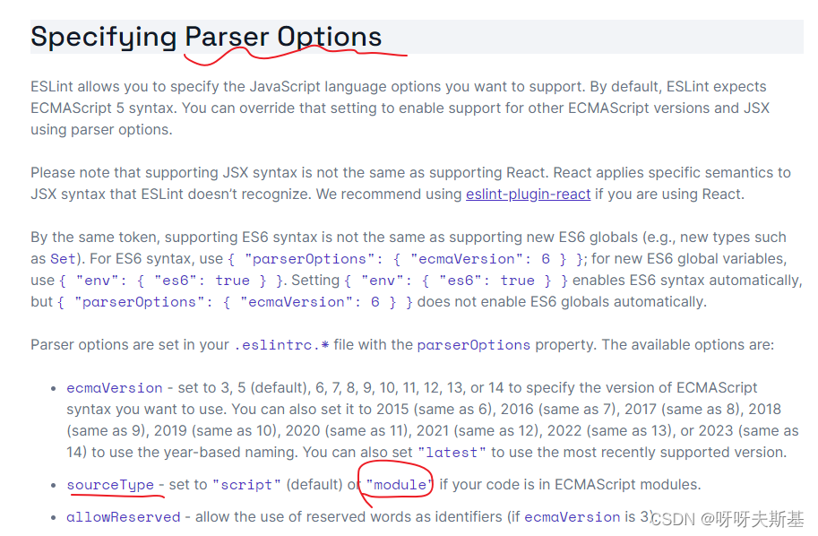

## 报错

```js
export * from "./Checkbox";
```

报错：`Parsing error: The keyword 'export' is reserved`

## 原因

ECMAScript modules(import/export) 是 es6 的语法。

根据 eslint 官方文档 [Configure language options](https://eslint.org/docs/latest/user-guide/configuring/language-options) ，eslint 默认使用 es5 语法：



## 解决

要让 eslint 知道我在使用 es6 的 modules 语法。有下面几种方法：

### 方法一

```js
// .eslintrc.js:
module.exports = {
  env: {
    es6: true,
  },
};
```

此时还是会报错，但是报错内容变了：

`Parsing error: 'import' and 'export' may appear only with 'sourceType:module'`

这是因为虽然 es modules 是 es6 的功能，但是 eslint 中的 env: es6 是不包含 modules 功能的：



根据报错内容的提示，将 parserOptions.sourceType 设为 module



```js
module.exports = {
  env: {
    es6: true,
  },
  parserOptions: {
    sourceType: "module",
  },
};
```

### 方法二

```js
module.exports = {
  env: {
    es2016: true,
  },
  // env: es2016 ~ es2022 都包含 es modules，不需要再设置 sourceType:module 了
};
```

### 方法三

```js
module.exports = {
  parserOptions: {
    ecmaVersion: "latest",
    sourceType: "module",
  },
};
```
