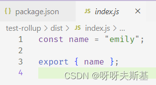

## 打包一个最简单的 library

新建 test-rollup 文件夹。进入文件夹，执行 `pnpm init` 自动生成 package.json 文件：

```json
{
  "name": "test-rollup",
  "version": "1.0.0",
  "main": "index.js", // npm 包的入口。如果要发布的话，一定记得修改这个字段
  "scripts": {}
}
```

新建入口文件 src/index.js：（先写个最简单的，只导出一个变量）

```js
export const name = "emily";
```

执行 `pnpm install rollup --D` 安装 rollup。新建 rollup.config.js :

```js
export default {
  input: "./src/index.js",
  output: {
    dir: "dist",
    format: "es",
  },
};
```

在 package.json 中添加 _build_ 命令：（`-c` 是 `--config` 的简写）

```json
  "scripts": {
    "build": "rollup -c rollup.config.js",
  }
```

执行 `pnpm run build` 打包。报错：


package.json 中 的 [type](https://nodejs.org/api/packages.html#type) 字段指定 .js 文件使用的模块语法。可选值： `commonjs` `module`，默认 `commonjs`。
因为我没有在 package.json 中设置 type，所以默认使用 commonjs 模块语法，但是在 rollup.config.js 中我使用了 export ，这是 es 的模块语法，所以 rollup 会报错。

在 package.json 中设置 `type: 'module'`

重新打包，成功：


自动生成了 dist/index.js 文件：


因为内容简单，打包后的内容也是一目了然，不需要再测试代码的正确性了。

### 设置 package.json 中的 main 字段

如果要把这个 library 发布到 npm 上，必须设置 [main ](https://nodejs.org/api/packages.html#main)字段。因为他人在使用 npm 包时, 是根据 main 字段查找入口文件的。

> The "main" field defines the entry point of a package when imported by name via a node_modules lookup.

```js
{
  main: "dist/index.js"; // 别人引用的时候，使用的是打包后的代码
  // main: 'src/index.js',	// 如果这样设置，则发布后，别人使用的是 src 代码
}
```

在 turborepo 中，package 之间引用时也是根据 main 字段找入口。具体看 [turborepo - Understanding imports and exports](https://turbo.build/repo/docs/getting-started/create-new#understanding-imports-and-exports)

---

## 打包成多种格式

修改 rollup.config.js 的 [output](https://rollupjs.org/guide/en/#outputformat) 字段

```js
output: [
  { file: "dist/bundle.es.js", format: "es" },
  // iife 格式必须指定 name
  { file: "dist/bundle.iife.js", format: "iife", name: "myVar" },
];
```

打包成功，生成两个文件：


---

## 将多个文件打包成一个

试试复杂一点的，把两个文件打包成一个

新建 src/apple.js 文件：

```js
export function eat() {
  console.log("吃苹果");
}
```

在入口文件 src/index.js 中引入 apple.js 中的方法：

```js
export { eat } from "./apple";
export const name = "emily";
```

打包成功：


---

## library 中使用 npm 包

修改 src/index.js ，引用 lodash 包：

```js
export { map } from "lodash";
```

打包成功，但给出了两个警告：


先不管这两个警告，看打包结果：


可以看到，rollup 没有把 lodash 打包进来。在使用 bundle 的时候，如果环境中没有 lodash 的话，就会报错。

回过头来看刚才的两个警告：

警告 1：


点进[链接](https://rollupjs.org/guide/en/#warning-treating-module-as-external-dependency)查看详情：


警告 2：


点进[链接](https://rollupjs.org/guide/en/#outputglobals)查看详情：


这两个警告都和代码中引用了 npm 包有关。用 rollup 打包时，处理引用的 npm 包有两种方法：

- 把 npm 包作为外部依赖，不打包进 bundle 中
- 把 npm 包打包进来

这两种方法没有优劣之分，全看需求。

### 把 npm 包作为外部依赖

如果不想打包 lodash（即把 lodash 作为我们这个 lib 的 peer dependency），则需要修改配置 rollup.config.js：

```js
  external: ["lodash"], // 声明 lodash 是外部依赖，不要打包进来【注意不是 ouput.external】
  output: [
    { file: "dist/bundle.es.js", format: "es"},
    {
      file: "dist/bundle.iife.js",
      format: "iife",
      name: "myVar",
      // 对于 iife/umd 格式，需要通过 output.globals 提供全局变量名称，以替换外部引入（如果不指明，则默认和引用的依赖同名）
      globals: {
        lodash: "lodash_foo",
      },
    },
  ],
};
```

重新打包，成功且没有警告。

bundle.es.js 不变。bundle.iife.js 中全局变量名称变为我们在 rollup.config.js 中提供的了：


### 把 npm 包打包进来

默认情况下，[rollup 不知道怎么处理依赖的路径](https://rollupjs.org/guide/en/#with-npm-packages)。所以，如果想把 lodash 打包进来，需要使用 [@rollup/plugin-node-resolve](https://www.npmjs.com/package/@rollup/plugin-node-resolve) 。

用大白话说就是，rollup 看到 `import from 'lodash'` 时，不知道去哪找 lodash 包。所以要告诉 rollup，我使用的是 node 的模块路径解析算法。rollup 就会按照这个算法，最终在 node_modules 下找到了 lodash 包，并把它打包进来。

修改配置：

```js
import { nodeResolve } from "@rollup/plugin-node-resolve";
export default {
  ...
  plugins: [nodeResolve()]
};
```

打包报错：


因为 lodash 包使用 commonjs 模块语法，而 src/index.js 中的 `export {map} from 'lodash'` 是 es 模块语法，所以会报错。

此时有两种处理方法：

- 使用 plugin 将 commonjs 转为 es module
- 直接使用 lodash-es

#### 使用 plugin 将 commonjs 转为 es module

使用 `@rollup/plugin-commonjs` 将 commonjs 转为 es 语法。修改 rollup.config.js:

```js
import { nodeResolve } from "@rollup/plugin-node-resolve";
import commonjs from "@rollup/plugin-commonjs";
export default {
  ...
  plugins: [nodeResolve(), commonjs()],
};
```

打包成功。两个 bundle 文件都很大，因为把整个 lodash 都打包进来了


修改 src/index.js，只引用 map 包

```js
// export { map } from "lodash";
export { map } from "lodash/map";
```

重新打包，两个 bundle 文件都变小了很多：（500kb -> 80kb)


#### 直接使用 lodash-es

lodash 官方直接提供一个 es module 语法的包 `lodash-es`。

把 src/index.js 中 引用的 `lodash` 改为 `'lodash-es'`

```js
// export { map } from "lodash";
export { map } from "lodash-es";
```

打包成功。而且得益于 rollup 的 treeshaking（依赖 ES Module 语法的静态分析，rollup 可以知道哪些内容是必需的，哪些是没用到的，从而只打包必需的内容），在没有指明只引用 lodash/map 的情况下，两个 bundle 文件依然都很小（80kb 左右）

However, sometimes, [Tree-shaking Doesn't Seem to be Working](https://www.rollupjs.com/guide/troubleshooting#tree-shaking-doesnt-seem-to-be-working)。

---

## babel

Babel is a toolchain that is mainly used to convert ECMAScript 2015+ code into a backwards compatible version of JavaScript in current and older browsers or environments.

[rollup guide - babel](https://www.rollupjs.com/guide/tools#babel)

安装 _@babel/core_ [@rollup/plugin-babel](https://github.com/rollup/rollup-plugin-babel) _@babel/preset-env_

新建配置文件 babel.config.json

```json
{
  "presets": ["@babel/preset-env"],
  "plugins": []
}
```

修改 rollup.config.js

```js
import { babel } from "@rollup/plugin-babel";
export default {
  ...
  plugins: [
    nodeResolve(),
    commonjs(),
    babel({ babelHelpers: "bundled" }),
  ],
};
```

打包结果：


rollup 和 babel 共同使用时，有两种策略：

- run the code through Babel first
- run the code through Rollup first, and then pass it to Babel.

我上面的写法是先 babel 再 rollup。若想要先 rollup 再 babel，就要使用插件中的 `getBabelOutputPlugin` 方法。

两种策略的取舍这里不说明了，看 [@rollup/plugin-babel](https://github.com/rollup/plugins/tree/master/packages/babel)

---

## 区分 dev 和 prod

package.json 新增 dev 命令：

```json
  "scripts": {
    "dev": "rollup --config rollup.config.js -w",
    "build": "rollup --config rollup.config.js",
  },
```

修改 rollup.config.js，export 的内容由 object 改为函数，接受命令行参数：

```js
import { uglify } from "rollup-plugin-uglify";

export default (commandLineArgs) => {
  const isDev = commandLineArgs.watch;	// 根据有无 watch 参数判断 dev/prod
  const isProd = !isDev;
  let output;
  if (isDev) {
    output = {
    	// 为了方便 dev，新建 example 文件夹。把生成的 bundle 放到这个文件夹中
        file: "example/bundle.js",
        format: "iife",
        name: "myVar",
        sourcemap: true,	// 开启 sourcemap
    };
  } else {
    ...
  }
  return {
    ...
    plugins: [
      ...
      isProd && uglify(),
    ],
  };
};
```

新建 example/index.html，引用 dev 打包的文件：

```html
<!DOCTYPE html>
<html>
  <head>
    <meta charset="UTF-8" />
    <script src="./bundle.js"></script>
  </head>
  <body>
    <script>
      myVar.eat();
    </script>
  </body>
</html>
```

执行 `pnpm run dev`， 在 example 文件夹下生成 bundle.js 和 bundle.js.map


打开 example.html，控制台输出‘吃苹果’。如果像下图中一样 sourcemap 没有生效，可能是浏览器没开启此功能：


ctrl+shift+p 调出浏览器的 command，启用 soucemap 功能：


sourcemap 生效了：


### HMR Dev Server

使用 `rollup-plugin-serve` 和 `rollup-plugin-livereload`

修改 rollup.config.js

```js
import serve from "rollup-plugin-serve";
import livereload from "rollup-plugin-livereload";

export default (commandLineArgs) => {
  return {
    plugins: [
      ...(isDev && serve({ contentBase: "example", port: 8050 })),
      isDev && livereload({ watch: "example" }),
    ],
  };
};
```

执行 pnpm run dev


由上图可知：

1. rollup 打包成功。监听 src 的变化，一有变化就自动重新打包
2. server 启动成功 ，serve example/index.html on port 8050
3. LiveReload 启动成功，监听 example 文件夹的变化，一有变化就自动刷新页面

每当我们修改了 src 或者 rollup.config.js 中的内容，rollup 都会重新打包，打包成功后 example /bundle.js 文件就会变化，触发 livereload。直接修改 example/index.html 的内容也会触发 livereload。

这样配置后 dev 很方便，不需要手动打包，也不需要手动刷新页面。

---

## 处理 Vue SFC

### rollup-plugin-vue 不再维护

[rollup-plugin-vue](https://github.com/vuejs/rollup-plugin-vue) 是 vue 官方提供的 rollup 插件，专门处理 Vue SFC（Single File Component 单文件组件），插件内部依赖 @vue/compiler-sfc 。

可惜，这个插件已经不再维护了，最后一次更新是在 2019 年 4 月。自那时起，vue 也更新了不少版本了。vue 更新**可能** 会导致 rollup-plugin-vue 出 bug 甚至不可用：（以下都是假设）

- 比如，vue 添加了新功能，@vue/compiler-sfc 中的方法可以接受新的参数，但 rollup-plugin-vue 并不会传递新参数
- 比如，@vue/compiler-sfc 出现了 breaking changes，一些功能的 api 变了，但 rollup-plugin-vue 还在按照老 api 调用

所以如果不得不使用这个插件，建议试出一个稳定的 vue 版本，之后就不要轻易更新了。
（vue 和 @vue/compiler-sfc 必须保持版本一致，所以这两个的版本是一回事）

### rollup-plugin-vue 用法

新建 src/Greeting.vue

```html
<template>
  <section class="greeting">
    {{ text }}
    <input type="button" :value="count" @click="count++" />
  </section>
</template>

<script setup>
  import { ref } from "vue";
  defineProps({
    text: { type: String, default: "hello" },
  });
  const count = ref(0);
</script>

<style lang="scss" scoped>
  .greeting {
    border: 1px solid red;
    input[type="button"] {
      background: blue;
    }
  }
</style>
```

在 src/index.js 中引用：

```js
export { default as Greeting } from "./Greeting.vue";
```

安装 `rollup-plugin-vue` ，`@vue/compiler-sfc` ，`rollup-plugin-postcss`， `sass`
其中 postcss 是为了处理 SFC 中 的 `<style>`，如果没使用 `<style>` 就不用安。如果没使用 sass 语法，就不需要安 `sass` 包。

修改 rollup.config.js

```js
import vue from "rollup-plugin-vue";
import postcss from "rollup-plugin-postcss";
export default (commandLineArgs) => {
  if (isDev) {
    output = {
      ...
      globals: {	// 指定 globals vue->Vue
        vue: "Vue",
      },
    };
  }
  return {
    plugins: [
      vue(),
      postcss()	// sass 包只要安装了就行，postcss 会自动调用的。
    ],
  };
};
```

修改 example/index.html，使用 bundle 中的 vue 组件

```html
<!DOCTYPE html>
<html>
  <head>
    <meta charset="UTF-8" />
    <script src="https://unpkg.com/vue@3/dist/vue.global.js"></script>
    <script src="./bundle.js"></script>
  </head>
  <body>
    <div id="app">
      <my-component :text="text"></my-component>
    </div>

    <script>
      const { eat, name, map, Greeting } = myLib;
      const { createApp } = Vue;
      createApp({
        components: { myComponent: Greeting },
        data() {
          return {
            text: name,
          };
        },
      }).mount("#app");
    </script>
  </body>
</html>
```

`pnpm run dev` 成功，打开 localhost:8050：


---

[代码在这](https://github.com/liuzx-emily/rollup-demo)
