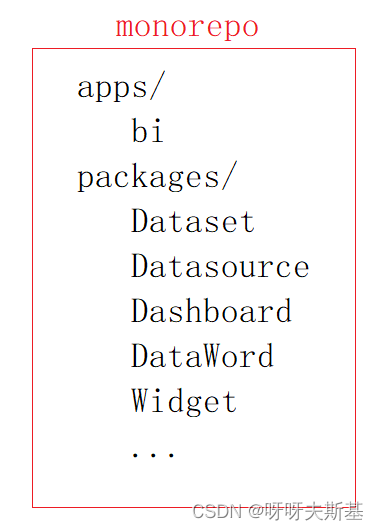

2023 年 1 月，因工作需要，调研 monorepo 和微前端等技术。

## 任务

一直在做的 BI 项目，随着需求迭代，模块越来越多，项目越来越复杂、臃肿。
最近，前一阶段的开发工作基本结束。新模块还在设计阶段。借此契机，调研一下前端项目拆分的技术，希望解决以下问题：

###### 问题 1

build 耗时太久。我的电脑性能一般，build 一次要十几分钟。（项目使用 vite，在 dev 阶段是按需加载的，所以 dev 时启动很快。只有 build 时慢）

###### 问题 2

BI 项目中有一个数据集模块 Dataset，这个模块本身相对独立，而且在公司其他一些项目中也会用到。
现在其他开发组要使用 Dataset 时，需要把我们的项目代码全部拷过去，然后删掉用不到的东西。因为数据集模块依赖了全局的 store、component 和方法，也接受父级组件通过 props 或者 provide 提供的参数，所以删的时候要很小心。
每次有新项目要使用 Dataset 的时候，都要重复一遍这个操作，很麻烦。
而且后续如果 BI 中有更新涉及到了 Dataset，别的项目也很难同步这个更新。

###### 问题 3

项目使用 vue2，在开发新模块时希望技术栈不受限制，可以使用新技术，或者换技术栈（比如 vue3 ts react ）

## 了解基本概念

### monorepo

一种代码管理方式，与之并列的概念是 polyrepo

- polyrepo 每个项目有自己的代码仓库
- monorepo 把多个（通常是相关的）项目的代码放在一个代码仓库中

[A Guide to Monorepos for Front-end Code](https://www.toptal.com/front-end/guide-to-monorepos)

monorepo advantages

- One place to store all configs and tests
- Easily refactor global features with atomic commits
- Simplified package publishing
- Easier dependency management
- Re-use code with shared packages while still keeping them isolated

monorepo disadvantages

- No way to restrict access only to some parts of the app.
- Poor Git performance when working on large-scale projects.

mono 和 poly 之间没有优劣之分。需要根据具体需要去选择。

注：turborepo 是实现 monorepo 的一个工具库。号称是现有的最快速、方便的 monorepo 方案。
[Why TurboRepo Will Be The First Big Trend of 2022](https://www.swyx.io/turborepo-why)

### 微前端

[微前端的介绍](https://zhuanlan.zhihu.com/p/78362028)
微前端是一种项目架构方式。
微服务指把一个巨型服务，拆分成多个独立的子服务。指服务端。
微前端是相同的理念，只不过指前端领域。

qiankun 是实现微前端的一个工具库。我们项目用不了，因为 qiankun 不支持 vite 子应用。具体看 [qiankun issues: vite support](https://github.com/umijs/qiankun/issues/1257)

从问题提出到现在近两年的时间，官方对此没有回应。
民间有一些包去实现这个需求，但代价也不小：比如没有了沙箱环境，热更新失效，发布时必须指明部署地址等。

京东的微前端库 micro-app 同样有这个问题：[microapp vite 支持](https://micro-zoe.github.io/micro-app/docs.html#/zh-cn/framework/vite)

因为从底层设计就不兼容，所以在不改底层实现时，可以说这个问题是无法解决的：主应用使用 eval 去执行子应用的 js，eval 天生自带隔离环境（？应该是，不确定）。但 vite 打包之后仍是 esm 代码，eval 里无法处理 import export。

## 调研结论

微前端和 monorepo 是两个不相干的概念，不要混淆。

结论：

1. 我们的项目不适用微前端。理由懒得细说了，看这个吧 - [你可能并不需要微前端](https://www.yuque.com/kuitos/gky7yw/fy3qri)
2. 可以使用 monorepo。比如说：把比较独立的模块做成包。主应用是一个项目，每个独立包都是单独的项目。把这些项目都放在一个仓库中去管理。
   这里只是说可以这样做，至于到底要不要做，还需要再仔细衡量。因为这么重构，改动可能会非常大。（在 [《工作记录：bi 重构》](post:e2101432-0ebb-40f0-8303-edf97004f667) 中就提到了。在调研完之后，我在开发中尝试把 Widget 独立成包，但是工作量远超想象，不得不放弃了。）
   
