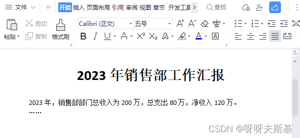
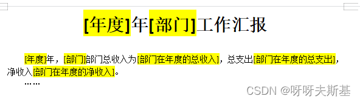
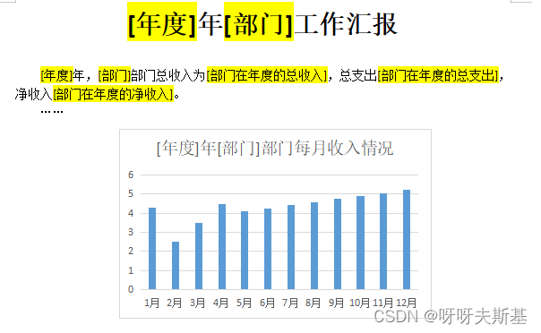
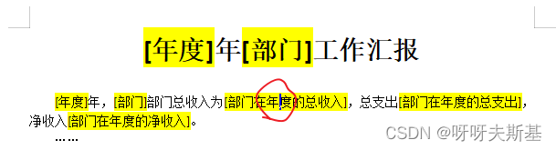
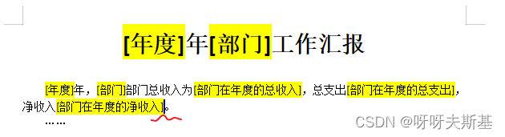
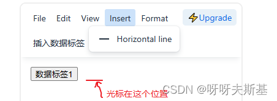
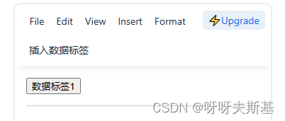
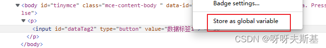
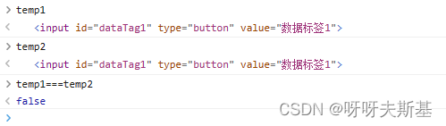

项目中需要实现 “在线编辑 word 模板” 的功能，我打算使用富文本组件 tinymce ，因为业务需求比较特殊，研究一下 tinymce 是否能实现。

如何在 vue 项目中引用 tinymce，可以看另一篇文章 [《在 vue 项目中使用 tinymce》](post:bf59642c-25e2-436e-9c89-820cd7bdd2e8)

（最后这个功能没有用 tinymce 实现，换了别的富文本库。但还是把这次的研究过程记录下来，给自己做一个总结回顾）

---

## 业务描述

### 使用场景

假设我需要写一个 word 文件：《2023 年销售部工作汇报》



写完之后，我还要给开发部、采购部写同样的报告，格式相同，只有金额数值需要根据各部门实际情况填写。写完了今年的报告，我还要补上之前年份的报告。

这些都是重复的工作，我想省点力气。做一个模板，让程序给我自动生成多份 word 文件。

简单观察就能发现，这篇报告中只有两个变量：**年度** 和 **部门**。收入支出的值都可以按照设定好的规则，根据这两个变量的值自动计算查询：



我使用这个模板时，只需要指明 **年度** 和 **部门** 的值，程序就会自动把所有值替换好，生成 word 文件。年度和部门是直接替换文字，金额是根据年度和部门的值自动查询数据库后再替换。

上面是简单的描述，真实项目要复杂得多，这里不详细说明了。

### 解释

- 年度、部门是 “全局参数”，导出 word 时用户可以设置这个值或者使用默认值（比如说年度默认取当前年）。
- 总收入、总支出、净收入是“数据标签”，每个标签都需要配置好规则，这样导出 word 时就可以根据全局参数的值实时查询数据

数据标签的规则设置非常灵活，可配置项很多，大部分的业务场景都可以覆盖。这里不细说了，举个例子简单理解一下就够了：（很久不写 sql 了，不确定语法对不对，明白意思就行）

```sql
# [总收入]的规则：
SELECT SUM(income) FROM table_money WHERE year = 年度 and dept = 部门;
```

除了简单的数据标签，还可以插入多种类型的图表。这些内容也需要配置数据规则、设置想要的样式。导出 word 时查询完数据，会自动渲染：



---

## 用 tinymce 怎么实现

### 每个数据标签是一个整体

全局参数、数据标签等业务组件，它们其实都是占位符。在编辑模板的时候，这些占位符的名字是由配置决定的（会根据你的配置信息自动给标签起名字），不应该让用户在富文本中直接修改文字。而且每个标签应该是一个整体。

如下图：光标在数据标签内部了，这是不可以的，应该禁止光标点进去：



光标在净收入标签的后面。这时候用户点击 Backspace 键，应该把 [净收入] 标签整个删除：



这种效果其实在 CodeMirror 中可以实现，也很好实现，因为 CodeMirror 提供了支持。但 tinymce 中并没提供支持（其实大部分富文本组件都不支持，这对于富文本属于进阶功能了，普通使用者用不到）。我也试了很久，在 tinymce 中想要实现很麻烦，

灵机一动，我可以用 button 标签啊！最终全局参数、数据标签决定用：

```html
<input type="button" value="[年度]" />
```

PROBLEM SOLVED!

（后来在网上看到有人说，Web component 配合 tinymce custom_elements 属性也可以实现类似功能。就不去试了，这里提一下。而且 Web component 也有兼容性问题，现在项目还没放弃兼容 IE，用不了）

---

### 编辑器中怎么显示图表

项目中的图表很多是用 echarts 实现的，比如柱状、饼图。但 echarts 图是不能放在 tinymce 编辑框中直接用的。所以我使用图片当占位符。

在屏幕外获取数据、渲染图表。渲染好之后，把图表转为图片，再更新占位符的 src。

因为最终导出到 word 后，用户看到的也是一张静态的图片（word 里也放不了活的 echarts 图表哇）

### 给数据标签添加事件

编辑模板时，点击数据标签，要弹出配置弹窗。所以要给数据标签添加点击事件。

tinymce 所有的 set 方法只接受 string 类型的参数。所以不能把 element 直接传给 insertContent，只能传 element.outerHTML。这样绑定的事件就无效了。

```js
onMounted(() => {
  tinymce.init({
    selector: "#target",
    toolbar: "addDataTag",
    setup: (editor) => {
      editor.ui.registry.addButton("addDataTag", {
        text: "插入数据标签",
        onAction: () => {
          const button = editor.getDoc().createElement("input");
          button.setAttribute("id", "dataTag1");
          button.setAttribute("type", "button");
          button.setAttribute("value", "数据标签1");
          button.addEventListener("click", function () {
            console.log("click");
          }); // 没用
          // insertContent 方法只接受 string 类型的参数，所以这里只能传 button.outerHTML。绑定的事件函数丢失了。
          editor.insertContent(button.outerHTML);
        },
      });
    },
  });
});
```

要想加点击事件，只能先用 tinymce set。等页面中已经有这个元素后，再去找到它并绑定事件：

```js
        onAction: () => {
          ...
          // 绑不上事件！
          button.addEventListener("click", function () { console.log("before");	});
          editor.insertContent(button.outerHTML);
          const res = editor.getDoc().querySelector("#dataTag1");
          // 成功绑定事件！
          res.addEventListener("click", function () { console.log("after"); });
        },
```

但是这样绑定的事件是临时的：每次页面回显数据时，都要给数据标签重新绑定一遍事件。

```js
onMounted(() => {
  tinymce.init({...});
  setTimeout(() => {
    // 从服务器获取数据并回显
    tinymce.activeEditor.setContent(`<input id="dataTag1" type="button" value="数据标签1">`);
    // 绑定事件
    const widgets = tinymce.activeEditor.getDoc().querySelector("input[type='button']");
    widgets.addEventListener("click", function () { console.log("回显时绑定事件"); });
  }, 500);
});
```

回显后给已有的标签绑定事件，新增时给当前新增的这个绑定事件。很麻烦，不如 **每次初始化时，给 editor.getDoc().body 绑定事件，根据 e.srcElement 判断触发元素**

（这里只是根据麻烦程度来考虑。但其实给元素绑定事件是根本不可行的，只能给 body 绑，原因在下面会说明）

### 关联数据

模板内容是一段 html 代码。业务组件的配置项是 object 对象。

要把 html 中代表业务组件的 Element 和配置项关联起来，就需要在 Element 上绑定属性：

```html
<input type="button" value="[年度]" biz-type="globalParams" biz-id="1" />
```

#### 自定义属性和事件被 cleanup 了

但是，我发现 tinymce 在每次获取、设置数据时，都会先执行 cleanup： 清除元素上的自定义属性、事件处理函数等。也就是说，上面的按钮在添加到文档中时， `biz-type` 和 `biz-id` 这两个自定义属性就已经丢失了。

显式调用 tinymce `getContent` `setContent` `insertContent` 方法时会被 cleanup。其他隐式触发 tinymce set 的操作也会悄悄执行 cleanup，防不胜防。举例：

我插入了一个数据标签，点击事件有，一切正常。光标的位置和数据标签在同一行，点击工具栏：插入水平线



变成：



再点击”数据标签 1“，没有反应，说明绑定的事件已经丢了。我认为原因是：插入水平线功能的内部实现是先 get 了当前行，进行数据处理、计算，再把算好的结果 set 进去，取代以前的内容。所以这一行的内容都被替换了，只是看上去一样罢了。

我也验证了这个想法：用浏览器的调试工具，把之前的 element 存下来了。和之后的 element 进行比较，果然是不相等的：



前后已经不是同一个元素了：


这也说明，在上一部分 “给数据标签添加事件” 中，给具体元素绑定事件是不可行的，很容易就会因为 cleanup 而丢失。只能采用给整个 editor.body 绑定事件的做法。

丢失事件的问题用 “给 body 整体绑事件” 就解决了，下面该说丢失自定义属性的问题了。

我原本想看 tinymce 的源码，看看它 cleanup 时用的什么规则，但找了挺久没找到。我决定换个思路，想到 tinymce 自动清理应该是为了规范数据，所以它不认 ”乱七八糟“ 的自定义属性，那正规的属性他就应该认了吧。我试了试 [HTML5 提供的自定义属性语法](https://developer.mozilla.org/zh-CN/docs/Web/HTML/Global_attributes/data-*) ：

```html
<input type="button" value="[年度]" data-biz-type="globalParams" data-biz-id="1" />
```

成功，tinymce 接受这两个属性了！
