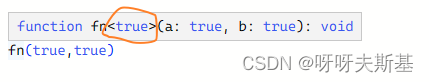
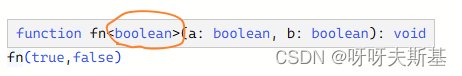
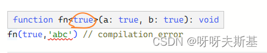

```ts
declare function fn<T extends true | false | "abc">(a: T, b: T): void;
fn(true, true);
fn(true, false);
fn(true, "abc"); // compilation error
```

在编辑器中，鼠标移上去，可以每次调用方法时的具体类型：






每次调用方法时，泛型 T 的具体类型究竟是如何决定的？
为什么 `fn(true,false)` 时推断 T 是 `boolean`，`fn(true,'abc')` 就不能推断 T 是 `true|'abc'` 呢？

我知道，如果每次调用都推成最宽泛的情况（即每次调用 fn，都推定 T 是 `true|false|'abc'`），泛型就失去了意义。
可是像现在这样，明明有规则但又不说清楚，算怎么回事呢？

只能通过 ts 的表现大概推测：同一个基本类型( string number boolean )可以，跨基本类型不行（maybe）

```ts
type U = "a" | "b" | 1;
declare function fn1<T extends U>(...args: T[]): void;

fn1("a");
fn1("a", "b");
fn1("a", 1); // compilation error
fn1("a", "b", 1); // compilation error
fn1("a", 1 as "a" | 1);
```
