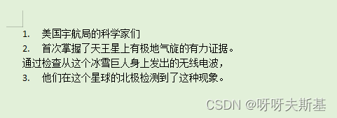

需求：上传 word 文档，在页面的富文本编辑器中展示、编辑后，再导出成 word 格式。

我负责开发列表功能

---

## 为什么不用 ul

一开始想用`<ul>` `<li>` 去实现列表，但随即发现一些问题：

###### 问题一：word 中的列表项允许跳过层级

在 word 中，可以手动调整列表项的编号级别


将 `1.1.` 的列表项降级一次就变为 `1.1.1.`：


也可以降级多次：


###### 问题二：列表项之间可能存在正文

下图四个列表项是属于同一个列表（共享同一套列表设置，延续编号）


将第三行变为正文。通过编号可以看出，前两行和最后一行仍然属于同一个列表



会出现这两个问题，是因为 word 的列表并不像 html 中的 `<ul>` `<li>` 一样有严格的层级嵌套结构。

如果要强行用 `<ul>` 。对于问题一，需要补齐跳过的层级。对于问题二，需要把插在列表中的中文也转为列表项。

---

## 采用平级标签

列表采用平级标签

```html
<p list-id="Numbered_557ff913-3ef4-446f-9a00-5e369471e9cd" list-item-level="0">
  <span>美国宇航局的科学家们</span>
</p>
<p list-id="Numbered_557ff913-3ef4-446f-9a00-5e369471e9cd" list-item-level="1">
  <span>首次掌握了天王星上有极地气旋的有力证据。</span>
</p>
```

`list-id` ：所属列表的 id

`list-item-level`：列表项的层级

### 计算列表序号

对于 word 内容：


在页面上变为平级的 p 标签：

```html
<p level="0">美国宇航局的科学家们</p>
<p level="1">首次掌握了天王星上有极地气旋的有力证据。</p>
<p level="1">通过检查从这个冰雪巨人身上发出的无线电波，</p>
<p level="0">他们在这个星球的北极检测到了这种现象。</p>
<p level="5">这些发现证实了关于我们太阳系中所有具有大量大气层的行星的一个广泛的事实：</p>
<p>无论这些行星主要由岩石还是气体组成，</p>
<p level="0">它们的大气层在两极都有漩涡的迹象。</p>
<p level="1">美国宇航局的科学家们利用微波观测发现了天王星上的第一个极地气旋，</p>
<p level="1">在这里看到的是天王星每张图片中中心右侧的一个浅色的点。</p>
<p level="5">这些图像使用的是波长为K、Ka和Q的波段，</p>
```

为了算出指定列表项的序号，单靠它自身的属性是不够的，必须结合整个文档的内容去计算：

1. 获取所在列表的所有列表项
2. 补齐可能缺少的层级
3. 构造成树
4. 列表项在树中的位置就是他的序号

### 转换为不同的序号类型

在 word 中可以设置很多不同类型的序号，比如：甲乙丙丁、一二三四、罗马数字、英文字母 26 进制序号等

在上一步计算出数字序号后，再转成不同类型的序号。

比如，对于阿拉伯数字序号为 `2.3.2` 的项，使用 甲乙丙丁 类型就是：`乙.丙.乙`；使用罗马数字类型就是 `II.III.II`

### 应用 formatter

序号还有 formatter 属性。

比如，对于数字序号为 `2.3.5` 的项，使用 一二三四 类型的序号：

formatter = `{0}.{1}.{2}` ，对应序号：`二.三.五`
formatter: `第{0}章第{1}节第{2}段` ，对应序号：`第二章第三节第五段`
formatter: `{1} * {2}` ，对应序号：`三 * 五`

---

## 渲染序号

列表项的序号使用 `::before` 实现，这样用户就不能随便修改序号的值了。

计算好序号之后，赋给 list-item-prefix 属性：

```html
<p list-id="1" list-item-level="5" list-item-prefix="2.1.1.1.1.1.">
  <span>这些发现证实了关于我们太阳系中所有具有大量大气层的行星的一个广泛的事实： </span>
</p>

<style>
  p[list-id]::before {
    content: attr(list-item-prefix);
  }
</style>
```

但是，由于项目富文本编辑器的限制，计算序号的方法没办法调用。平级标签的方案放弃了。不过计算序号的方法已经写好了，放这里吧：

```js
function getCorrectIndex(htmlString, id) {
  const doc = new DOMParser().parseFromString(htmlString, "text/html");
  const el = doc.querySelector("#" + id);
  // 获取所在列表的所有列表项
  const listId = el.getAttribute("list-id");
  var elements = Array.from(doc.querySelectorAll(`[list-id="${listId}"]`)).map((o) => {
    return {
      el: o,
      level: parseInt(o.getAttribute("list-item-level")),
    };
  });
  // （这里偷了个懒，去掉位置在自己之后的项，因为它们不影响序号。这样el肯定是最后一项，算序号时直接算tree的最后一项就行了）
  elements = elements.filter(function (o) {
    return o.el === el || compareElementOrder(o.el, el);
  });
  // 补齐可能缺少的层级
  patchMissingLevels(elements);
  // 构造成树
  const tree = convertToTree(elements);
  // 列表项在树中的位置就是他的序号
  return calculateLastItemIndex(tree);
}

// 比较两个元素在文档中的位置
function compareElementOrder(element1, element2) {
  var position = element1.compareDocumentPosition(element2);

  if (position & Node.DOCUMENT_POSITION_FOLLOWING) {
    // element1 出现在 element2 之前
    return true;
  } else if (position & Node.DOCUMENT_POSITION_PRECEDING) {
    // element1 出现在 element2 之后
    return false;
  } else {
    // 其他（不在同一个文档中、包含关系、待定、是同一元素）
    return false;
  }
}

// 补齐可能缺少的层级
function patchMissingLevels(arr) {
  for (var i = 0; i < arr.length - 1; i++) {
    var level1 = arr[i].level;
    var level2 = arr[i + 1].level;

    if (level1 + 1 < level2) {
      var newLevel = level1 + 1;
      var newItem = { level: newLevel };
      arr.splice(i + 1, 0, newItem);
    }
  }

  return arr;
}

function convertToTree(arr) {
  var root = { children: [] }; // 根节点
  var stack = [root]; // 用于维护父节点的栈

  for (var i = 0; i < arr.length; i++) {
    var current = arr[i];
    var level = current.level;

    var parent = null;
    while (stack.length > 0) {
      var last = stack[stack.length - 1];
      if (level > last.level) {
        parent = last;
        break;
      }
      stack.pop();
    }

    var newNode = { ...current, children: [] };
    if (parent) {
      parent.children.push(newNode);
    } else {
      root.children.push(newNode);
    }

    stack.push(newNode);
  }

  return root.children;
}

function calculateLastItemIndex(arr) {
  var res = [];
  res.push(arr.length);
  var lastItem = arr[arr.length - 1];
  while (lastItem.children.length > 0) {
    arr = lastItem.children;
    res.push(arr.length);
    lastItem = arr[arr.length - 1];
  }
  return res;
}
```

调用方法：

```js
const htmlString = `
  <p id="id1" list-id="1" list-item-level="0">美国宇航局的科学家们</p>
  <p id="id2" list-id="1" list-item-level="1">首次掌握了天王星上有极地气旋的有力证据。</p>
  <p id="id3" list-id="1" list-item-level="1">通过检查从这个冰雪巨人身上发出的无线电波，</p>
  <p id="id4" list-id="1" list-item-level="0">他们在这个星球的北极检测到了这种现象。</p>
  <p id="id5" list-id="1" list-item-level="5">这些发现证实了关于我们太阳系中所有具有大量大气层的行星的一个广泛的事实： </p>
  <p id="id6" >无论这些行星主要由岩石还是气体组成，</p>
  <p id="id7" list-id="1" list-item-level="0">它们的大气层在两极都有漩涡的迹象。</p>
  <p id="id8" list-id="1" list-item-level="1">美国宇航局的科学家们利用微波观测发现了天王星上的第一个极地气旋，</p>
  <p id="id9" list-id="1" list-item-level="1">在这里看到的是天王星每张图片中中心右侧的一个浅色的点。</p>
  <p id="id10" list-id="1" list-item-level="5">这些图像使用的是波长为K、Ka和Q的波段，</p>
`;
console.log(getCorrectIndex(htmlString, "id2")); // [1, 1]
console.log(getCorrectIndex(htmlString, "id5")); // [2, 1, 1, 1, 1, 1]
console.log(getCorrectIndex(htmlString, "id8")); // [3, 1]
console.log(getCorrectIndex(htmlString, "id9")); // [3, 2]
console.log(getCorrectIndex(htmlString, "id10")); // [3, 2, 1, 1, 1, 1]
```
