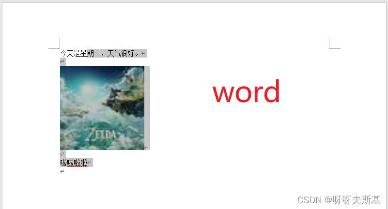
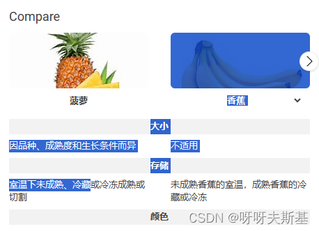

## Problem

What I want : <span style="color:darkorange">In the WYSIWYG editor, content changes color when selected.</span>

（The picture below is word, the background of the selected content turns gray.）



Normally, modern browsers support this effect by default. As shown below, the selected text and images all turn blue.



But in tiptap, the selected image does NOT change color.


## Solution

In browser, `user-select` controls the **color changing** effect.

> The user-select CSS property controls whether the user can select text.

But for elements with `draggable = true` set, browsers will change the value of `user-select` to `none`(which makes sense when you think about it). Images in tiptap are draggable and therefore do not change color.

Solution is simple: just set `user-select` MANUALLY !

```css
.tiptap-container img {
  user-select: text;
}
```


