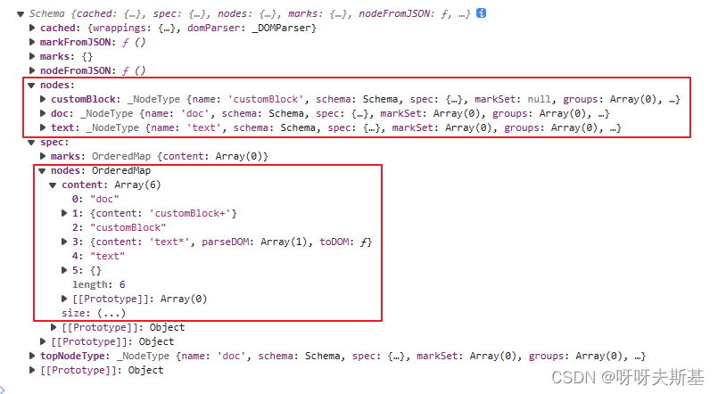
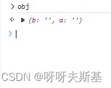
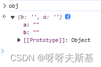
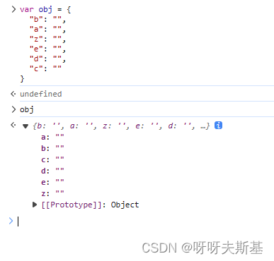

## 起因

使用 prosemirror 时，想要取 schema 实例设置的 nodes

```js
const mySchema = new Schema({
  nodes: {
    doc: {},
    customBlock: {},
    text: {},
  },
  marks: {},
});
```

在浏览器控制台查看 mySchema，发现两个地方有 nodes：


- `mySchema.nodes` 是普通对象，有三个属性，就是我想要获取的 nodes。但是我设置时顺序是 doc - customBlock - text，而控制台显示的顺序是 customBlock - doc -text，不一致
- `mySchema.spec.nodes` 是一个 [OrderedMap](https://github.com/marijnh/orderedmap) 对象

好奇用意所以研究了一下

## object property order

es5: 不规定属性顺序

es2015: 规定对象属性顺序，但不要求老操作符遵守

> While ES6 / ES2015 adds property order, it does not require `for-in`, `Object.keys`, or `JSON.stringify` to follow that order, due to legacy compatibility concerns.

> Other operations, like `Object.getOwnPropertyNames`, `Object.getOwnPropertySymbols`, `Object.defineProperties`, and `Reflect.ownKeys` do follow the following order for ordinary objects:
>
> - Integer indices (if applicable), in ascending order.
> - Other string keys (if applicable), in property creation order.
> - Symbol keys (if applicable), in property creation order.

es2020: 要求老操作符也要遵守这个顺序

> As of **ES2020**, even older operations like `for-in` and `Object.keys` are required to follow property order. That doesn't change the fact that using property order for fundamental program logic probably isn't a good idea, since the order for non-integer-index properties depends on when the properties were created.

**按照最新规定，对象属性是有顺序的，但并不保证是插入顺序！而且你无法得知用户使用的浏览器是否遵守最新规定。
所以当顺序很重要的时候，就不要用 object！可以用数组或者 Map（Map 会记住 key 的插入顺序）**

---

## 在浏览器控制台中查看对象

```js
var obj = {
  b: "",
  a: "",
};
```

打印 obj，显示的顺序正确：



但是点击箭头查看详情时，会看到详情里展示顺序变了：


应该是浏览器为了开发者查看详情方便，展示的时候重新排序了。

多加几个属性测试一下，也是如此：



结论：**在浏览器控制台中，点击按钮查看对象详情时，显示的并不是对象属性的真正顺序！**
（以前没想过这个问题，觉得控制台里展现的就是数据最真实的、原始的样子。发现了个盲区，好玩，但也要警惕）

---

## 说回 prosemirror

在 prosemirror scheam 中，nodes 的先后顺序很重要（顺序控制节点的优先级）

不知道出于什么原因，没有用 array 或者 Map 存储数据，而用了 object。这时为了保证顺序，就用 orderedMap 了

---

参考：[stackoverflow - Does ES6 introduce a well-defined order of enumeration for object properties?](https://stackoverflow.com/questions/30076219/does-es6-introduce-a-well-defined-order-of-enumeration-for-object-properties)
