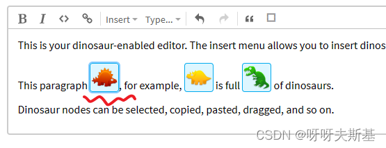
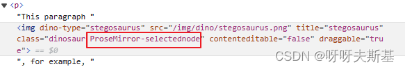
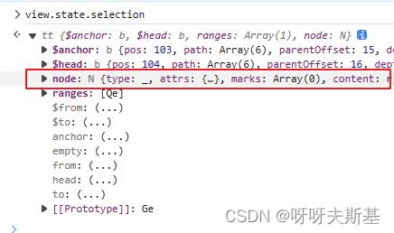
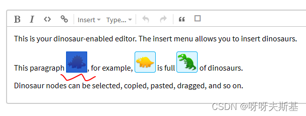
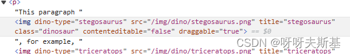
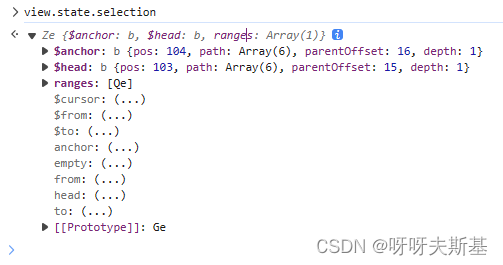
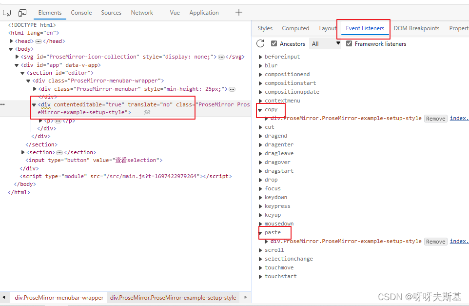
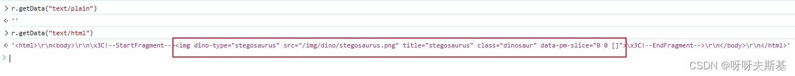
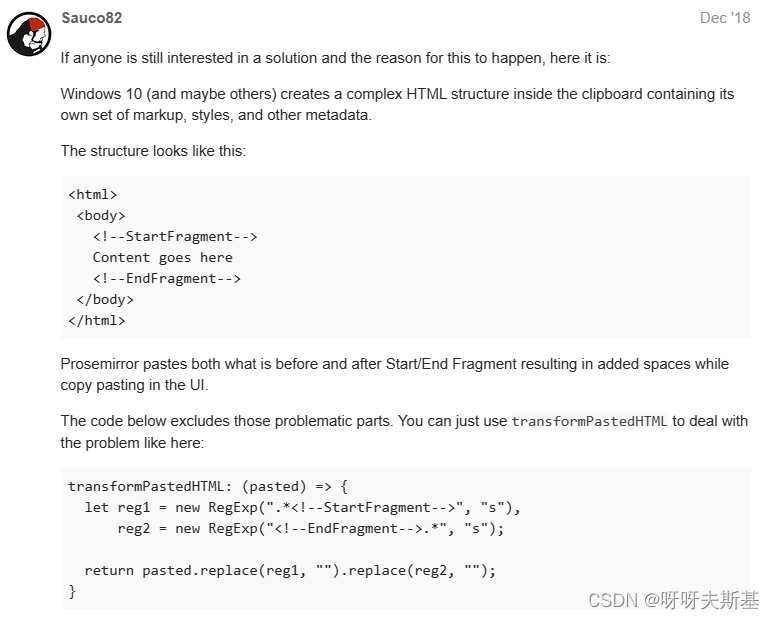

## bug

项目使用 prosemirror，复制 NodeSelection 时，会在末尾多出两个空格。

---

## NodeSelection

prosemirror 的 Selection 是抽象类，它有三个子类

- `TextSelection` 最常见的
- `NodeSelection` 指向单一节点的选区。设置了 selectable = true 的节点，点击选中为 NodeSelection
- `AllSelection` 全选整个文档

对于设置了 selectable = true 的节点，点击时是 NodeSelection，拖选时是 TextSelection。用 prosemirror 的 [dino 例子](https://prosemirror.net/examples/dino/)来举例说明：

### 点击红色恐龙



控制台查看 dom，是 selectednode



此时选区是 NodeSelection



### 拖选红色恐龙



查看 dom，不是 selectednode



此时选区是 TextSelection



---

## debug

### 定位事件处理函数



控制台 - Elements - 选中 prosemirror 容器 - Event Listeners - copy & paste，找到 prosemirror-view 的 input.ts 文件：

```js
handlers.copy = editHandlers.cut = (view, _event) => {
  let event = _event as ClipboardEvent
  let sel = view.state.selection, cut = event.type == "cut"
  if (sel.empty) return

  // IE and Edge's clipboard interface is completely broken
  let data = brokenClipboardAPI ? null : event.clipboardData
  let slice = sel.content(), {dom, text} = serializeForClipboard(view, slice)
  if (data) {
    event.preventDefault()
    data.clearData()
    data.setData("text/html", dom.innerHTML)
    data.setData("text/plain", text)
  } else {
    captureCopy(view, dom)
  }
  if (cut) view.dispatch(view.state.tr.deleteSelection().scrollIntoView().setMeta("uiEvent", "cut"))
}

editHandlers.paste = (view, _event) => {
  let event = _event as ClipboardEvent
  // Handling paste from JavaScript during composition is very poorly
  // handled by browsers, so as a dodgy but preferable kludge, we just
  // let the browser do its native thing there, except on Android,
  // where the editor is almost always composing.
  if (view.composing && !browser.android) return
  let data = brokenClipboardAPI ? null : event.clipboardData
  let plain = view.input.shiftKey && view.input.lastKeyCode != 45
  if (data && doPaste(view, data.getData("text/plain"), data.getData("text/html"), plain, event))
    event.preventDefault()
  else
    capturePaste(view, event)
}
```

### 复制

简化一下代码：

```js
handlers.copy = editHandlers.cut = (view, e) => {
  if (空选区) {
    return;
  }

  const { dom, text } = serializeForClipboard(
    view,
    view.state.selection.content()
  );
  event.preventDefault();
  e.clipboardData.clearData();
  e.clipboardData.setData("text/html", dom.innerHTML);
  e.clipboardData.setData("text/plain", text);

  if (是剪切) {
    删除选区;
  }
};
```

核心操作是，通过 `serializeForClipboard` 获取 `dom` 和 `text`，然后 set 到 clipboardData 中。

点击 dino 节点，复制（此时是 NodeSelection）。打断点查看，set 进去的 html 是：

```js
""
```

set 进去的 text 是空字符串。

到这一步还没有问题

### 粘贴

接下来看粘贴，同样简化一下代码：

```js
editHandlers.paste = (view, event) => {
  // ctrl+v 和 shift+insert 粘贴；ctrl+shift+v 粘贴为纯文本
  let plain = view.input.shiftKey && view.input.lastKeyCode != 45; // 粘贴为纯文本flag
  doPaste(
    view,
    event.clipboardData.getData("text/plain"),
    event.clipboardData.getData("text/html"),
    plain,
    event
  );
  event.preventDefault();
};
```

核心操作是，把 clipboardData 中的数据取出来，调用 doPaste

粘贴。打断点查看：


文本数据是空字符串，没问题。html 数据变了，多套了 `html > body > startFragment `。

一步步查看 `doPaste` -> `parseFromClipboard` ，发现 `parser.parseSlice` 返回值不对。它的返回值是 `[dino节点，TextNode<两个空格>`

继续查看 parseSlice 内部实现，发现它用 childNodes 获取子节点，得到`[text, comment, img, comment, text ]`（如果用 children 只会得到一个子节点 img）。一头一尾的 text 内容都是 "\n\n"，两个 comment 节点分别是 startFragment 和 EndFragment。

循环处理子节点：开头的 \n\n 被忽略，startFragment 忽略，img 保留，endFragment 忽略，结尾的 \n\n 保留

### 换成 TextSelection，复制

对比看看 TextSelection。复制，打断点查看，set 进去的 html 数据 是：（和刚才 NodeSelection 时相比，外面多套了一层 p）

```html
<p data-pm-slice="1 1 []">
  
</p>
```

text 还是空字符串

### TextSelection，粘贴

获取的 html 数据是：

```html
<html>
  <body>
    <!--StartFragment-->
    <p data-pm-slice="1 1 []">
      
    </p>
    <!--EndFragment-->
  </body>
</html>
```

`doPaste` -> `parseFromClipboard` -> `parser.parseSlice`，childNodes 是 `[text, comment, p>img, comment, text]`。循环处理子节点，和 NodeSelection 不同的是，处理到最后一项 \n\n 时，这一项被忽略了（简单看了一下，大概是循环到最后一项是，已生成的节点是[p>img]，判断最后一项的根节点 p 是块级元素，就把当前的 \n\n 忽略掉了）

### 总结

1. 复制时向 e.clipboardData 中设置数据。NodeSelection 设置的是 `img`，TextSelection 是 `p>img`
2. 粘贴时从 e.clipboardData 中获取数据。NodeSelection 获取到的数据多套了 html>body>startFragment， TextSelection 也多套了
3. 粘贴时，parseSlice 方法内部通过 childNodes 取子节点。NodeSelection 取到的是 `[text, comment, img, comment, text]`，TextSelection 是 `[text, comment, p>img, comment, text]`。comment 都被去掉了，开头的 \n\n 都被去掉了，但是结尾的 \n\n 在 NodeSelection 中被保留，Text Selection 中去掉了

通过看代码已经 debug 不下去了，改不动。不理解为什么要多套 html>body，弄得最后多俩空格，无语

---

## discussion

又去 google，看到了 [Space added on paste](https://discuss.prosemirror.net/t/space-added-on-paste/1274) 。和我遇到的问题一样。有人回复：

居然是 windows 干的好事，完全没想到。我一直以为是 prosemirror 内部处理什么东西加的。。

> [Windows HTML Clipboard Format HTML](https://learn.microsoft.com/en-us/windows/win32/dataxchg/html-clipboard-format): The fragment should be preceded and followed by the HTML comments <!--StartFragment--> and <!--EndFragment--> to indicate where the fragment starts and ends

解决方法上面也贴出来了，在 transformPastedHTML 中把 windows 加的这些东西给去掉就 ok 了
