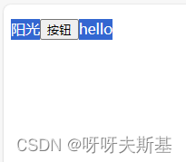

页面内容如下：

```html
<body>
  <div id="container1">
    <p>阳光<input type="button" value="按钮" /><span>hello</span></p>
  </div>
</body>
```


选择所有内容：



## user-select

按钮左右两侧的文字背景都变蓝了，但是按钮没有变。这是因为按钮的 [user-select](https://developer.mozilla.org/en-US/docs/Web/CSS/user-select) 默认值是 `none`


如果希望按钮也可以选择，手动设置 `user-select`：

```css
input[type="button"] {
  user-select: text;
}
```

此时再全选：


## 禁止复制

通过阻止默认事件来实现禁止复制

```js
// 禁止复制（ctrl+c ctrl+x shift+insert）
container1.addEventListener("copy", (e) => {
  e.preventDefault();
});
// 禁止右键菜单
container1.addEventListener("contextmenu", (e) => {
  e.preventDefault();
});
// 禁止选中文字
container1.addEventListener("selectstart", (e) => {
  e.preventDefault();
});
```

## 在 copy 事件中获取内容

在 `copy` 事件中获取 `selection`

```js
container1.addEventListener("copy", (e) => {
  const sel = window.getSelection();
  console.log(sel);
});
```


`selection.toString` 获取选择区域中的纯文本

```js
container1.addEventListener("copy", (e) => {
  const sel = window.getSelection();
  console.log(sel.toString()); // 输出'阳光hello'
});
```

输出： `阳光hello`（注意：虽然给按钮设置了 user-select，但是 toString() 中还是没有按钮的文本！）

如果要获取选中内容的 html 格式，用 [cloneContents](https://developer.mozilla.org/zh-CN/docs/Web/API/Range/cloneContents) 获取 html

```js
container1.addEventListener("copy", (e) => {
  const sel = window.getSelection();
  // console.log(sel().toString());	// 输出'阳光hello'
  const range = sel.getRangeAt(0); // TODO: getRangeAt(0) 什么意思
  console.log(range.cloneContents()); // 输出 document-fragment
});
```

输出：


## 在 copy 事件中修改内容

通过 `e.clipboardData.setData` 修改剪贴板内容（必须阻止 copy 默认事件）

```js
container1.addEventListener("copy", (e) => {
  const sel = window.getSelection();
  const text = sel.toString();
  e.clipboardData.setData("text/plain", text + "-后缀");
  e.preventDefault(); // 必须要阻止默认事件
});
```

## 在 paste 中获取内容

通过 `e.clipboardData.getData` 获取内容

```js
container1.addEventListener("paste", (e) => {
  // console.log(e.clipboardData.types); // 输出 ['text/plain', 'text/html']
  console.log(e.clipboardData.getData("text/plain"));
  console.log(e.clipboardData.getData("text/html"));
});
```

输出：


windows 系统用 `clipboardData` 获取 html 数据时，会自动包一层 html>body 和 startFragment，这个”特性“造成了 prosemirror 项目的 bug —— [fix: prosemirror adds two extra spaces when paste](https://blog.csdn.net/tangran0526/article/details/133815110)。

下一篇文章会讲到用 `navigator.clipboard.read` 获取数据，用那个 API 拿到的 html 数据是纯净的，不会包 html>body 和 startFragment 标签。

## 在 paste 中修改内容

在 paste 阶段再想修改内容很麻烦，但有时候不得不这么做。

如果想要在用户从网站上复制内容时，末尾都追加上版权信息。这种情况可以在 copy 方法中修改内容。
但是如果在用户进行粘贴操作时，需要根据不同的目标区域有不同的修改策略，那么就只能在 paste 方法中处理了。

举例：

```html
<!DOCTYPE html>
<html>
  <head>
    <meta charset="UTF-8" />
    <title>Document</title>
  </head>
  <body>
    <body>
      <section style="display: flex">
        <div
          style="height: 200px; background: pink; flex: 1"
          contenteditable="true"
          id="target1"
        ></div>
        <div
          style="height: 200px; background: blue; flex: 1"
          contenteditable="true"
          id="target2"
        ></div>
      </section>
    </body>
  </body>
</html>
```


希望在粉色区域粘贴时，加上后缀”-后缀 1”。在灰色区域粘贴是，加上后缀“-后缀 2”

要实现这个效果，只能阻止默认事件，然后自己执行 insertHTML

```js
target1.addEventListener("paste", (e) => {
  const text = e.clipboardData.getData("text/plain");
  document.execCommand("insertHTML", false, text + "-后缀1");
  e.preventDefault();
});
target2.addEventListener("paste", (e) => {
  const text = e.clipboardData.getData("text/plain");
  document.execCommand("insertHTML", false, text + "-后缀2");
  e.preventDefault();
});
```

效果：

