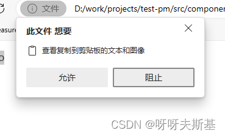
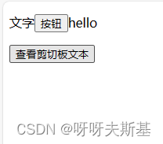
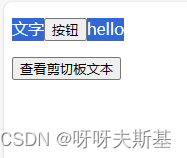
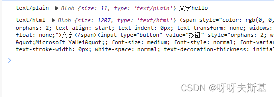
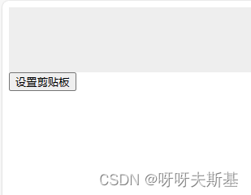
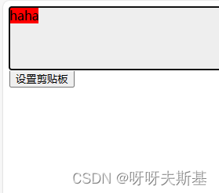

使用 [navigator.clipboard](https://developer.mozilla.org/zh-CN/docs/Web/API/Navigator/clipboard) 可以**随时**获取剪贴板对象（也就是说，在 copy/paste 事件外也可以用）

但是，此操作必须用户允许：



## readText

`readText()` 获取剪贴板中的文本内容

```html
<!DOCTYPE html>
<html>
  <head>
    <meta charset="UTF-8" />
    <title>Document</title>
  </head>
  <body>
    <div>
      <p>文字<input type="button" value="按钮" /><span>hello</span></p>
    </div>
    <input type="button" value="查看剪切板文本" onclick="getClipboardText()" />
    <script>
      async function getClipboardText() {
        const text = await navigator.clipboard.readText();
        console.log(text);
      }
    </script>
  </body>
</html>
```



选择 div 中的全部内容，复制



点击“查看剪切板文本按钮”，控制台输出：`文字hello`

## read

`read()` 获取剪贴板内容

```js
async function getClipboard() {
  const clipboardItems = await navigator.clipboard.read();
  for (const clipboardItem of clipboardItems) {
    const types = clipboardItem.types;
    // console.log("types", types); // 输出 ['text/plain', 'text/html']
    for (const type of types) {
      const blob = await clipboardItem.getType(type);
      const blobText = await blob.text();
      console.log(type, blob, blobText);
    }
  }
}
```

输出结果：



上图的含义是：剪贴板中有两类数据：`text/plain`（纯文本） 、 `text/html`（文本格式存储的 html）
纯文本数据内容是：`文字hello`
html 数据内容是：`<span>文字</span><input type="button" value="按钮"/><span>hello</span>`（省略 style 属性）

## writeText

```js
async function setClipboard() {
  await navigator.clipboard.writeText("你好");
}
```

#### write

```html
<!DOCTYPE html>
<html>
  <head>
    <meta charset="UTF-8" />
    <title>Document</title>
  </head>
  <body>
    <!-- 粘贴到可编辑的div中，能直观的看到效果 -->
    <div contenteditable="true" style="height: 80px; background: #eee"></div>

    <input type="button" value="设置剪贴板" onclick="setClipboard()" />
    <script>
      async function setClipboard() {
        await navigator.clipboard.write([
          new ClipboardItem({
            "text/html": new Blob([`<span style="background:red">haha</span>`], {
              type: "text/html",
            }),
          }),
        ]);
      }
    </script>
  </body>
  </body>
</html>

```

为了方便演示效果，准备一个 `contenteditable= true` 的 div：


点击“设置剪贴板"按钮，然后粘贴到 div 中，结果：

