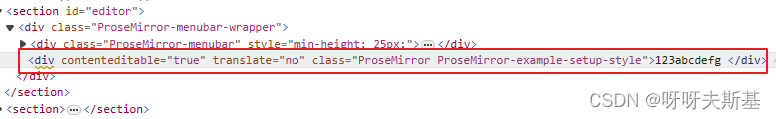
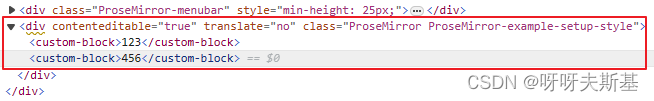

初始化 vite 项目
`pnpm create vite` framework - vue ,variant - JavaScript

初始化 eslint
`npm init @eslint/config`

## 最简单的 schema

nodes 中必须包含**顶级节点**和**文本节点**。顶级节点默认为 doc（可通过 topNode 修改）。文本节点为 text

```js
const mySchema = new Schema({
  nodes: {
    // content 的语法和正则类似。text* 代表任意个 text 节点
    doc: { content: "text*" },
    text: {},
  },
});
```

此时只能输入文字，文字直接放在（编辑区的）根节点中



## 添加 block 类型

```js
const mySchema = new Schema({
  nodes: {
    doc: {
      content: "custom_block*", // 文档包含任意个 custom_block
    },
    // doc 和 text 以外的节点类型，都必须提供 parseDom 和 toDom
    custom_block: {
      content: "text*", // 任意个文本
      parseDOM: [{ tag: "custom-block" }],
      toDOM() {
        return ["custom-block", 0];
      },
    },
    text: {},
  },
});
```

因为 html 中不存在 `custom-block` 这个标签，所以需要加一段 css：

```css
custom-block {
  display: block;
}
```

效果：



## NodeSpec 中的字段

- `group?: string` 分组，组名可以在 content 表达式里引用

- `atom?: boolean` Can be set to true to indicate that, though this isn't a leaf node, it doesn't have directly editable content and should be treated as a single unit in the view.（不知道什么场合用）

- `selectable?: boolean` Controls whether nodes of this type can be selected as a node
  selection.Defaults to true for non-text nodes.
  比如说，对于图片节点，当 `selectable = true` 时，点击图片则选区变为 NodeSelection。 `selectable = false` 时，点击图片没效果，选区还是空。
- `draggable?: boolean` node**在未选中**时是否可以拖拽
- `definingAsContext?: boolean` Determines whether this node is considered an important parent node during replace operations (such as paste). Non-defining (the default) nodes get dropped when their entire content is replaced, whereas defining nodes persist and wrap the inserted content.（意思理解了，但用时没感觉出来区别）
- `definingForContent?: boolean` In inserted content the defining parents of the content are preserved when possible. Typically, non-default-paragraph textblock types, and possibly list items, are marked as defining.（意思理解了，但用时没感觉出来区别）
- `defining?: boolean` When enabled, enables both `definingAsContext` and `definingForContent`
- `isolating?: boolean` When enabled (default is false), the sides of nodes of this type count as boundaries that regular editing operations, like backspacing or lifting, won't cross. An example of a node that should probably have this enabled is a table cell.
- `leafText?: (node: Node) => string` Defines the default way a leaf node of this type should be serialized to a string (as used by Node.textBetween and Node.textContent
