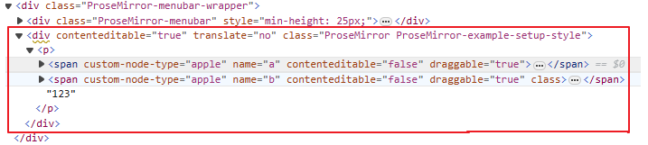
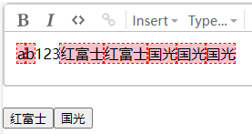

## apple type

向 schema 中添加 apple type

```js
const nodes = {
  apple: {
    inline: true,
    attrs: {
      name: { default: "unknown" },
    },
    group: "inline",
    draggable: true,
    parseDOM: [
      {
        tag: "span[custom-node-type=apple]",
        getAttrs(dom) {
          return {
            name: dom.getAttribute("name"),
          };
        },
      },
    ],
    toDOM(node) {
      let { name } = node.attrs;
      return ["span", { "custom-node-type": "apple", name }];
    },
  },
};
```

加上样式：

```css
span[custom-node-type="apple"]::before {
  content: attr(name);
  background: pink;
  outline: 1px dashed red;
}
```

效果：




## insertApple

```html
<template>
  <section>
    <input type="button" value="红富士" @click="handleClick" />
    <input type="button" value="国光" @click="handleClick" />
  </section>
</template>

<script setup>
  import { inject } from "vue";
  const editorView = inject("editorView");

  function handleClick(e) {
    const name = e.target.value;
    insertApple(name);
  }

  function insertApple(name) {
    const view = editorView.value;
    const appleType = view.state.schema.nodes.apple;
    const newAppleNode = appleType.create({ name });
    view.dispatch(view.state.tr.replaceSelectionWith(newAppleNode));
  }
</script>
```

点击按钮就可以在文档中插入一个 apple 节点



### 实时更新按钮状态

增加功能：插入前需要判断，仅在文档中没有此类苹果时才能添加

```js
function insertApple(name) {
  const view = editorView.value;
  const appleType = view.state.schema.nodes.apple;
  const find = findNodeIndex(view.state.doc, (node) => {
    return node.type.name === appleType.name && node.attrs.name === name;
  });
  if (find !== -1) {
    return;
  }
  const newAppleNode = appleType.create({ name });
  view.dispatch(view.state.tr.replaceSelectionWith(newAppleNode));
}

function findNodeIndex(doc, isMyNode) {
  let found = -1;
  doc.nodesBetween(0, doc.content.size, (node, pos) => {
    if (found !== -1) return false;
    if (isMyNode(node)) found = pos;
  });
  return found;
}
```


增加功能：按钮不可用时，将按钮禁用。

改写 insertApple 方法：添加 just_check 参数


- `insertApple(name, true)` 只想看看命令是否可用，并不想真的插入一个苹果
- `insertApple(name)` 确实是想插入一个苹果

根据 insertApple(name, true) 的返回值更新 button 的 disabled 状态：

```js
const button1 = ref();
const button2 = ref();
function updateButtonState(el) {
  const name = el.value;
  const flag = insertApple(name, true);
  if (flag) {
    el.removeAttribute("disabled");
  } else {
    el.setAttribute("disabled", true);
  }
}
setInterval(() => updateButtonState(button1.value), 1000 / 60);
setInterval(() => updateButtonState(button2.value), 1000 / 60);
```

上面的代码用定时器调用 updateButtonState，很垃圾。

如果能在 view 变化时才调用 updateButtonState 就好了 —— prosemirror 的 `Plugin` 提供了这个能力！！！

### 用 Plugin 实现实时更新

```js
import { Plugin } from "prosemirror-state";

new Plugin({
  view(view) {
    // 初始化时执行，只执行一次

    return {
      update(view, prevState) {
        // view 每次变化时都会执行 update
      },
      destroy() {},
    };
  },
});
```

使用 Plugin 重写插入苹果的功能：（伪代码）

```js
new Plugin({
  view() {
    appleMenus = [
      { name: "红苹果", active: true },
      { name: "绿苹果", active: true },
    ];

    return {
      update(view, prevState) {
        appleMenus.forEach((appleMenu) => {
          appleMenu.active = insertApple(appleMenu.name, true);
        });
      },
      destroy() {},
    };
  },
});
```

### 将 insertApple 改写成 command 形式

prosemirror 的 [command](https://prosemirror.net/docs/guide/#commands) 格式为：

```js
function command_a(state, dispatch, view) {
  // When a command isn't applicable, it should return false and do nothing.
  // When applicable, it should dispatch a transaction and return true.
}
```

举例：`toggleMark` 是 prosemirror 的内置方法，返回一个 切换指定 mark 和 attrs 的 command

```js
function toggleMark(markType, attrs){
	return function(state, dispatch){
		if(无法切换) return false
		if(dispatch){
			dispatch(tr....)
		}
		return true
	}
}
```

依样画葫芦改造 insertApple：（改造后 insertApple 本身不是 command，它返回一个 command）

```js
function insertApple(name) {
  return function (state, dispatch) {
    const appleType = state.schema.nodes.apple;
    const find = findNodeIndex(state.doc, (node) => {
      return node.type.name === appleType.name && node.attrs.name === name;
    });
    if (find !== -1) {
      return false;
    }
    if (dispatch) {
      const newAppleNode = appleType.create({ name });
      dispatch(state.tr.replaceSelectionWith(newAppleNode));
    }
    return true;
  };
}
```

这样调用内置方法（toggleMark）和自定义方法（insertApple）就可以用统一的方式调用了

## 自定义菜单

MyCustomMenuPlugin.js

```js
import { setBlockType, toggleMark } from "prosemirror-commands";
import { Plugin } from "prosemirror-state";
import { ref } from "vue";
import { mySchema } from "./schema";
import { findNodeIndex } from "./utils/utils";

export const MyCustomMenuPlugin = new Plugin({
  view(view) {
    function update(view) {
      // 按钮的 active 和 enable 状态需要即时更新
      menus.value.forEach((menu) => {
        if (menu.updateActive) {
          menu.active = menu.updateActive(view.state);
        }
        if (menu.updateEnable) {
          menu.enable = menu.updateEnable(view.state); // 不传dispatch参数
        }
      });
    }
    update(view);
    return { update };
  },
});
export const menus = ref([
  {
    label: "加粗",
    run: toggleMark(mySchema.marks.strong),
    active: true,
    updateActive: (state) => markActive(state, mySchema.marks.strong),
    enable: true,
  },
  {
    label: "段落",
    run: setBlockType(mySchema.nodes.paragraph),
    active: true,
    updateActive: (state) => blockTypeActive(state, mySchema.nodes.paragraph),
    enable: true,
  },
  {
    label: "标题1",
    run: setBlockType(mySchema.nodes.heading, { attrs: { level: 1 } }),
    active: true,
    updateActive: (state) =>
      blockTypeActive(state, mySchema.nodes.heading, { level: 1 }),
    enable: true,
  },
  {
    label: "插入大苹果",
    run: insertApple("大苹果"),
    enable: true,
    updateEnable: (state) => insertApple("大苹果")(state),
  },
  {
    label: "插入小苹果",
    run: insertApple("小苹果"),
    enable: true,
    updateEnable: (state) => insertApple("小苹果")(state),
  },
]);
// 自定义命令
function insertApple(name) {
  return function (state, dispatch) {
    const appleType = state.schema.nodes.apple;
    const find = findNodeIndex(state.doc, (node) => {
      return node.type.name === appleType.name && node.attrs.name === name;
    });
    if (find !== -1) {
      return false;
    }
    if (dispatch) {
      const newAppleNode = appleType.create({ name });
      dispatch(state.tr.replaceSelectionWith(newAppleNode));
    }
    return true;
  };
}

// mark 级别的按钮用来判断 active（从 prosemirror-example-setup 包中抄的）
function markActive(state, type) {
  let { from, $from, to, empty } = state.selection;
  if (empty) return !!type.isInSet(state.storedMarks || $from.marks());
  else return state.doc.rangeHasMark(from, to, type);
}
// block 级别的按钮用来判断 active（从 prosemirror-example-setup 包中抄的）
function blockTypeActive(state, nodeType, attrs) {
  let { $from, to, node } = state.selection;
  if (node) return node.hasMarkup(nodeType, attrs);
  return to <= $from.end() && $from.parent.hasMarkup(nodeType, attrs);
}
```

TestEditor.vue：

```html
<script setup>
  import { exampleSetup } from "prosemirror-example-setup";
  import { EditorState } from "prosemirror-state";
  import { EditorView } from "prosemirror-view";
  import { onMounted, shallowRef } from "vue";
  import "./editor.css";
  import { MyCustomMenuPlugin, menus } from "./MyCustomMenuPlugin";
  import { mySchema } from "./schema";

  const editorView = shallowRef(); // 不能用ref

  onMounted(() => {
    editorView.value = new EditorView(document.querySelector("#editor"), {
      state: EditorState.create({
        schema: mySchema,
        plugins: exampleSetup({
          schema: mySchema,
          menuBar: false, // 不使用 exampleSetup 提供的 menu
        }).concat(MyCustomMenuPlugin), // 用 concat 加上我们自定义的 menu 插件
      }),
    });
  });

  function handleClick(e, o) {
    e.preventDefault();
    o.run(editorView.value.state, editorView.value.dispatch);
  }
</script>

<template>
  <section class="custom-menu">
    <input
      v-for="o in menus"
      :key="o.label"
      type="button"
      :value="o.label"
      @click="(e) => handleClick(e, o)"
      :class="{ active: o.active }"
      :disabled="!o.enable"
    />
  </section>
  <section id="editor"></section>
</template>

<style>
  span[custom-node-type="apple"]::before {
    content: attr(name);
    background: pink;
    outline: 1px dashed red;
  }
  input[type="button"].active {
    font-weight: bold;
    background: gray;
    color: white;
  }
</style>
```

效果：


