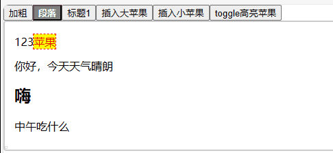
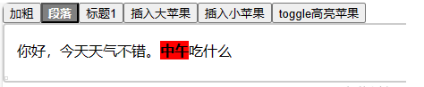
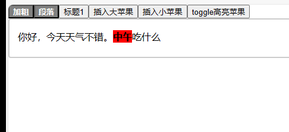
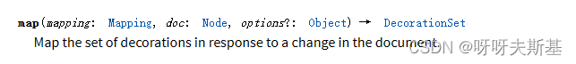

## 使用 decorations

使用 props - decorations() 添加 decorations

写一个简单的插件：高亮所有 apple 节点

```js
export const MyHighlightApplesPlugin = new Plugin({
  props: {
    // view 每次变化都会执行 decorations 方法
    decorations(state) {
      let arrs = [];
      state.doc.descendants((node, pos) => {
        if (node.type.name === "apple") {
          const deco = Decoration.inline(pos, pos + 1, { class: "highlight" });
          arrs.push(deco);
        }
      });
      return DecorationSet.create(state.doc, arrs); // 返回 DecorationSet
    },
  },
});
```

css

```css
span[custom-node-type="apple"].highlight::before {
  background: yellow;
  color: red;
}
```

效果：


## 用 Plugin - state 存储数据

Plugin 中的 state 字段可以存储数据

- `init: (config, state) => T`
- `apply: (tr, value:T, oldState, newState) => T`

`plugin.getState(state)` 可以获取这个数据

将 DecorationSet 存在 state 中，改写上面的插件：

```js
export const MyHighlightApplesPlugin = new Plugin({
  state: {
    init(_, state) {
      return createAppleDecos(state.doc);
    },
    apply(tr) {
      return createAppleDecos(tr.doc);
    },
  },
  props: {
    decorations(state) {
      const set = MyHighlightApplesPlugin.getState(state);
      return set;
    },
  },
});

function createAppleDecos(doc) {
  let arrs = [];
  doc.descendants((node, pos) => {
    if (node.type.name === "apple") {
      const deco = Decoration.inline(pos, pos + 1, { class: "highlight" });
      arrs.push(deco);
    }
  });
  return DecorationSet.create(doc, arrs); // 返回 DecorationSet
}
```

## setMeta

给高亮效果添加开关，点击按钮随时切换是否高亮

plugin 中存储 enable 字段（以前只存储 `set`，现在是 `{enable,set}`）

```js
export const MyHighlightApplesPlugin = new Plugin({
  state: {
    init(_, state) {
      return {
        enable: true,
        set: createAppleDecos(state.doc),
      };
    },
    apply(tr, value) {
      const { enable } = value;
      let set;
      if (enable) {
        set = createAppleDecos(tr.doc);
      } else {
        set = DecorationSet.empty;
      }
      return { enable, set };
    },
  },
  props: {
    decorations(state) {
      const { set } = MyHighlightApplesPlugin.getState(state);
      return set;
    },
  },
});
```

enable 字段添加上了，接下来要在点击按钮时修改它的值

```js
function toggleHighlightApples() {
  // 通过 getState 获取数据
  const state = MyHighlightApplesPlugin.getState(editorView.value.state);
  // 直接修改！
  state.enable = !state.enable;
  // 然后 dispatch 一个 tr
  const tr = editorView.value.state.tr;
  editorView.value.dispatch(tr);
}
```

上面的代码在插件外部直接修改 state.enable ，能实现效果，但是不好。
正确的做法是发一个信号，让 plugin 内部自己修改。

`tr.setMeta` 发信号：

```js
function toggleHighlightApples() {
  const state = MyHighlightApplesPlugin.getState(editorView.value.state);
  const tr = editorView.value.state.tr;
  tr.setMeta(MyHighlightApplesPlugin, !state.enable);
  editorView.value.dispatch(tr);
}
```

`apply` 中 `getMeta` 接收信号

```js
    apply(tr, value) {
      let { enable } = value;
      const meta = tr.getMeta(MyHighlightApplesPlugin);
      if (meta !== undefined) {
        enable = meta;
      }
      let set;
      if (enable) {
        set = createAppleDecos(tr.doc);
      } else {
        set = DecorationSet.empty;
      }
      return { enable, set };
    },
```

效果



## set.map(tr.mapping, tr.doc) 的作用

官网示例 [image placeholder example](https://prosemirror.net/examples/upload/) 中用到 `set.map(tr.mapping, tr.doc)` ，作用看不懂，写代码测试一下

写一个简单的插件：给粗体文字自动添加红色背景

```js
export const TestPlugin = new Plugin({
  state: {
    init(_, state) {
      return addRedBg(state.doc);
    },
    apply(tr, set) {
      return set;
    },
  },
  props: {
    decorations(state) {
      const set = TestPlugin.getState(state);
      return set;
    },
  },
});

function addRedBg(doc) {
  let arrs = [];
  doc.descendants((node, pos) => {
    if (node.marks.find((mark) => mark.type.name === "strong")) {
      const deco = Decoration.inline(pos, pos + node.nodeSize, {
        style: "background:red",
      });
      arrs.push(deco);
    }
  });
  return DecorationSet.create(doc, arrs);
}
```

文档初始内容为：

```html
<p>你好，今天天气不错。<strong>中午</strong>吃什么</p>
```

效果：



因为只在 init 中设置 deco，在 apply 中什么都没做。所以插件不会响应后续视图变化

新增 bold 文本，不会变红：


移除 bold，不会消失：


修改文档内容，致使 bold 文字位置变动，红色不跟着挪位置：


这些都是意料之中的效果。现在在 apply 中添加上这一句：

```js
    apply(tr, set) {
      set = set.map(tr.mapping, tr.doc);	// 新增
      return set;
    },
```

新增 bold 文本、移除 bold 的效果不变，不放图了。

修改文档内容，致使 bold 文字位置变动，效果和之前不同了：



[transform Guide](https://prosemirror.net/docs/guide/#transform) 中讲到了 Mapping 的用法

```js
let tr = new Transform(myDoc);
tr.split(10); // split a node, +2 tokens at 10
tr.delete(2, 5); // -3 tokens at 2
console.log(tr.mapping.map(15)); // → 14
console.log(tr.mapping.map(6)); // → 3
console.log(tr.mapping.map(10)); // → 9
```

结合 DecorationSet.map 的说明：

`set.map(tr.mapping, tr.doc)` 的含义就明白了 —— 所有 deco 都应用 tr.mapping 找到新位置。

但是对于新增的 bold 文本（需要新增 deco），或者已经有的 bold 文本去掉 bold 效果（需要移除 deco），`set.map(tr.mapping, tr.doc)` 就无能为力了（剪切、复制、拖拽等同样处理不了）
