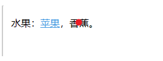
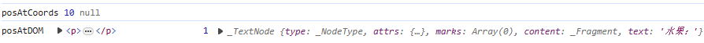
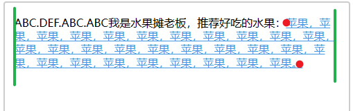

为了描述清晰，先区分两个概念：光标 vs 鼠标


上图中，光标位置不变，一直在句号的后面。鼠标位置一直在变

## 需求

editor 需要实现这样的效果：

1. 添加超链接：
   点击“插入超链接”按钮后，在 editor 中光标附近出现一个设置面板。填写文本、链接后点击确定，在光标位置插入超链接

   

2. 编辑超链接：

   鼠标移动到 link 上时，显示 toolbar。光标移开时，toolbar 消失。

   

   点击 toolbar 中的“编辑链接”，弹出设置面板。这个设置面板和添加链接时的一样，不会随着光标移出而消失：

   

   点击 toolbar 中的“移除链接”：

   

## 遇到问题

想用 tiptap 的 [addNodeView](https://tiptap.dev/guide/node-views/vue#render-a-vue-component) 实现设置面板和 toolbar，但是 vue 组件中的内容显示不出来。
debug 了好久，最后才反应过来 link 是 **mark**，不是 **node**，用不了 **node**View！

## 尝试把 link 改为 node，失败

既然只有 node 才能用 nodeView，那我就把 link 改成 node 类型的！

```js
// link node schema:
link: {
  inline: true,
  group: "inline",
  content: "text*",
  attrs: { href: {} },
  parseDOM: [
    {
      tag: "a[href]",
      getAttrs(dom) {
        return { href: dom.getAttribute("href") };
      },
    },
  ],
  toDOM(node) {
    let { href } = node.attrs;
    return ["a", { href }, 0];
  },
},
```

link 设置成 node 后，能显示出来。但是光标在 link 内部时，按回车不会换行。


其实已经有预感了，mark 和 node 完全不同，强行改肯定会遇到问题。

仔细想一下，prosemirror 的 node 种类：

- text：纯文本在 pm 中是 TextNode。但在 html 里就是文字，不是 html 标签
- inline 节点：内容不可编辑，比如 img
- block 节点

prosemirror 没有 “内容可编辑的 inline 节点”，所以它不需要处理 “光标在 inline 元素**内部**时，按下 enter ” 的情况，所以我们在 link 内部按 enter 没有反应。

当然问题肯定不止这一个，参考 [github issue - support for inline nodes with content](https://github.com/ProseMirror/prosemirror/issues/114) 和 [prosemirror discussion - Inline nodes with content](https://discuss.prosemirror.net/t/discussion-inline-nodes-with-content/496)：

prosemirror 之前是完全不支持 inline nodes with content 的。因为：

- 部分浏览器处理 inline 节点边界位置的光标有问题
- 光标在边界时难处理
- 违背了 prosemirror “内联内容使用平面”的原则（详细内容查看 [library guide](https://prosemirror.net/docs/guide/#doc)），会造成很多问题。

最终作者决定仅对使用 custom node view 的节点支持此特性

> marijnh: I've decided to only support this when the node is drawn using a custom node view, since browsers just behave to awfully to have this work generally without custom special-case code.

---

## 监听 mousemove 实现 toolbar

<span style="color:darkorange">TODO：mouseover mouseout 更效率一点</span>

### 判断光标是不是在 link 上

#### 1. 找 pos

pos 指 prosermirror 的 document position

- `posAtCoords` 获取当前光标位置的坐标【含义很好理解，用它没错】
- `posAtDOM` 获取触发 mousemove 的 dom 元素起始位置的坐标【比较 tricky，在下一步“找 node”里我会详细解释】

```js
new Plugin({
  props: {
    handleDOMEvents: {
      mousemove(view, e) {
        const pos1 = view.posAtCoords({ top: e.clientY, left: e.clientX })?.pos;
        const pos2 = view.posAtDOM(e.target);
        }
      },
    },
  },
}),
```

#### 2. 找 node

node 是 prosemirror 的 node，用 `doc.nodeAt(pos)`

```js
const pos1 = view.posAtCoords({ top: e.clientY, left: e.clientX })?.pos;
const pos2 = view.posAtDOM(e.target);

const node1 = view.state.doc.nodeAt(pos1);
const node2 = view.state.doc.nodeAt(pos2);

// 重点看看 node 不一样时的情况：
if (node1 !== node2) {
  console.log("posAtCoords", pos1, node1);
  console.log("posAtDOM", e.target, pos2, node2);
}
```

当光标在 link 上时，`posAtCoords` 和 `posAtDOM` 最终都能找到 `TextNode<苹果 linkMark>`


重点看看取到的 node 不一样的情况。

- 当光标在纯文本上时：

  

  结果：
  

  `posAtCoords`：找到的 pmNode 是 `TextNode<香蕉>`
  `posAtDOM`：<span style="color:darkorange">e.target 是 p</span>，pos 是 p 段首位置，pmNode 是 `TextNode<水果>`。怪怪的

  关键原因：

  - link 在 pm 里是 `TextNode<文字，link>`，在 html 中是 a 标签。
  - 纯文字在 pm 里是 `TextNode<文字>`，在 html 里不是标签

- 当光标在空白处时：

  

  结果：

  

  `posAtCoords`：没有对应的 pmNode
  `posAtDOM`：e.target 是 p，pos 是 p 段首位置，pmNode 是 `TextNode<水果>`。还是怪怪的

虽然上面两种情况 `posAtDOM` 的结果都怪怪的。不过我现在只关心光标在 link 上的情况，所以其实用哪个都行。

#### 3. node 有没有 link mark

```js
const marks = node?.marks;
const linkMark = marks?.find((mark) => (mark.type.name = "link"));
```

现在在 mousemove handler 中已经可以判断出光标是否在 link 上了。
下一步就是把浮窗显示出来，最主要的是确定浮窗的位置（指浏览器的坐标，不是 pm 的 pos）

### 确定浮窗位置

`view.coordsAtPos(pos)` 根据 pm pos 获取浏览器位置坐标，所以关键是获取 pm pos。

获取 pmNode 的首、尾 pos：

```js
let nodePos;
// 没有找到相关的 API，所以傻瓜式遍历了。。。
view.state.doc.descendants((_node, pos) => {
  if (node === _node) {
    nodePos = [pos, pos + node.nodeSize]; // 尾pos = 首pos + nodeSize
  }
  if (nodePos) return false;
});
```

但是 link 是可以跨行的，如下图：


只说水平方向，如果只考虑 link 的首、尾 pos，即图中红点位置，那么悬浮窗就会很靠右！
所以还要考虑段首、段尾坐标（图中绿色竖线）。注意：段尾坐标不是段尾文字的位置，因为文字可能没有铺满整行。

算段首、段尾坐标的方法：

- link 首尾 pos 对应的 y 坐标不同，说明跨行了，需要取段首、段尾坐标：
- 段首坐标比较简单，找到 link 所在的 block 元素，用它的 headPos 取坐标
- 段尾没想到好办法，只能循环 link 跨越的所有 pos，找到 x 坐标最大的。

—— 理论上是这样，不过我没试过，实在懒得写了

就跟 link 起始位置对齐吧！

```js
if (!linkMark) {
  closeToolbar();
} else {
  let nodeHeadPos;
  view.state.doc.descendants((_node, pos) => {
    if (nodeHeadPos !== undefined) return false;
    if (node === _node) {
      nodeHeadPos = pos;
    }
  });
  const { left: headLeft, top: headTop } = view.coordsAtPos(nodeHeadPos);
  openToolbar({
    left: headLeft,
    top: headTop,
    text: node.text,
    link: linkMark.attrs.href,
    from: nodeHeadPos,
    to: nodeHeadPos + node.nodeSize,
  });
}
```

### 光标朝浮窗移动的过程中，怎么浮窗保持不关闭它不关

悬浮窗一般不会紧贴着 link，不好看，会留出一个间距。如下图红框区域：


光标移向浮窗的过程中，经过红框区域，光标已经不在 link 上了，就会关闭浮窗。
但我们此时是希望浮窗保持不关的，怎么办？

#### 方法 1：透明 padding 伪装间距

一种偷懒的想法是，给 toolbar 底部加一个透明 padding，伪装成间距。光标在移动的过程中，虽然移出了 link，但是直接移动到 toolbar 上了，toolbar 是 editor 外的元素，不会触发我们的 mousemove handler。
实现效果！但是这样做的坏处是遮挡了 editor。如果用户在这个区域想点击 editor，就点不上了。我把这个间距调大，容易看出效果：

当然一般间距都比较小，影响不大

```html
<template>
  <div v-show="visible" :style="containerStyle">
    <div :style="{ height: toolbarHeight + 'px' }">这里是 toolbar</div>
  </div>
</template>

<script setup>
  const toolbarHeight = ref(34);
  const containerStyle = reactive({
    left: "",
    top: "",
    paddingBottom: "10px",
  });

  function show({ left, top, text, link }) {
    visible.value = true;
    const { top: parentTop, left: parentLeft } =
      window.view.dom.getBoundingClientRect();
    // 参数 left top 都是相对于浏览器的位置，要减去父容器自身偏移量
    containerStyle.left = left - parentLeft + "px";
    // 计算 top 时最后要 +1，不然会有空隙。
    containerStyle.top =
      top -
      parentTop -
      toolbarHeight.value -
      parseInt(containerStyle.paddingBottom) +
      1 +
      "px";
  }
</script>
```

如果计算 top 时没有加 1，就是下图这种效果：为了看得清楚，我给 toolbar 添加绿色背景，p 添加深灰色背景。在绿色和深灰色之间有一条空隙！


这个 1px 距离是哪里来的我还不知道，我试过调字号、间距、边框等，都是差 1px。。。

#### 方法 2：mousemove 中判断坐标位置


mousemove handler 中判断，如果 toolbar 是显示状态，且光标在红框区域移动，就不要关闭 toolbar。

#### 效果

方法 1 写起来比较省事，我就用方法 1 了。看看效果：


### toolbar 用 absolute 还是 fixed？

#### absolute

- 位置是相对于父元素的，计算的时候还得考虑父元素的 padding border margin，比较麻烦
- 【优】滚动时会跟着走
- 【缺】会被父元素“框住”（超出父元素尺寸的内容显示不出来）


#### fixed

- 位置是相对浏览器的，计算省事
- 【缺】滚动时不会自动跟着走。如果想要跟着走，需要自己监听 scroll 事件修改浮窗坐标
- 【优】不会被“框住”


上面说的优缺点，无论是算起来麻烦，还是滚动时会不会自动跟着走，都是能解决的。唯一不能解决的是“被框住”（指用 absolute 的情况）。

我现在的需求是写 toolbar，高度很小，所以不怕“被框住”，可以用 absolute。

如果悬浮框很大，父元素尺寸很小，很容易遮住：

- 用 absolute 时判断，如果上面有位置，就在上面显示。如果下面有位置，就在下面显示。
- 用 fixed 吧。


## 实现设置窗口

设置窗口有两种触发方式

### 通过 hover toolbar 触发

要反显、修改的是鼠标 hover 的 link。和光标（即 pm selection）完全无关

如下图：此时光标在 link-B 中，鼠标 hover 到 link-A 上。
编辑时，反显的 text 和 link 都是 link-A 的。保存后，也是 link-A 被替换：


显示设置弹窗：

```js
function hoverToolbarCallEditLink({ left, top, text, link, from, to }) {
  LinkSettingsPanelRef.value.showSettingsPanel({
    left,
    top,
    text,
    link,
    from,
    to,
  });
}
```

保存

```js
function updateLink_trigger_by_hover_toolbar() {
  const from = linkData.pmNodePos;
  const to = from + linkData.pmNode.nodeSize;
  return setLink(
    from,
    to,
    linkData.link,
    linkData.text
  )(window.view.state, window.view.dispatch);
}
```

### 通过外部按钮触发

目标是光标位置，可能是任意内容，根据 view.selection 找。


显示设置弹窗

```js
function insertLink() {
  const state = editorView.value.state;
  const { from, to } = state.selection;
  const { left, top } = editorView.value.coordsAtPos(from);
  const selectionFragment = state.doc.cut(from, to);
  LinkSettingsPanelRef.value.showSettingsPanel({
    left: left - 10,
    top: top - 10,
    text: selectionFragment.textContent,
    link: "",
    from,
    to,
  });
}
```

保存

```js
function save() {
  setLink(
    linkData.from,
    linkData.to,
    linkData.link,
    linkData.text
  )(editorView.value.state, editorView.value.dispatch);
  visible.value = false;
}
```

### commands: setLink &removeLink

```js
export function setLink(from, to, link, text) {
  link = link && link.trim();
  return function (state, dispatch) {
    if (dispatch) {
      const linkMark = state.schema.marks.link;
      let tr = state.tr;
      tr.insertText(text, from, to); // insertText 会移除 mark。所以必须先 insertText。后 addMark
      const newLinkMark = linkMark.create({ href: link });
      // tr.addMark(from, to, newLinkMark); // 第二个参数不能传 to，那是原来的文字范围，要用新文字的长度！
      tr.addMark(from, from + text.length, newLinkMark);
      dispatch(tr);
    }
    return true;
  };
}

export function removeLink(from, to) {
  return function (state, dispatch) {
    const linkMark = state.schema.marks.link;
    if (!state.doc.rangeHasMark(from, to, linkMark)) {
      return false;
    }
    if (dispatch) {
      const tr = state.tr.removeMark(from, to, linkMark);
      dispatch(tr);
    }
    return true;
  };
}
```

---

2023.12.29 发现了更好的写法。

判断 pos 是不是在 link 中。如果在 link 中，那么这个 TextNode(with link) 的起始位置是多少？

```js
/**
 * 获取 pos 位置所在的链接的信息。如果 pos 不在链接中，返回 {}。如果 pos 在某个链接中，返回这个 TextNode 的起始位置、结束位置、TextNode
 * @param {EditorState} state
 * @param {Number} pos
 * @returns {{start,end,node}|null}
 */
export function getLinkTextNode(state, pos) {
  const linkMarkType = state.schema.marks.link;
  const $pos = state.doc.resolve(pos);

  // 使用 marks() 获取当前位置的 marks
  if (!linkMarkType.isInSet($pos.marks())) {
    return null;
  }
  // 当 $pos 在文本节点中时，$pos.textOffset =  $pos.pos - 文本节点起始位置。所以文本节点起始位置 = $pos.pos - $pos.textOffset
  const start = pos - $pos.textOffset;
  const linkNode = state.doc.nodeAt(pos); // // $pos.node 不能找 TextNode。要用 nodeAt
  // const linkNode = $pos.parent.maybeChild($pos.index()); // 这样也可以找到 TextNode
  const end = start + linkNode.nodeSize;
  return {
    start,
    end,
    node: linkNode,
  };
}
```

mousemove 可以简化为：

```js
// 1. 找 pos
// const pos = view.posAtDOM(e.target);
const pos = view.posAtCoords({ top: e.clientY, left: e.clientX })?.pos;
// 2. 获取 pos所在位置的 link 的信息
const linkTextNodeInfo = getLinkTextNode(view.state, pos);
if (!linkTextNodeInfo) {
  LinkHoverToolbarRef.value.hideToolbar();
  return;
}
const { start, end, node: linkTextNode } = linkTextNodeInfo;
const linkMark = linkTextNode.marks.find((mark) => mark.type.name === "link");
const { left: headLeft, top: headTop } = view.coordsAtPos(start);
// 跨行还得取父元素段首、段尾的位置。但是我懒得算了！就跟 link 起始位置对齐吧
LinkHoverToolbarRef.value.showToolbar({
  left: headLeft,
  top: headTop,
  text: linkTextNode.text,
  link: linkMark.attrs.href,
  from: start,
  to: end,
});
```
