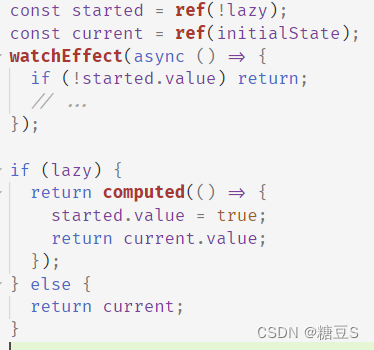
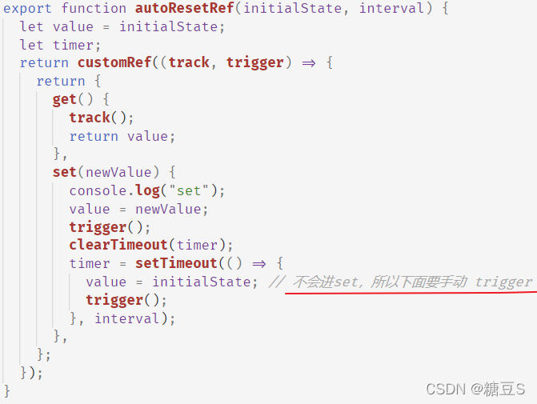
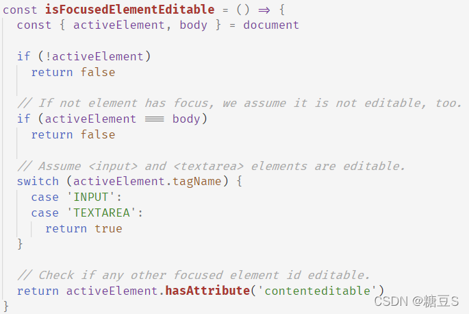
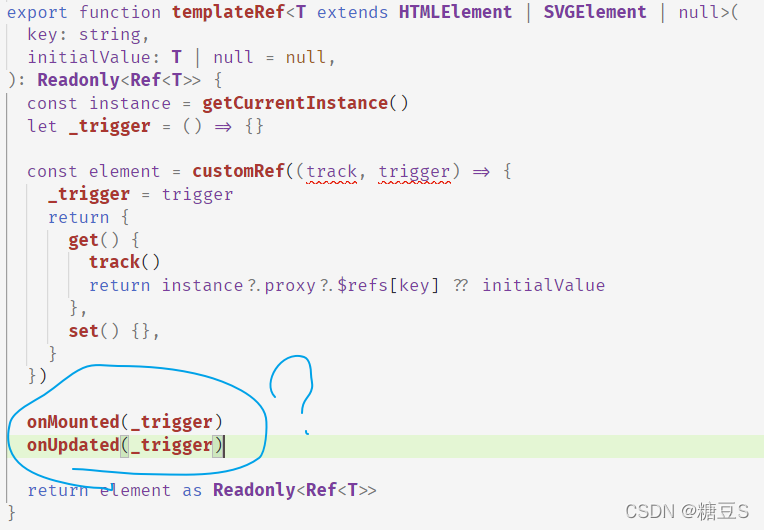
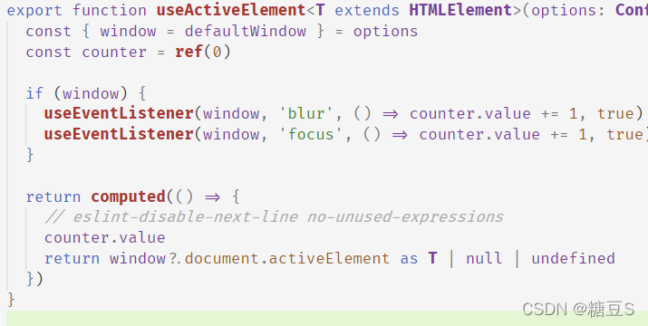

## asyncComputed

1. 【使用】时注意：默认 lazy = false, 所以会立刻调用，所以要注意变量、函数的定义顺序。默认 onError = null，所以不会抛出错误，debug 很难受
2. 异步操作完成之后，比较 counter 和 counterAtBeginning 比较来判断是否是最新一次调用
3. 内部使用 watchEffect 实现。但 watchEffect 本身没有返回值，是不可能 lazy 调用的，巧妙地使用 started 和 computed 实现 lazy

   

## autoResetRef

vue3 提供了 customRef



## onClickOutside

用 `Event.composedPath()` 判断

## onStartTyping

Fires when users start typing on non-editable elements.
如何判断 **on non-editable elements** ？

1. `document.activeElement` 当前获得焦点的 Element ，如果没有焦点元素，会返回 body 或者 null
2. input 和 textarea 是 editable 的（不需要判断是否 disabled，因为 disabled 的元素无法获得焦点）；添加了 contenteditable 属性的元素（注意：这种判断方法只是这个组件的方案！）

   

## templateRef

未曾设想的道路，还是用的 customRef
【想不明白】 onMounted 和 onUpdated 两行是干什么的？



## useActiveElement

【想不明白】 特意用 counter computed 是什么目的？建一个 ref 并返回，直接在 blur 和 focus 的 handler 中修改 ref 不行吗？



---

## useAsyncState

1. promiseTimeout 方法（延时 n 秒）的实现
2. 第一个参数可以是函数，也可以是真的 promise。所以内部要加个判断

## useBreakpoints

1. [Window.matchMedia()](https://developer.mozilla.org/zh-CN/docs/Web/API/Window/matchMedia) 兼容性很 nice。监听特定尺寸变化
   ```js
   const mediaQuery = window.matchMedia(
     "(max-width: 1600px) and (min-width:1200px)"
   );
   mediaQuery.addEventListener("change", (e) => {
     console.log(e);
   });
   ```
   window.onresize - 监听所有变化，比如用来触发 echarts.resize()
2. 用 reduce 生成 obj

   ```js
   options = {
     key1: value1,
     key2: value2,
   };
   // 生成
   res = {
     key1: " 根据 value1 生成的内容",
     key2: "根据 value2 生成的内容",
   };

   const res = Object.keys(options).reduce((obj, key) => {
     Object.defineProperty(obj, key, {
       get: () => {
         return "根据 options[key] 生成的内容";
       },
       enumerable: true, // 默认是 false，不会出现在 ... 中。所以必须手动置为 true
     });
     return obj;
   }, {});
   ```

## useBrowserLocation

1. 如何监听 location 变化？
   很遗憾，浏览器没有提供原生监听事件。只能努力监听一下了，思路同 vue-router
   - window.hashchange
   - window.onpopstate
2. @vueuse 的实现：变化后每次返回一个新的 location，整个引用都变化了。所以要给 location 包一层 ref（如果不该整个不改用，只是一个一个改属性，那应该套一层 reactive 就好了吧）

## useClipboard

1. [ClipboardEvent](https://developer.mozilla.org/zh-CN/docs/Web/API/ClipboardEvent) 兼容性 very nice
   `document.addEventListener('copy',handler)`
   `document.addEventListener('paste',handler)`
2. [剪贴板 Clipboard API ](https://developer.mozilla.org/zh-CN/docs/Web/API/Clipboard_API)：该 API 被设计用来取代使用 document.execCommand() 的剪贴板访问方式。不兼容 IE
