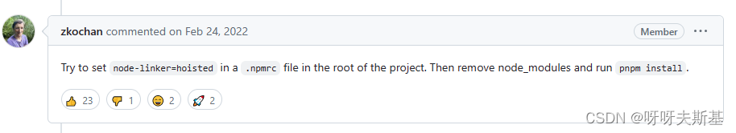
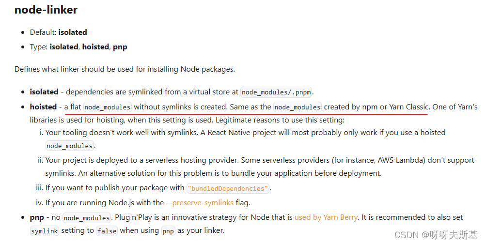
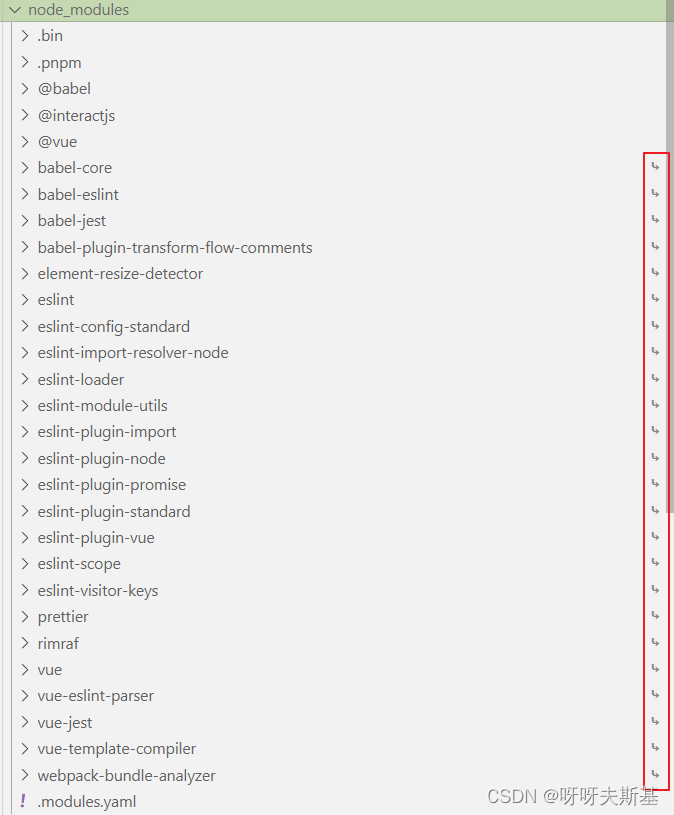
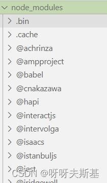
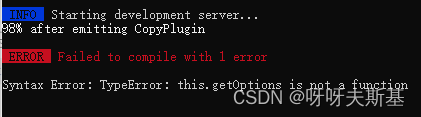
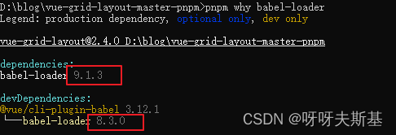

## 起因

工作原因需要研究 vue-grid-layout 的源码，于是把源码下载到本地。
因为我习惯使用 pnpm，所以用 `pnpm i` 安装依赖。安装好后执行 `npm run serve`，启动失败。尝试解决但是折腾了一番没有成功。
看到源码里有 yarn.lock，于是我重新用 `yarn install` 安装依赖，这次就可以成功启动了。

**用 yarn 安装可以成功运行的项目， 用 pnpm 安装后却运行失败。** 这个情况挺有意思的，我决定研究一番，于是有了这篇文章。

以前也遇到*类似*问题：使用相同的包管理器，但是 node 版本不同，有的 node 版本安装的包能成功运行，有的不能。

---

## 测试 npm yarn pnpm

请出今日受害者：`vue-grid-layout`。在 github 上下载源码.zip。解压后复制成三份：

- vue-grid-layout-npm
- vue-grid-layout-yarn
- vue-grid-layout-pnpm

分别使用 `npm` `yarn` `pnpm` 安装依赖（版本 node 16.0.0，yarn 1.22.11，pnpm 7.27.0）。安装过程中都报了一些 warning 或 error，暂时忽略。启动项目 `npm run serve`

npm 和 yarn 均可成功启动并运行。pnpm 启动失败，报错： `Failed to resolve loader: cache-loader. You may need to install it.`

---

## node-linker=hoisted

google 找到 [pnpm issue: Failed to resolve loader: cache-loader You may need to install it.](https://github.com/pnpm/pnpm/issues/3585)

pnpm maintainer 回复：

按照他的方法尝试。再新建项目 vue-grid-layout-pnpm-hoisted，设置好 `.npmrc` 后用 pnpm 安装依赖。再启动，成功！

[官方文档中 node-linker=hoisted 的含义](https://pnpm.io/npmrc#node-linker) ：所有包平铺在 node_modules 下，不使用 symlink，和 npm 或 yarn 的安装效果相同。

pnpm 默认（node-linker=isolated) 安装的 node_modules，子文件夹有 30 个。下图红框部分可以看到使用了 symlink：

用 npm、yarn、或者设置了 node-linker=hoisted 的 pnpm 安装的 node_modules：

子文件夹非常多（npm 997，yarn 994，hoisted pnpm 1045），因为所有直接、间接的依赖都平铺在 node_modules 中了

---

## 使用原版 pnpm，手动安装缺少的包

虽然只要设置了 node-linker=hoisted 就可以在本项目中使用 pnpm 。但是这也失去了使用 pnpm 的意义了。
还是用“原版”（即不修改 node-linker）的 pnpm 测试。

在 vue-grid-layout-pnpm 项目中手动安装 cache-loader，启动仍报错 `Failed to resolve loader: babel-loader'`
手动安装 babel-loader，启动报错：`Syntax Error: TypeError: this.getOptions is not a function`

google 了一下，是包和包之间版本不匹配。但是通过报错信息看不出是哪个包的哪个文件报错。在 node_modules 下全局搜索 `this.getOptions`，锁定嫌疑人 babel-loader。用 pnpm why 查看：

需要安装 8.3.0 版本，但是刚刚安装的是 9.1.3 版本。重新安装：`pnpm i babel-loader@8.3.0`，启动报错 `Failed to resolve loader: vue-loader`。

这样提示一个安一个，报错一个解决一个，不知道什么时候才到尽头，放弃了。还是研究研究为什么 pnpm 不安装这些包吧。

---

## 为什么 pnpm 没安装 cache-loader？

其实 pnpm 正确安装了所有依赖。但是出问题的这个项目使用 webpack，而 webpack 解析包的路径时用的是它自己的一套逻辑，找不到 pnpm 安装的包。

具体请看另一篇文章：[《pnpm 安装后 node_modules 是什么结构？为什么 webpack 不识别 pnpm 安装的包？》](https://blog.csdn.net/tangran0526/article/details/137950620)
