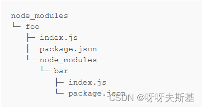
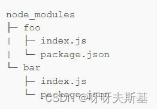
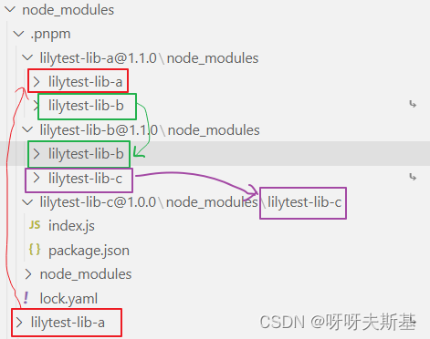
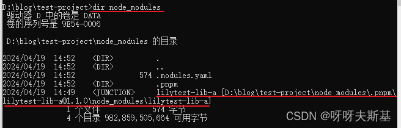
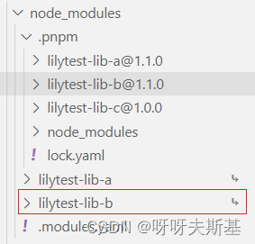
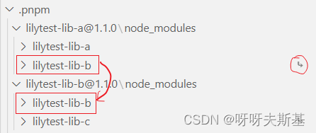
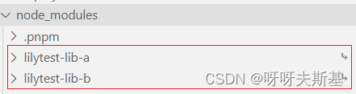

本篇研究：使用 pnpm 安装依赖时，node_modules 下是什么结构

---

## 回顾

### npm@3 之前：依赖树

缺点：

- frequently packages were creating too deep dependency trees, which caused long directory paths issue on Windows
- packages were copy pasted several times when they were required in different dependencies

### npm@3 和 yarn：扁平化

缺点：

- modules can access packages they don’t depend on
- the algorithm of flattening a dependency tree is pretty complex

---

## 测试 pnpm 效果

### yalc

为了方便看效果，我打算自己建几个 npm 包测试。

我并不想真的发布 npm 包，所以使用 [yalc](https://github.com/wclr/yalc) 模拟。折腾了一番，成功用 yalc 发布、安装 lib 后，发现自己的行为很愚蠢。。。因为使用这个 lib 时，要用 `yalc add xxx` 来安装，安装的逻辑是 yalc 的逻辑，不是 pnpm 的。所以这种方法不能测试出 pnpm 安装包的效果！STUPID!!!

还是老实发布 lib 吧

### publish library

参考[《在 npm 上发布包 npm publish》](https://blog.csdn.net/tangran0526/article/details/139620788)，创建三个包 a b c 并发布，依赖关系为：a 依赖 b，b 依赖 c，c 无依赖

### test-project

新建文件夹 test-project，`npm init -y`

安装 a ` pnpm i lilytest-lib-a`：

以 `node_modules/lilytest-lib-a` 为例说明。它是一个链接，真实路径为 `.pnpm/lilytest-lib-a@1.1.0/node_modules/lilytest-lib-a`。使用 dir 可以看到：

安装 a 和 b：

和之前相比，只多了 node_modules/lilytest-lib-b，链接到 `.pnpm/lilytest-lib-b@1.1.0/node_modules/lilytest-lib-b`

---

## 总结

结合官网说明，总结一下 pnpm 的安装流程：

### 第一步：在 .pnpm 下安装真实依赖

在 `node_modules/.pnpm` 下安装所有 package，无论直接、间接、间间接、间间间接、间间间...接的。放在`node_modules/.pnpm/<name>@<version>/node_modules/<name>`中。这些是 node_modules 下唯一的“真实”文件

解释一下：为什么最后还要多套一层 node_modules？

- **allow packages to import themselves.** `foo` should be able to `require('foo/package.json')` or `import * as package from "foo/package.json".`
- **avoid circular symlinks.** Dependencies of packages are placed in the same folder in which the dependent packages are. For Node.js it doesn't make a difference whether dependencies are inside the package's node_modules or in any other node_modules in the parent directories.

### 第二步：在 .pnpm 下链接依赖

比如，将 .pnpm/a/node_modules 下的 b 链接到 .pnpm/b/node_modules/b：
将 .pnpm/b/node_modules 下的 c 链接到 .pnpm/c/node_modules/c：

### 第三步：在 node_modules 下链接直接依赖

将 node_modules 下的 a 和 b 链接到 .pnpm 下对应位置

参考阅读：

- [Symlinked node_modules structure](https://pnpm.io/symlinked-node-modules-structure)

### 个人理解

pnpm 将所有直接的、间接的依赖都平铺放在 `node_modules/.pnpm` 下，其实是和 yarn 同样采用了**扁平化**策略。不同之处在于：yarn 是放在 node_modules 下，导致间接依赖也暴露给外界了。而 pnpm 是放在 `node_modules/.pnpm` 下，所有依赖都“保护”起来了，外界不可访问。

但是 pnpm 要把直接依赖暴露给外部，所以 pnpm 又在 node_modules 下放了所有直接依赖。但它们都不是实体，都 symlink 到 .pnpm 下对应的位置。

---

## old-school webpack

本篇文章的起因就是 webpack 不认 pnpm 的路径，终于说回这个问题了。

[webpack Problems with pnpm and the way loaders are resolved](https://github.com/webpack/webpack/issues/5087)

> We have issues in lots of applications because webpack can't resolve packages in the node_modules created by pnpm. I think it is because webpack doesn't resolve dependencies the way Node does. Node resolves requires from the real path of a module. That is why the symlink approach pnpm uses works with all Node apps. However, it seems to confuse webpack and some other tools like browserify and eslint.
