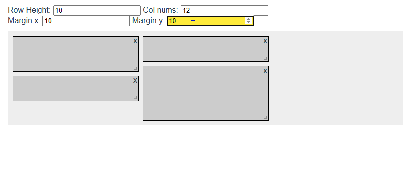
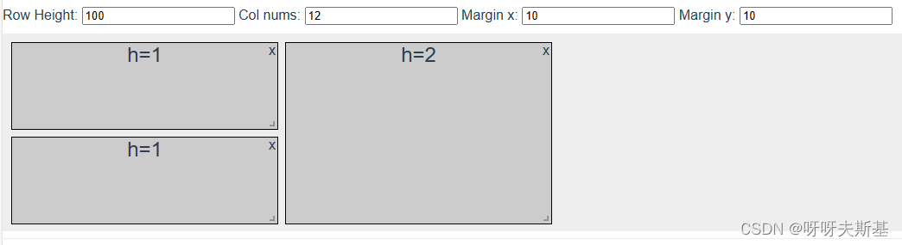
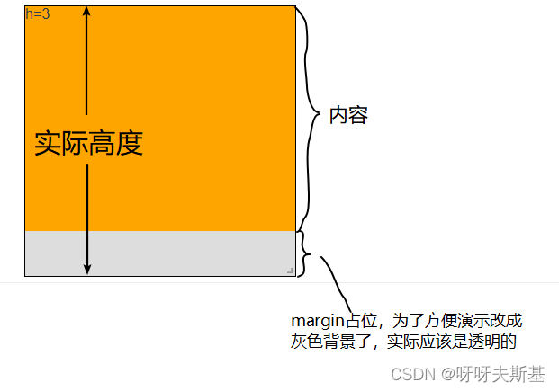
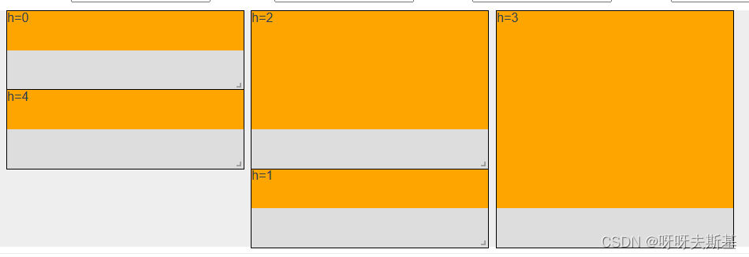
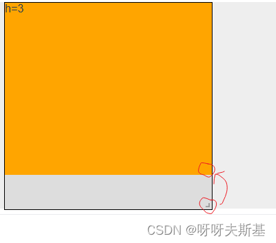
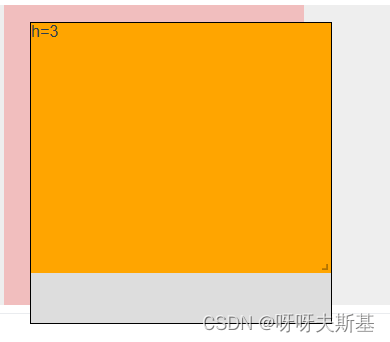
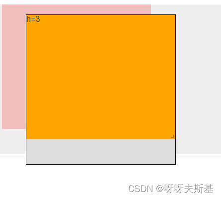
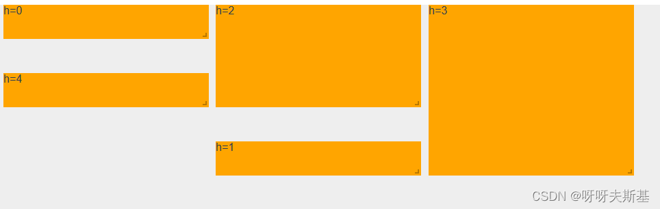

## 问题

用 vue-gird-layout 时发现，当改变 margin 值时，item 的尺寸也会跟着变化。

如下图：row height 和每个 item 的 h 都保持不变。修改 margin-y，item 的实际高度也跟着变了：


---

## 原因

研究了一番，发现原因。关键在于**网格**模式

考虑以下情况：第一列是两个 h=1 的 item，第二列是一个 h=2 的 item。无论 margin 是多少，都应该保证第一和第二列的底部是平齐的（不然网格逻辑就崩溃了）


记 h=1 的 item 的实际高度为 `rowHeight`。

那么 h=2 的 item 的实际高度不是 `2 * rowHeight`，而是 `2 * rowHeight + yMargin`。

同理 h=n 的 item 的实际高度应该是 `n * rowHeight + (n-1) * yMargin`。

所以就出现了最上面说的问题。而且 h 越大的 item，需要“补齐”的 margin 就越多。

---

## 解决

其实 vue-grid-layout 的实现逻辑是合理的。但是不符合我的需求：我项目中的 row height 的值设置得比较小，导致每个 item 的 h 都很大。margin 稍微一变，item 的实际高度就剧烈变化，效果不好。

我的理想效果是：在保持网格系统效果（对齐）的同时，margin 变化时 item 的高度不要剧变。

思路：将 vue-grid-layout 的 margin-y 设置为 0，在 item 中自己模拟一个 margin 的效果

具体实现：

1. 传给 grid-layout 的 marginY 恒为 0
2. item 内部模拟 margin，grid-item 设置属性 `drag-allow-from`
   
   整体效果：
   
3. 挪动 resize-handle 的位置
   ```css
   .vue-grid-item:not(.vue-grid-placeholder) > .vue-resizable-handle {
     bottom: 50px !important;
   }
   ```
   
4. 把 placeholder 改小：

   placeholder 是在 drag 或者 resize 时的一个图形提示，下图粉色背景的：

   

   placeholder 的大小没法改。正好它下面有一个没用的 .vue-resizable-handle。把真正的 placehoder 背景去掉，用它内部的 handle 伪装 placeholder。

   ```css
   .vue-grid-placeholder {
     background: none !important;
   }
   .vue-grid-placeholder .vue-resizable-handle {
     position: absolute;
     bottom: 50px !important;
     background: pink !important;
     width: auto !important;
     height: auto !important;
   }
   ```

   改后的效果：

   

最终效果：


