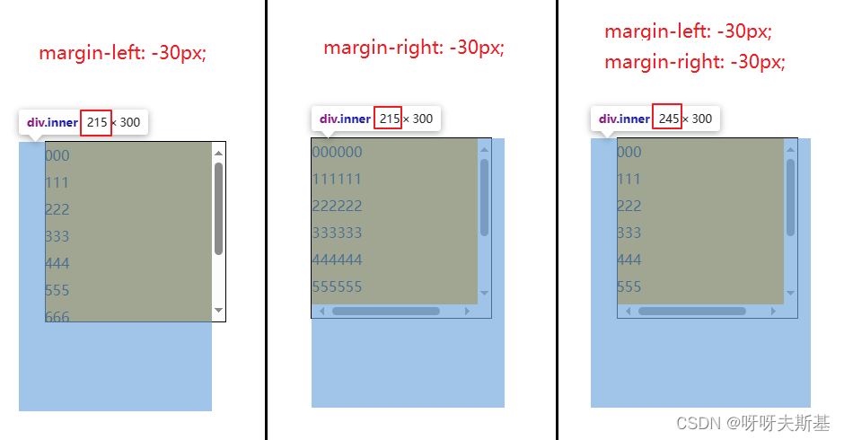
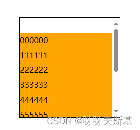
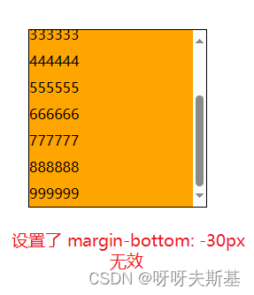

margin 很复杂，这里只讨论如下特定代码的情况

## 准备工作

```html
<!DOCTYPE html>
<html>
  <head>
    <meta charset="UTF-8" />
    <style>
      .outer {
        width: 200px;
        height: 200px;
        margin: 50px auto 0;
        outline: 1px solid black;
        overflow: auto;
      }
      .inner {
        background: orange;
      }
      .item {
        line-height: 30px;
      }
    </style>
  </head>
  <body>
    <div class="outer">
      <div class="inner">
        <div class="item">000000</div>
        <div class="item">111111</div>
        <div class="item">222222</div>
        <div class="item">333333</div>
        <div class="item">444444</div>
        <div class="item">555555</div>
        <div class="item">666666</div>
        <div class="item">777777</div>
        <div class="item">888888</div>
        <div class="item">999999</div>
      </div>
    </div>
  </body>
</html>
```

准备两层 div `.outer > .inner` （带有文字的`.item` 是为了 `.inner` 滚动时能看到文字在动，更直观）

现在 `.inner` 的尺寸是 185x300。
宽度 185px 是父级 `.outer` 的 200px 宽减去滚动条的宽度。
高度 300px 是由内容撑起的

接下来给 .inner 添加 margin，测试效果

---

## 横向 margin

```css
.inner {
  margin-left: 30px;
  margin-right: 30px;
}
```

记住 .inner 的原始宽度是 185px


再测试 margin 为负的情况



总结：==width 为 auto 时，设置横向 margin （无论正负）可以改变内容宽度==

---

## 纵向 margin

```css
.inner {
  margin-top: 30px;
  margin-bottom: 30px;
}
```

纵向正 margin 不会改变内容高度





再试负值，marginTop 和 marginBottom 的行为就不同了。

### `margin-top: -30px`

上移 30px，内容为 000000 的 .item 已经完全移出视区，看不到了。


### `margin-bottom: -30px`

最后一个 item999999 还能看到，并不会挪出视区外。


## 总结

margin 只有四个方向，但就有三种不同效果！

- left 和 right
  width 为 auto 时，可以改变内容宽度。
  - 正值：压缩内容，width 变小。
  - 负值：延展内容，width 变大
- top
  **不**改变内容高度，改变内容顶部和父级顶部的相对位置关系（有点拗口，意会一下吧）。
  - 正值：内容顶部和父级顶部之间空出一段距离（不会导致内容底部看不到，因为父级的滚动条会随着变长）
  - 负值：内容顶部比父级顶部还要靠上，挪上去的那部分看不到了（不会导致底部和父级留出距离，因为父级滚动条会随着变短）
- bottom
  - 正值：不改变内容高度，效果参考 top 的正值
  - 负值：**不生效**
