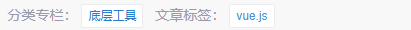
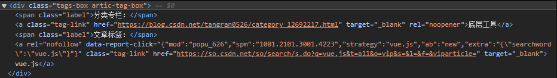
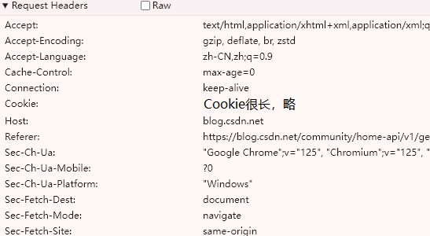

[爬虫源码](https://github.com/liuzx-emily/blog-crawler)

## 起因

前几天想给一个项目加 eslint，记得自己曾经在 csdn 博客里写过相关内容，所以来搜索。但是发现 csdn 只能搜标题，没办法搜正文，所以我没搜到自己想要的内容。

没办法只能自己又重新折腾了一通 eslint，很烦躁。迁怒于 CSDN（？），所以打算写一个爬虫，自己搜。

## 新建项目

只想做一个很简单的爬虫，爬取我自己的 blog，获取所有文章的标题、摘要、分类、标签、内容、发布更新时间。

一说到爬虫我就想到 python，但是懒得配置 python 的开发环境了，用 nodejs 随便搞一搞吧。简单查了一下，决定用 node-crawler

- `npm init -y`
- `git init`
- 创建 .gitignore
- `pnpm i crawler`
- 创建 index.js

## 爬取文章内容页面

此页面可以获取标题、分类、标签、正文内容。页面中也展示了发布和更新日期，但获取较麻烦，不在此页面爬取。

```js
// index.js
const Crawler = require("crawler");

const crawler = new Crawler();
crawler.direct({
  uri: `https://blog.csdn.net/tangran0526/article/details/125663417`,
  callback: (error, res) => {
    if (error) {
      console.error(error);
    } else {
      const $ = res.$; // node-crawler 内置 cheerio 包。$ 是 cheerio 包提供的，用法和 jQuery 基本一致
      const title = $("#articleContentId").text();
      const content = $("#article_content").text();
    }
  },
});
```

获取标题、正文很简单，通过 id 直接锁定元素，然后用 text() 获取文本内容。但是分类和标签就要复杂一点了。



对应的 html 结构是：



分类和标签的 class 都是 tag-link，只能从 attr 区分。
注意：cheerio 的 map() 返回伪数组对象，需要调用 get() 获取真数组

```js
const categories = $(`.tag-link[href^="https://blog.csdn.net/tangran0526"]`)
  .map((_i, el) => $(el).text())
  .get();
const tags = $(`.tag-link[href^="https://so.csdn.net/so/search"]`)
  .map((_i, el) => $(el).text())
  .get();
```

发布和更新日期就不在详情页面获取了。因为对有更新和无更新的文章，日期的展示形式不同，而且没有特殊的 class 能锁定元素，获取起来比较麻烦。

## 获取文章列表

### 找到接口

找到[文章列表页面](https://blog.csdn.net/tangran0526?type=blog)，惊喜的发现有滚动加载，也许能找到获取列表的接口。打开浏览器控制台，Network 中看到疑似请求 `https://blog.csdn.net/community/home-api/v1/get-business-list?page=1&size=20&businessType=blog&orderby=&noMore=false&year=&month=&username=tangran0526`

返回值为：

```js
{
  code: 200,
  data: {
    list: [{ articleId, title, ... },...],
    total: 84,
  },
  message: "success",
};
```

因为是 get 请求，所以可以直接把接口地址放到浏览器地址栏里访问。这样改参数看效果更直接。可以避免吭哧吭哧写代码试，最后发现参数无效或者哪有错的倒霉情况。

在地址栏里改参数发现 size 能正常工作。给它设大一点，就可以一次获取所有文章。

```js
let url = "https://blog.csdn.net/community/home-api/v1/get-business-list";
const queryParams = {
  businessType: "blog",
  username: "tangran0526",
  page: 1,
  size: 1000, // 设大一点，一次取完所有文章
};
url +=
  "?" +
  Object.entries(queryParams)
    .map(([key, value]) => key + "=" + value)
    .join("&");
crawler.direct({
  uri: url,
  callback: (error, res) => {
    if (error) {
      console.error(error);
    } else {
      console.log(res);
    }
  },
});
```

### 爬虫被拦截，如何解决

这个接口返回的是 json，不是 html 了，不确定爬虫返回的 res 是什么结构。node-crawler 的[文档](https://github.com/bda-research/node-crawler?tab=readme-ov-file#callback)中有写：

> - `response.body`: `Buffer` | `String` | `JSON` HTTP response content which could be a html page, plain text or xml document e.g.

打断点查看 res：


res.body 是一段 html。内容是：**当前访问人数过多，请完成安全认证后继续访问**。这是网站的防护策略。我 google 了“爬虫、安全验证、验证码”等相关内容，找到了解决方法：我在浏览器中找到刚才成功访问的请求，把它的 request headers 全部赋给 crawler 的 headers：

```js
crawler.direct({
  uri: url,
  headers: {
    // 全部放这里
  },
  callback,
}
```

再次运行，res.body 是想要的结果了。只不过是字符串格式，需要 `JSON.parse` 转换一下。

### 在 headers 中找到关键项

下面来精简 request headers。之前是把所有的 headers 都拿过来了，但应该不需要那么多。筛查哪些 headers 是必不可少的：



二分法排除，确认了只有 **cookie** 是必须的。

去浏览器中清除 cookie 后，在浏览器中重新访问接口，也弹出了这个安全验证页面。实锤 cookie 是关键！


cookies 内容也很多，二分法筛查并结合名称猜测，找到了两个关键 cookie：`yd_captcha_token` 和 `waf_captcha_marker`。只要它们两个的值正确，就不会触发安全验证。

```js
const cookie_yd_captcha_token = "略";
const cookie_waf_captcha_marker = "略";
crawler.direct({
  uri: url,
  headers: {
    Cookie: `yd_captcha_token=${cookie_yd_captcha_token}; waf_captcha_marker=${cookie_waf_captcha_marker}`,
  },
  callback,
});
```

这两个 cookie 的值应该是有时效的。每次失效后都必须重新获取：打开浏览器——清除 cookies 后访问接口——遇到安全验证——通过后获取新的有效 cookie。

所以这是一个人工爬虫——需要人力辅助的爬虫。。。。我知道这很烂，但没兴趣继续研究了，就这样吧。如果想真正解决，应该使用 [puppeteer](https://github.com/puppeteer/puppeteer) 这类爬虫：内置 Headless Browser，可以模拟用户操作，**也许**能解决图形、滑块等验证。

## 将爬取结果输出到文件

先调用 list，再对每一篇文章获取详情。最后将结果输出到文件。

执行 `node index.js`，等待爬虫运行，输出 result.json 文件。
