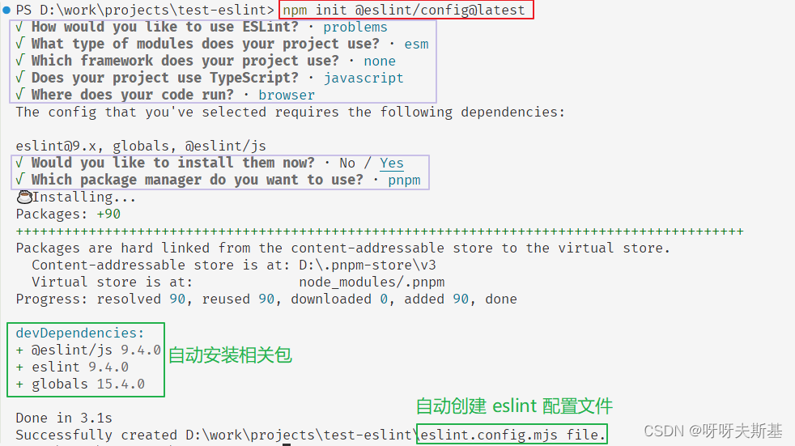
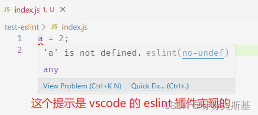
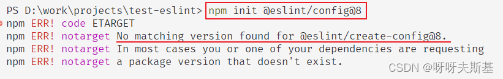
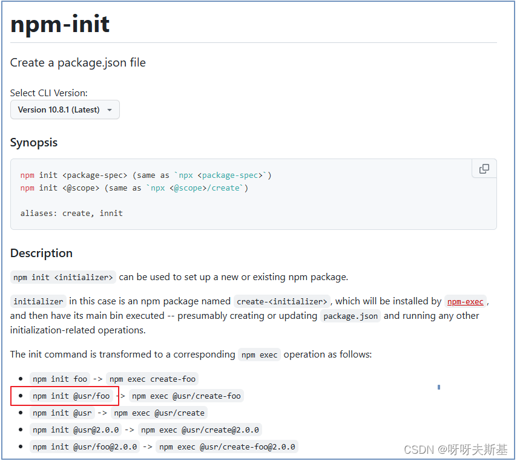

## vscode 中 eslint 无效

我想要给一个项目添加 eslint，按照 eslint 官方指南操作：

```cmd
npm init @eslint/config@latest
```



自动安装了相关依赖并创建配置文件 `eslint.config.mjs`。

按理说，此刻项目应该已经配置好 eslint 了。但是我的编辑器 **vscode** 并不能检测到代码中的错误？？？！！！


---

## 破案了：eslint 无罪，是 vscode 版本过低

折腾了半天解决了，直接上结论：eslint 生效了。<span style="color:darkorange">但是编辑器中的错误提示是 vscode 的 eslint 插件提供的，这个插件没生效！</span>



### 如何证明 eslint 生效了？

在控制台执行 `eslint index.js`，成功找到所有错误

### vscode 对 eslint 的支持没生效

`npm init @eslint/config@latest` 是按照**最新**的 eslint 规则进行安装和配置的。eslint 的最新版本是 v9+，和之前的版本相比有很多 **breaking changes**。而我此时用的 vscode 已经两年没有更新了。。。所以 vscode 无法识别最新的 eslint 规则。

eslint v9+的 breaking changes 很多，不一一列举了，这里只说一个：配置文件格式变动，以前的 `.eslintrc.js.`等已全面弃用


我也是在研究途中才发现我的 vscode 已经两年没更新了。虽然我给 vscode 设置了自动更新，但是貌似因为我给 vscode 设置了“以管理员身份运行”，自动更新从来没生效。。。


我一开始还升级过 vscode eslint 插件的版本，没用。原来病根在 vscode 身上。

把 vscode 和 vscode eslint 插件的版本都升到最新后，一切都 OK 了！

---

## 一些心路历程

在研究的过程中（此时还是老版本的 vscode），我发现把配置文件换成以前的格式 `.eslintrc.js` 后，vscode 就能正确识别 eslint 了。
我在 eslint 官网查到 eslint 的新老版本配置文件变化很大，所以想到是版本不匹配的问题了。

我立刻升级了 vscode eslint 插件，但还是不起作用。这时候的我完全没想到是 vscode 版本过老，还以为是这个插件没有 up to speed

所以当时的我认为，只能在项目里用一个老点的 eslint 版本，让 vscode 能认识。

我看到 `npm init @eslint/config@latest` ，自作聪明的尝试 `npm init @eslint/config@8`（试图安装 eslint 8）。失败：



果然没那么简单，哈哈哈。所以我去研究了一下 [npm init](https://docs.npmjs.com/cli/v10/commands/npm-init) 的用法

---

## npm init



我应该查看 `@eslint/create-config` 包的版本（在上一部分安装@8 的报错信息也提到了这个包），看看它有没有哪个版本是对应 eslint 8 的。
——经过我一番查找，没有！这条路又堵死了，看来不能用自动化工具了。~~只能自己乖乖安包，自己写配置文件了~~（并不，升级 vscode 版本就好了）


