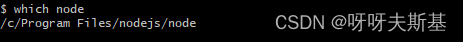
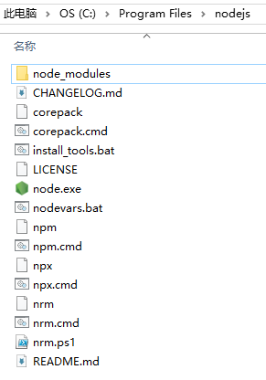
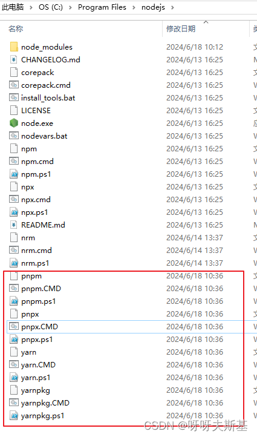
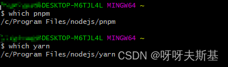
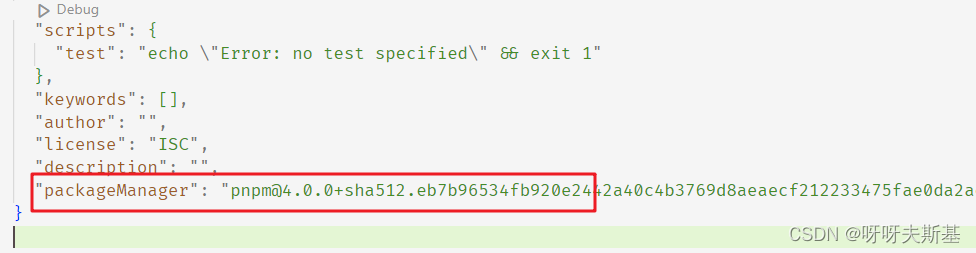
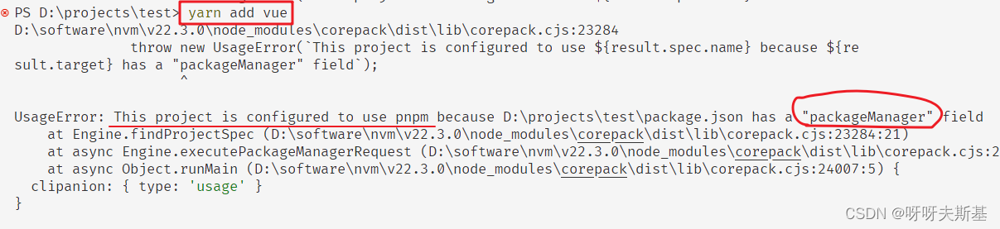
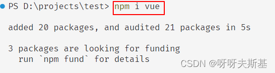
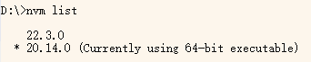
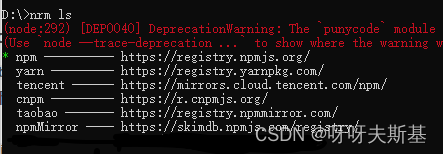

## corepack

corepack 管理"包管理器"，包括 **yarn** 和 **pnpm**。corepack 并**不能管理 npm**。

corepack 是 nodejs 提供的功能，安装 nodejs 时 corepack 就一起安装了。它还是实验性功能，默认是关闭的，具体介绍看[官方文档](https://nodejs.cn/api/corepack.html)。

注：下述说到 pnpm 的内容也适用于 yarn 。只提 pnpm 是为了方便叙述。

### 使用 corepack

#### 先卸载 pnpm

使用 corepack 前，先卸载你自行安装的 pnpm，因为它们可能会影响 corepack。

卸载后使用 `which pnpm` 或 `pnpm -v` 等命令确认是否成功

### 启用、禁用 corepack

启用： `corepack enable` ，禁用：`corepack disable`

为了查看启用的效果，用 `which` 找到 nodejs 所在目录（which 是 linux 命令。在 windows cmd 中不能直接用，我是在 git bash 中执行的）：

打开 nodejs 所在目录，包括以下内容：

开启 corepack：`corepack enable`。目录下多出了 pnpm 和 yarn 的相关文件（下图红框）：

使用 `which` 命令查看。已经可以使用 pnpm 和 yarn 了，并且它们都来自 nodejs 目录：

禁用：`corepack disable`。目录下 pnpm 和 yarn 的相关文件（红框里的）又消失了。此时 pnpm 和 yarn 都不可用了。

### corepack 控制的 pnpm 版本

通过 corepack 初次使用 pnpm 时，corepack 会从网络获取 pnpm 最新版本并缓存到本地。之后再使用 pnpm 时会直接用缓存的版本。

想要修改缓存的版本的话， 执行 `corepack install -g pnpm@<version>`。

corepack 被禁用后重新启用，并不看作前面所说的”初次使用“。即：假设你之前通过 corepack 安装了 pnpm@4，`corepack disable` 后再 `corepack enable` ，使用 pnpm 还会使用 pnpm@4 版本

---

## 使用 corepack 规定项目使用 pnpm 并锁定版本

多人开发项目时最好统一开发环境与工具。node 版本不同可能会导致项目无法启动、构建，或者 install package 时失败。pnpm 版本不同可能导致 pnpm-lock.yaml 不一致。

利用 corepack 可以规定项目使用的 pnpm 版本。在项目根目录下执行 `corepack use pnpm@<version>`

规定项目使用 pnpm，且版本为 4.0.0：

package.json 会自动添加 packageManager 项：

再使用 yarn 安装包的话，会阻止并报错：

但是使用 npm 安装包还是能成功，因为正如文章最开头说的： corepack 仅管理 **yarn** 和 **pnpm**，**不能管理 npm**。

---

## nvm

管理 node 版本。windows 系统用 [nvm-windows](https://github.com/coreybutler/nvm-windows)

---

## nrm

管理 npm registry 地址

