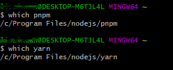
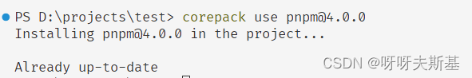

## corepack

corepack 管理"包管理器"，包括 **yarn** 和 **pnpm**。corepack 并**不能管理 npm**。

corepack 是 nodejs 提供的功能，安装 nodejs 时 corepack 就一起安装了。它是实验性功能，默认是关闭的。具体介绍看[官方文档](https://nodejs.cn/api/corepack.html)。

注：下述说到 pnpm 的内容也适用于 yarn 。只提 pnpm 是为了方便叙述。

### 使用 corepack

#### 先卸载 pnpm

使用 corepack 前，先卸载你自行安装的全局 pnpm，因为它们可能会影响 corepack。

卸载后使用 `which pnpm` 或 `pnpm -v` 等命令确认是否成功

### 启用、禁用 corepack

```bash
# 启用
corepack enable
# 禁用
corepack disable
```

为了查看启用的效果，用 `which` 找到 nodejs 所在目录（which 是 linux 命令。在 windows cmd 中不能直接用，我是在 git bash 中执行的）：


打开 nodejs 所在目录，包括以下内容：


开启 corepack：`corepack enable`。node 目录下多出了 pnpm 和 yarn 的相关文件（下图红框）：


使用 `which` 命令查看。已经可以使用 pnpm 和 yarn 了，并且它们都来自 nodejs 目录：



禁用 corepack：`corepack disable`。node 目录下 pnpm 和 yarn 的相关文件（红框里的）消失了。此时 pnpm 和 yarn 都不可用了。

### corepack 控制的 pnpm 版本

通过 corepack 初次使用 pnpm 时，corepack 会从网络获取 pnpm 最新版本并缓存到本地。之后再使用 pnpm 时会直接用缓存的版本。

想要修改缓存的版本的话， 执行 `corepack install -g pnpm@<version>`。

corepack 被禁用后重新启用，并不看作前面所说的”初次使用“。即：假设你之前通过 corepack 安装了 pnpm@4，`corepack disable` 后再 `corepack enable` ，使用 pnpm 还会使用 pnpm@4 版本

### corepack 被墙

使用 corepack 安装 pnpm 时可能因为被墙而失败。

corepack 安装包的时候并不使用 npm 设置的 registry，想要修改 corepack 使用的 registry 需要单独设置，设置方法见 [《npm/git/corepack/nvm 被墙可以通过设置 mirror 或 proxy 解决》](post:bb085790-9987-4479-9188-6bdbff059cd4#corepack)

## 使用 corepack 规定项目使用 pnpm 并锁定版本

多人开发项目时最好统一开发环境与工具。node 版本不同可能会导致项目无法启动、构建，或者 install package 时失败。pnpm 版本不同可能导致 pnpm-lock.yaml 不一致。

利用 corepack 可以规定项目使用的 pnpm 版本。在项目根目录下执行 `corepack use pnpm@<version>`

规定项目使用 pnpm，且版本为 4.0.0：



package.json 会自动添加 packageManager 项：


再使用 yarn 安装包的话，会阻止并报错：


但是使用 npm 安装包还是能成功，因为正如文章最开头说的： corepack 仅管理 **yarn** 和 **pnpm**，**不能管理 npm**。


## nvm

管理 node 版本。windows 系统用 [nvm-windows](https://github.com/coreybutler/nvm-windows)


### nvm 被墙

执行 `nvm list available` 或 `nvm install <version>` 等命令时可能会出错：

```bash
Could not retrieve https://nodejs.org/dist/index.json.

Get "https://nodejs.org/dist/index.json": dial tcp 104.20.22.46:443: i/o timeout
```

这是因为执行这些命令需要请求 nodejs 网站，但是被墙了。给 nvm 设置 mirror 可以解决此问题，设置方法见 [《npm/git/corepack/nvm 被墙可以通过设置 mirror 或 proxy 解决》](post:bb085790-9987-4479-9188-6bdbff059cd4#nvm)

### 同时使用 corepack 和 nvm

如果同时使用 corepack 和 nvm 的话，要注意：

- corepack 的开启状态是存在具体版本的 node 中的：

  如果你的项目用 pnpm，由 corepack 控制。那么用 nvm 安装新版本后记得启用 corepack，不然执行 pnpm 命令会报错 `'pnpm' 不是内部或外部命令，也不是可运行的程序`，因为新安装的 node 版本 corepack 是默认关闭的。

- corepack 安装的 pnpm 的版本是跨版本通用的：

  你在某个 node 版本环境中执行 `corepack install -g pnpm@<version>` 修改了 pnpm 版本，那么其它所有版本的 node 的 corepack 对应的 pnpm 版本都会变化。

## nrm

管理 npm registry 地址


