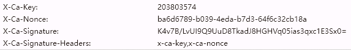

我把个人博客从 csdn 搬到 GitHub Pages 上，需要把我在 csdn 上写的文章都下载到本地。
编写一个 nodejs 爬虫处理这件事，需要两个接口：

- 获取文章列表
- 获取文章的 md 格式的内容

## 列表接口

我以前写的一个爬虫使用过 csdn 列表接口，并攻克了它的防护策略，见[《爬虫（没）入门：用 node-crawler 爬取 blog》](post:0cd4b446-1654-4a1e-b7b2-f1b260c3fa4f)。

## 文章 md 内容接口

进入 csdn 编辑文章的页面，找到所需接口 `https://bizapi.csdn.net/blog-console-api/v3/editor/getArticle?id=[articleId]&model_type=`。依然使用老方法，即“把浏览器中成功请求的接口的 headers 完整复制到爬虫代码中”。

但这次行不通了，报错 `HMAC signature does not match`。

观察浏览器中成功接口的请求头，发现四个关键 header：



研究 csdn 源码，过程很复杂不说了。`X-Ca-Key` 和 `X-Ca-Signature-Headers` 是常量。`X-Ca-Nonce` 是每次都随机生成的值，`X-Ca-Signature` 是通过`X-Ca-Nonce` 和**接口的完整地址**共同通过加密处理得出的加密值。接口的完整地址中包含了文章 id，所以不同的文章计算出的加密值是不同的。

`X-Ca-Nonce` 在 csdn 的源码中每次都会重新生成，但是生成方式类似 uuid 是完全随机的，它只是作为加密的一个输入值，让加密过程更复杂更难破译。在爬虫中可以随便设置一个固定值，无所谓。

`X-Ca-Signature` 是检验的关键：

```js
const X_CA_KEY = "203803574";

headers["X-Ca-Key"] = X_CA_KEY;
headers["X-Ca-Signature-Headers"] = "x-ca-key,x-ca-nonce";

const onceKey = "xxxx"; // 随便设置一个值
const fullUrl = `/blog-console-api/v3/editor/getArticle?id=${postId}&model_type`; // 不带域名的完整地址
const signature = generateSignature(fullUrl, onceKey);

headers["X-Ca-Nonce"] = onceKey;
headers["X-Ca-Signature"] = signature;

function generateSignature(fullUrl, onceKey) {
  const ekey = "9znpamsyl2c7cdrr9sas0le9vbc3r6ba"; // 常量
  const to_enc = `GET\n*/*\n\n\n\nx-ca-key:${X_CA_KEY}\nx-ca-nonce:${onceKey}\n${fullUrl}`;
  const hash = createHmac("sha256", Buffer.from(ekey)).update(Buffer.from(to_enc)).digest("base64");
  return hash;
}
```

加密过程很复杂，但是不需要去理解它的逻辑，因为没有逻辑，这只是为了增大破译的难度。

## 生成 post.md

### 拼接 metadata 和正文

从接口中获取 metadata: title createTime categories 等。和 md 正文拼接在一个 md 文件中。

```
---
title: [title]
createTime: [createTime]
---

[mdContent]
```

### 文件名

将 `${createTime}_${title}.md` 作为文件名。

注意：title 中可能含有特殊字符，无法直接作为文件名称，需要处理

```js
if (/:/g.test(filename)) {
  console.warn(`文章《${filename}》的标题含有:，不能直接用作文件名。将英文:修改为中文：`);
  filename = filename.replaceAll(/:/g, "：");
}
if (/\//g.test(filename)) {
  console.warn(`文章《${filename}》的标题含有字符/，不能直接用作文件名。将/修改为斜杠`);
  filename = filename.replaceAll(/\//g, "斜杠");
}
if (/[\\/:*?"<>|]/.test(filename)) {
  throw new Error(`文章《${filename}》的标题含有非法字符，不能直接用作文件名`); // \/:*?"<>|
}
```

## 将网络图片下载到本地

下载文章中引用的图片，并把正文中的图片链接从网络链接修改为本地路径。

```js
// 将markdown中的http资源转化为本地链接资源。下载的资源放在localAssetsDir中
async function convertHttpAssetsToLocalAssetsInMarkdown(markdownStr, localAssetsDir) {
  const httpAssetsLinkReg = /!\[.*?\]\(((https|http).*?)\)/gi;
  const linkArray = [];
  let tempResult = httpAssetsLinkReg.exec(markdownStr);
  while (tempResult) {
    linkArray.push(tempResult[1]);
    tempResult = httpAssetsLinkReg.exec(markdownStr);
  }
  for (const url of linkArray) {
    const localAssetFileName = await downladAsset(url, _getPath(localAssetsDir));
    markdownStr = markdownStr.replaceAll(url, path.join("../", localAssetsDir, localAssetFileName));
  }
  return markdownStr;
}
```

## 爬虫运行结果

所有的文章都下载到本地的 posts 目录下，名称为 `${createTime}_${title}.md`，内容包括 metadata 和正文。

文章中引用的图片全部下载到 postAssets 目录下，并且文章中图片的链接已修改为本地链接
